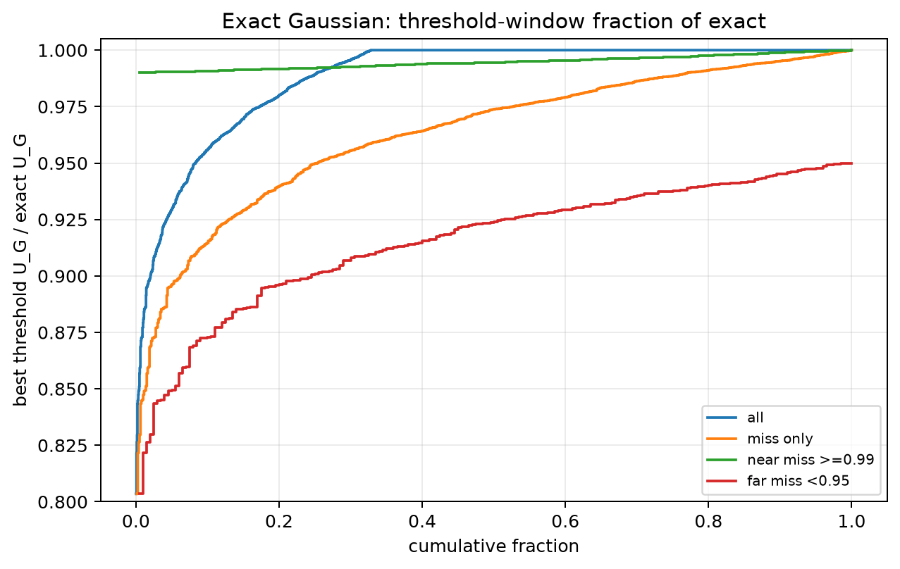
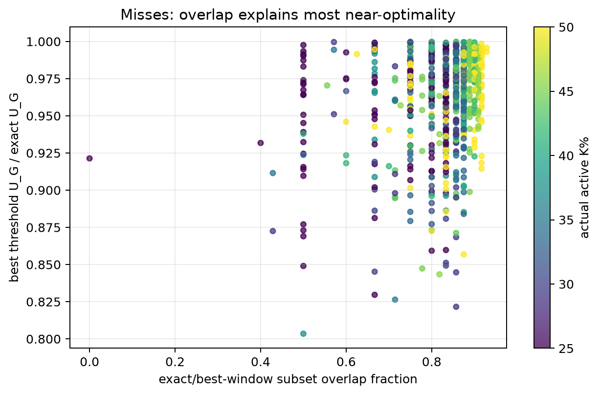
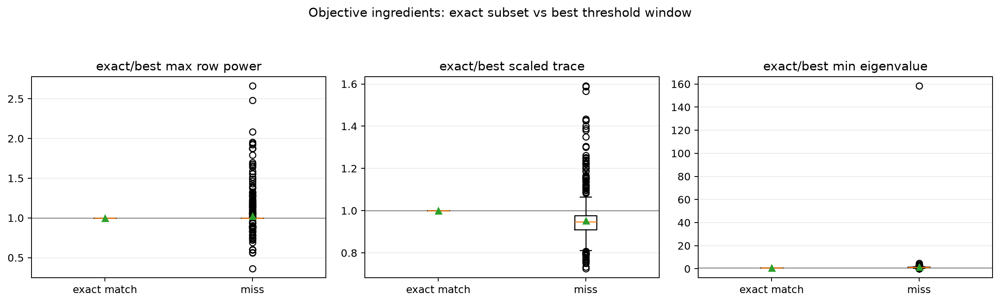
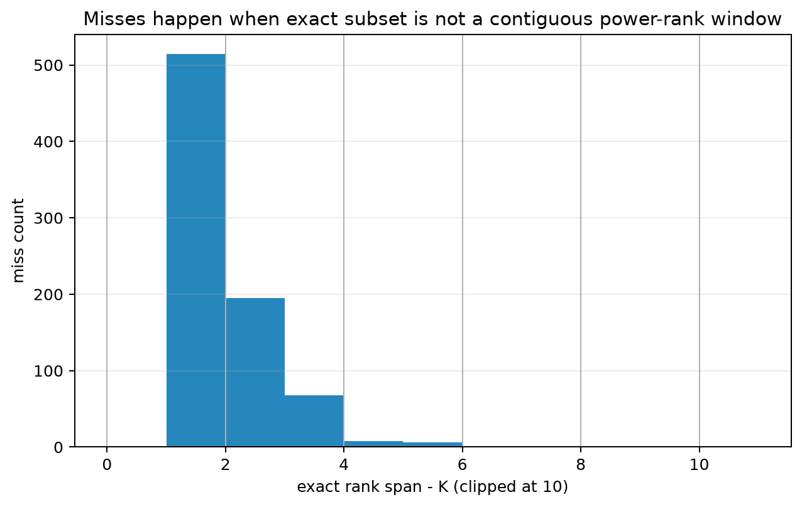

# Exact On Gauss: Threshold-Window Diagnostics

> Historical K semantics note: this report uses active-K semantics. Here `K` is the number of selected/kept antennas, not the number turned off. A `25% active` or `K=0.25N` case means `75% off`, not the real `25% off` task. For real off-percent experiments, `25% off => K_active=0.75N` and `50% off => K_active=0.50N`.

This report analyzes all non-smoke Gaussian exact experiments currently under `results/threshold_exact_gaussian*`.
The mechanism analysis deduplicates repeated actual exact problems by `(N, L, K, seed, sample, sigma, P)` so overlapping folders and rounded K percentages do not double-count the same matrix/subset problem.

## Direct Answer

- Source folders: `threshold_exact_gaussian_L2_N28_Kpct25_50_s5, threshold_exact_gaussian_L2_N8_12_16_20_24_Kpct25_50_s100, threshold_exact_gaussian_L2_N8_12_16_20_24_Kpct25_to_50_s100`.
- Raw completed rows loaded: `4010`; unique exact problems analyzed: `2410`.
- Best threshold window is exactly optimal in `67.2%` of unique cases.
- It is within 99% of exact in `74.7%` and within 95% in `91.7%`.
- Mean fraction `U_G(best T) / U_G(exact)` is `0.9880`, p05 is `0.9296`, worst observed is `0.8035`.
- Exact optimum itself is a contiguous row-power window in `67.2%` of unique cases.

The main reason best `T` is not always 100% exact is structural: the threshold search can only select a contiguous block in descending row-power order. In the misses, the exact subset is usually almost that block but with one or two row swaps that improve the weaker eigenmode and determinant balance. Because `L=2` and `K` is not tiny in most cases, those small swaps usually change `U_G` only slightly, which is why the threshold result is very near exact.

## Cases Where Best T Is Exact

When best `T` is exact, the exact optimum is almost always representable as a row-power window, or there is an equal-quality threshold window. These cases have full subset overlap and zero row-rank gaps.

| N | K | sample | best T | fraction | exact ranks | best ranks |
| --- | --- | --- | --- | --- | --- | --- |
| 8 | 2 | 4 | 0 | 1.0000 | 0 1 | 0 1 |
| 8 | 2 | 5 | 0 | 1.0000 | 0 1 | 0 1 |
| 8 | 2 | 6 | 0 | 1.0000 | 0 1 | 0 1 |
| 8 | 2 | 7 | 0 | 1.0000 | 0 1 | 0 1 |
| 8 | 2 | 8 | 1 | 1.0000 | 1 2 | 1 2 |
| 8 | 2 | 10 | 0 | 1.0000 | 0 1 | 0 1 |
| 8 | 2 | 11 | 0 | 1.0000 | 0 1 | 0 1 |
| 8 | 2 | 12 | 0 | 1.0000 | 0 1 | 0 1 |

## Cases Where Best T Misses Exact

The miss cases are not random failures of the objective calculation. They are cases where exact selection is non-contiguous in power rank. The best threshold window usually shares most selected antennas with exact, but exact swaps a few rows just outside/inside the window.

| group | cases | mean frac | p05 frac | mean overlap | mean swaps | rank gaps | window rate | max-power ratio | trace ratio | min-eig ratio | balance delta |
| --- | --- | --- | --- | --- | --- | --- | --- | --- | --- | --- | --- |
| exact_match | 1619 | 1.0000 | 1.0000 | 1.0000 | 0.0000 | 0.0000 | 1.0000 | 1.0000 | 1.0000 | 1.0000 | 0.0000 |
| miss | 791 | 0.9633 | 0.8964 | 0.8225 | 1.1504 | 1.4791 | 0.0000 | 1.0255 | 0.9534 | 1.4876 | 0.1111 |
| near_miss_99 | 182 | 0.9947 | 0.9904 | 0.8348 | 1.0824 | 1.3626 | 0.0000 | 1.0121 | 0.9668 | 1.1438 | 0.0865 |
| far_miss_95 | 200 | 0.9158 | 0.8511 | 0.7851 | 1.3150 | 1.5350 | 0.0000 | 1.0453 | 0.9461 | 1.4751 | 0.1290 |

Interpretation of the ratios in the table:

- `max-power ratio` is `exact max selected row power / best-window max selected row power`. It is usually near or above 1 in misses, so the exact gain is not mainly from lowering the scaling denominator.
- `trace ratio` near but below 1 means exact often sacrifices a little total scaled energy.
- `min-eig ratio > 1` or positive `balance delta` means exact improves the weaker spatial mode/eigenvalue balance, which matters directly for the determinant objective.

## Worst Observed Misses

| N | K | K% | sample | best T | fraction | overlap | swaps | rank gaps | exact ranks | best ranks | exact-only ranks | best-only ranks | max-power ratio | min-eig ratio | balance delta |
| --- | --- | --- | --- | --- | --- | --- | --- | --- | --- | --- | --- | --- | --- | --- | --- |
| 16 | 6 | 37.5000 | 37 | 3 | 0.8035 | 0.5000 | 3 | 2 | 0 1 2 3 6 7 | 3 4 5 6 7 8 | 0 1 2 | 4 5 8 | 1.3207 | 1.6564 | 0.1312 |
| 24 | 7 | 29.1667 | 5 | 0 | 0.8216 | 0.8571 | 1 | 1 | 0 1 2 3 4 5 7 | 0 1 2 3 4 5 6 | 7 | 6 | 1.0000 | 1.8161 | 0.0960 |
| 20 | 7 | 35.0000 | 6 | 0 | 0.8264 | 0.7143 | 2 | 2 | 0 1 2 3 4 7 8 | 0 1 2 3 4 5 6 | 7 8 | 5 6 | 1.0000 | 2.1295 | 0.1111 |
| 24 | 6 | 25.0000 | 40 | 0 | 0.8296 | 0.6667 | 2 | 2 | 0 1 2 3 6 7 | 0 1 2 3 4 5 | 6 7 | 4 5 | 1.0000 | 3.0750 | 0.2822 |
| 24 | 11 | 45.8333 | 5 | 0 | 0.8434 | 0.8182 | 2 | 2 | 0 1 2 3 4 5 6 7 8 11 12 | 0 1 2 3 4 5 6 7 8 9 10 | 11 12 | 9 10 | 1.0000 | 1.6535 | 0.1434 |
| 24 | 7 | 29.1667 | 40 | 0 | 0.8448 | 0.8571 | 1 | 1 | 0 1 2 3 4 6 7 | 0 1 2 3 4 5 6 | 7 | 5 | 1.0000 | 1.9007 | 0.1776 |
| 20 | 6 | 30.0000 | 61 | 0 | 0.8452 | 0.6667 | 2 | 3 | 0 1 2 3 6 8 | 0 1 2 3 4 5 | 6 8 | 4 5 | 1.0000 | 2.6169 | 0.3093 |
| 20 | 9 | 45.0000 | 22 | 0 | 0.8474 | 0.7778 | 2 | 3 | 0 1 2 3 4 5 6 10 11 | 0 1 2 3 4 5 6 7 8 | 10 11 | 7 8 | 1.0000 | 1.9562 | 0.3776 |
| 8 | 2 | 25.0000 | 77 | 0 | 0.8490 | 0.5000 | 1 | 1 | 0 2 | 0 1 | 2 | 1 | 1.0000 | 8.4824e-04 | -0.1941 |
| 20 | 6 | 30.0000 | 27 | 0 | 0.8493 | 0.8333 | 1 | 1 | 0 1 2 3 4 6 | 0 1 2 3 4 5 | 6 | 5 | 1.0000 | 2.4215 | 0.0700 |
| 20 | 6 | 30.0000 | 48 | 0 | 0.8512 | 0.8333 | 1 | 1 | 0 1 2 3 4 6 | 0 1 2 3 4 5 | 6 | 5 | 1.0000 | 1.9138 | 0.1220 |
| 16 | 8 | 50.0000 | 65 | 0 | 0.8569 | 0.8750 | 1 | 1 | 0 1 2 3 4 5 6 8 | 0 1 2 3 4 5 6 7 | 8 | 7 | 1.0000 | 1.5405 | 0.0728 |

These worst cases show the same pattern: exact is not far away in rank order, but it is not exactly contiguous. The threshold window cannot take a row from rank `a` while skipping a row inside the chosen interval, so it misses the small diversity/scale improvement.

## By N

| N | cases | exact rate | >=99% | mean frac | p05 | min | overlap | swaps | window rate | rank gaps |
| --- | --- | --- | --- | --- | --- | --- | --- | --- | --- | --- |
| 8.0000 | 300.0000 | 0.8600 | 0.9000 | 0.9943 | 0.9622 | 0.8490 | 0.9417 | 0.1433 | 0.8600 | 0.1567 |
| 12.0000 | 400.0000 | 0.8325 | 0.8725 | 0.9935 | 0.9491 | 0.8793 | 0.9626 | 0.1700 | 0.8325 | 0.2100 |
| 16.0000 | 500.0000 | 0.6860 | 0.7520 | 0.9882 | 0.9301 | 0.8035 | 0.9421 | 0.3560 | 0.6860 | 0.4500 |
| 20.0000 | 600.0000 | 0.5950 | 0.6900 | 0.9858 | 0.9272 | 0.8264 | 0.9342 | 0.4800 | 0.5950 | 0.6133 |
| 24.0000 | 600.0000 | 0.5400 | 0.6433 | 0.9832 | 0.9234 | 0.8216 | 0.9353 | 0.5450 | 0.5400 | 0.7317 |
| 28.0000 | 10.0000 | 0.4000 | 0.6000 | 0.9812 | 0.9430 | 0.9395 | 0.9286 | 0.6000 | 0.4000 | 0.7000 |

## By Actual Active K Percent

| actual K% | cases | exact rate | >=99% | mean frac | p05 | min | overlap | swaps | window rate | best T/N |
| --- | --- | --- | --- | --- | --- | --- | --- | --- | --- | --- |
| 25.0000 | 505.0000 | 0.7386 | 0.7822 | 0.9885 | 0.9246 | 0.8296 | 0.9269 | 0.2911 | 0.7386 | 0.0178 |
| 29.1667 | 100.0000 | 0.5100 | 0.6300 | 0.9786 | 0.8978 | 0.8216 | 0.9157 | 0.5900 | 0.5100 | 0.0292 |
| 30.0000 | 100.0000 | 0.6300 | 0.7100 | 0.9837 | 0.8997 | 0.8452 | 0.9317 | 0.4100 | 0.6300 | 0.0225 |
| 31.2500 | 100.0000 | 0.7600 | 0.8000 | 0.9890 | 0.9085 | 0.8772 | 0.9500 | 0.2500 | 0.7600 | 0.0231 |
| 33.3333 | 200.0000 | 0.6550 | 0.7200 | 0.9857 | 0.9241 | 0.8793 | 0.9425 | 0.3750 | 0.6550 | 0.0225 |
| 35.0000 | 100.0000 | 0.5700 | 0.6600 | 0.9834 | 0.9121 | 0.8264 | 0.9271 | 0.5100 | 0.5700 | 0.0310 |
| 37.5000 | 200.0000 | 0.7800 | 0.8400 | 0.9921 | 0.9408 | 0.8035 | 0.9517 | 0.2450 | 0.7800 | 0.0156 |
| 40.0000 | 100.0000 | 0.5800 | 0.6800 | 0.9859 | 0.9376 | 0.8853 | 0.9337 | 0.5300 | 0.5800 | 0.0320 |
| 41.6667 | 200.0000 | 0.7100 | 0.7950 | 0.9915 | 0.9518 | 0.8730 | 0.9555 | 0.3650 | 0.7100 | 0.0329 |
| 43.7500 | 100.0000 | 0.6300 | 0.7300 | 0.9862 | 0.9126 | 0.8712 | 0.9386 | 0.4300 | 0.6300 | 0.0275 |
| 45.0000 | 100.0000 | 0.5000 | 0.6300 | 0.9855 | 0.9405 | 0.8474 | 0.9344 | 0.5900 | 0.5000 | 0.0330 |
| 45.8333 | 100.0000 | 0.5600 | 0.6800 | 0.9871 | 0.9476 | 0.8434 | 0.9545 | 0.5000 | 0.5600 | 0.0358 |
| 50.0000 | 505.0000 | 0.6792 | 0.7584 | 0.9901 | 0.9410 | 0.8569 | 0.9564 | 0.3663 | 0.6792 | 0.0258 |

## Near-Miss Examples

| N | K | sample | best T | fraction | overlap | swaps | rank gaps | exact ranks | best ranks | exact-only ranks | best-only ranks |
| --- | --- | --- | --- | --- | --- | --- | --- | --- | --- | --- | --- |
| 16 | 6 | 10 | 0 | 0.9950 | 0.8333 | 1 | 1 | 0 1 2 3 5 6 | 0 1 2 3 4 5 | 6 | 4 |
| 12 | 4 | 8 | 1 | 0.9949 | 0.7500 | 1 | 1 | 1 2 4 5 | 1 2 3 4 | 5 | 3 |
| 20 | 10 | 43 | 1 | 0.9951 | 0.9000 | 1 | 1 | 1 2 3 4 5 6 7 8 9 11 | 1 2 3 4 5 6 7 8 9 10 | 11 | 10 |
| 24 | 6 | 20 | 1 | 0.9951 | 0.8333 | 1 | 1 | 1 2 3 4 5 7 | 1 2 3 4 5 6 | 7 | 6 |
| 24 | 12 | 2 | 0 | 0.9951 | 0.9167 | 1 | 1 | 0 1 2 3 4 5 6 7 8 9 10 12 | 0 1 2 3 4 5 6 7 8 9 10 11 | 12 | 11 |
| 12 | 5 | 83 | 0 | 0.9951 | 0.8000 | 1 | 1 | 0 1 2 4 5 | 0 1 2 3 4 | 5 | 3 |
| 8 | 3 | 23 | 0 | 0.9948 | 0.6667 | 1 | 1 | 0 1 3 | 0 1 2 | 3 | 2 |
| 20 | 10 | 6 | 0 | 0.9952 | 0.9000 | 1 | 1 | 0 1 2 3 4 5 7 8 9 10 | 0 1 2 3 4 5 6 7 8 9 | 10 | 6 |

## Plots

## Conclusion

For Gaussian `L=2`, the threshold-window approach is not an exact optimizer because exact optimal subsets are sometimes non-contiguous in row-power rank. But it is a very strong approximation because the best exact subset is usually close to a contiguous power window: high overlap, few swaps, and similar scaled trace. The exact solver gains the remaining percent by making local row swaps that improve determinant-sensitive balance, especially the weaker eigenmode. This points to a natural next algorithmic step: use best threshold windows as seeds, then run a tiny local swap refinement rather than expanding the threshold formula list.

## Artifacts

- `results/exact_on_gauss_threshold_diagnostics/exact_gaussian_case_diagnostics.csv`
- `results/exact_on_gauss_threshold_diagnostics/summary_by_N.csv`
- `results/exact_on_gauss_threshold_diagnostics/summary_by_actual_active_pct.csv`
- `results/exact_on_gauss_threshold_diagnostics/summary_by_match_group.csv`
