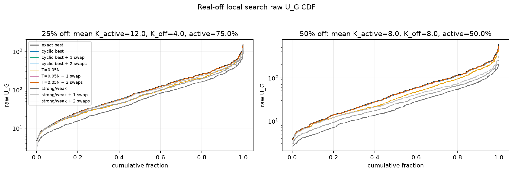
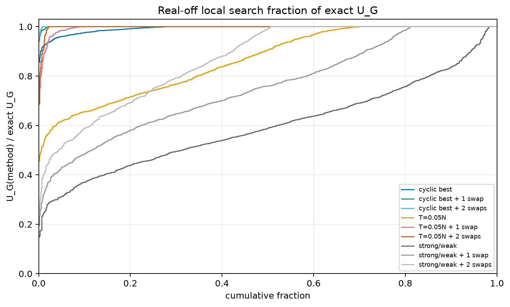
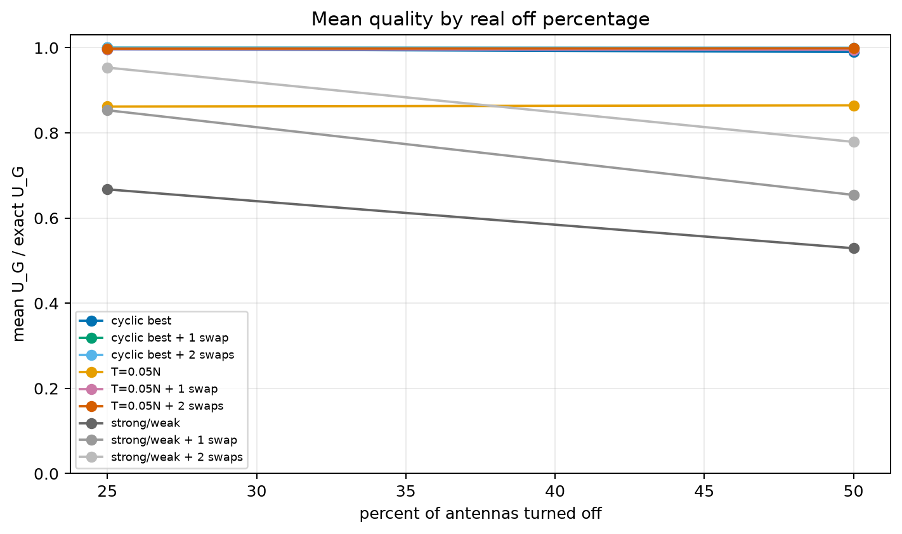
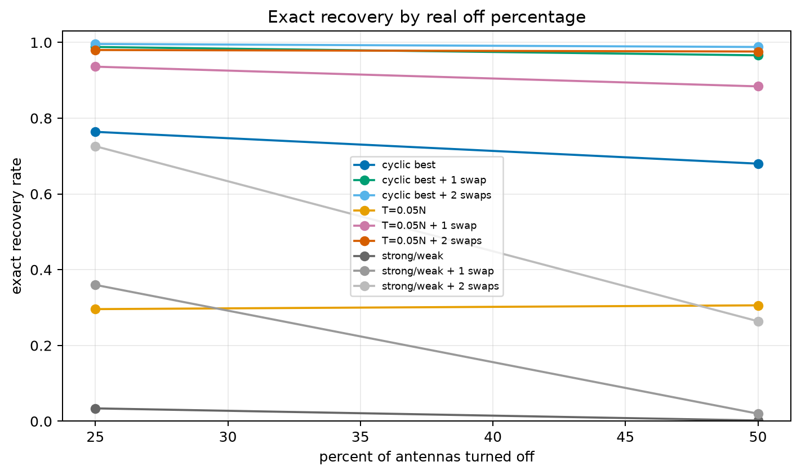
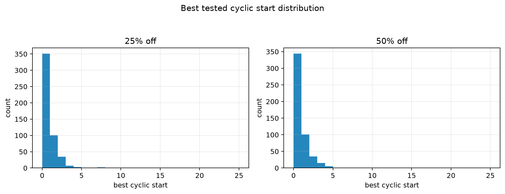
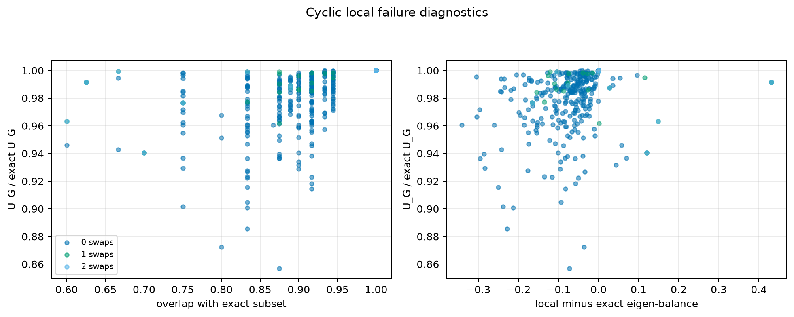
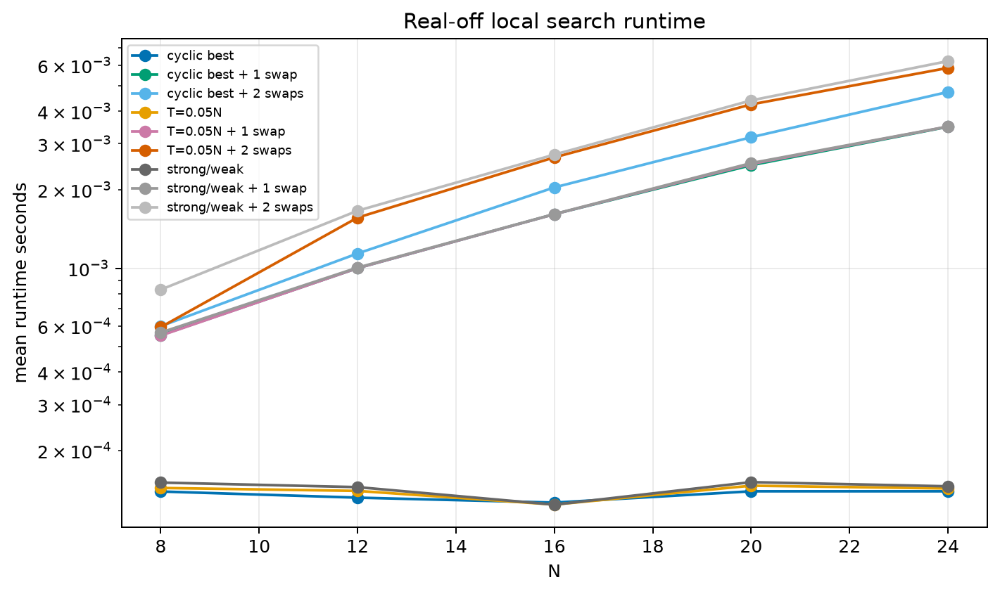

# Real-Off Cyclic Threshold Local Search Study

This report uses the real task condition: turn off a requested percentage of antennas while keeping the rest active.

## K Semantics

- `K_off = round(N * off_pct / 100)` is the number of disabled antennas.
- `K_active = N - K_off` is the number of selected/kept antennas.
- The solver variable `K` equals `K_active`; it does not mean the number of antennas turned off.
- Therefore `25% off` means `K_active = 0.75N`, and `50% off` means `K_active = 0.50N`.

## Setup

- Exact source: `results/threshold_exact_gaussian_L2_N8_12_16_20_24_Kpct25_to_50_s100`
- Profiles: gaussian
- N values: 8, 12, 16, 20, 24
- L values: 2
- Off percentages: 25, 50
- Seeds compared: best tested cyclic window, `T=round(0.05N)`, and strong/weak.
- Local search: greedy remove-one/add-one refinement by raw `U_G`, with 0, 1, or 2 swaps.

## Direct Answer

- `cyclic best`: mean fraction exact `0.9934`, p05 `0.9605`, exact recovery `72.2%`, mean swaps applied `0.000`.
- `cyclic best + 1 swap`: mean fraction exact `0.9997`, p05 `1.0000`, exact recovery `97.7%`, mean swaps applied `0.272`.
- `cyclic best + 2 swaps`: mean fraction exact `0.9998`, p05 `1.0000`, exact recovery `99.2%`, mean swaps applied `0.287`.
- `T=0.05N`: mean fraction exact `0.8632`, p05 `0.6181`, exact recovery `30.1%`, mean swaps applied `0.000`.
- `T=0.05N + 1 swap`: mean fraction exact `0.9959`, p05 `0.9851`, exact recovery `91.0%`, mean swaps applied `0.694`.
- `T=0.05N + 2 swaps`: mean fraction exact `0.9981`, p05 `1.0000`, exact recovery `97.8%`, mean swaps applied `0.770`.
- `strong/weak`: mean fraction exact `0.5982`, p05 `0.3126`, exact recovery `1.8%`, mean swaps applied `0.000`.
- `strong/weak + 1 swap`: mean fraction exact `0.7537`, p05 `0.4311`, exact recovery `19.0%`, mean swaps applied `0.923`.
- `strong/weak + 2 swaps`: mean fraction exact `0.8660`, p05 `0.5127`, exact recovery `49.5%`, mean swaps applied `1.571`.
- Two swaps improve cyclic-threshold mean exact fraction by `0.644` percentage points.
- After two swaps from cyclic best, remaining misses have mean overlap `0.744` with exact and mean swap distance `2.750` rows.

## Global Summary

| seed | swaps | cases | mean fraction exact | p05 | p50 | p95 | exact rate | near-99 rate | runtime s |
|---|---:|---:|---:|---:|---:|---:|---:|---:|---:|
| T=0.05N | 0 | 1000 | 0.8632 | 0.6181 | 0.9065 | 1.0000 | 30.1% | 34.7% | 1.396e-04 |
| T=0.05N + 1 swap | 1 | 1000 | 0.9959 | 0.9851 | 1.0000 | 1.0000 | 91.0% | 93.8% | 0.0018 |
| T=0.05N + 2 swaps | 2 | 1000 | 0.9981 | 1.0000 | 1.0000 | 1.0000 | 97.8% | 98.2% | 0.0030 |
| cyclic best | 0 | 1000 | 0.9934 | 0.9605 | 1.0000 | 1.0000 | 72.2% | 81.3% | 1.354e-04 |
| cyclic best + 1 swap | 1 | 1000 | 0.9997 | 1.0000 | 1.0000 | 1.0000 | 97.7% | 98.9% | 0.0018 |
| cyclic best + 2 swaps | 2 | 1000 | 0.9998 | 1.0000 | 1.0000 | 1.0000 | 99.2% | 99.5% | 0.0023 |
| strong/weak | 0 | 1000 | 0.5982 | 0.3126 | 0.5894 | 0.9140 | 1.8% | 2.2% | 1.434e-04 |
| strong/weak + 1 swap | 1 | 1000 | 0.7537 | 0.4311 | 0.7597 | 1.0000 | 19.0% | 19.6% | 0.0018 |
| strong/weak + 2 swaps | 2 | 1000 | 0.8660 | 0.5127 | 0.9914 | 1.0000 | 49.5% | 50.2% | 0.0032 |

## By Real Off Percentage

| off % | K semantics | seed | swaps | mean fraction exact | p05 | exact rate |
|---:|---|---|---:|---:|---:|---:|
| 25 | K_active mean 12.0, K_off mean 4.0 | T=0.05N | 0 | 0.8618 | 0.5384 | 29.6% |
| 25 | K_active mean 12.0, K_off mean 4.0 | T=0.05N + 1 swap | 1 | 0.9967 | 0.9635 | 93.6% |
| 25 | K_active mean 12.0, K_off mean 4.0 | T=0.05N + 2 swaps | 2 | 0.9977 | 0.9997 | 98.0% |
| 25 | K_active mean 12.0, K_off mean 4.0 | cyclic best | 0 | 0.9968 | 0.9772 | 76.4% |
| 25 | K_active mean 12.0, K_off mean 4.0 | cyclic best + 1 swap | 1 | 0.9999 | 1.0000 | 98.8% |
| 25 | K_active mean 12.0, K_off mean 4.0 | cyclic best + 2 swaps | 2 | 1.0000 | 1.0000 | 99.6% |
| 25 | K_active mean 12.0, K_off mean 4.0 | strong/weak | 0 | 0.6673 | 0.3738 | 3.4% |
| 25 | K_active mean 12.0, K_off mean 4.0 | strong/weak + 1 swap | 1 | 0.8531 | 0.5299 | 36.0% |
| 25 | K_active mean 12.0, K_off mean 4.0 | strong/weak + 2 swaps | 2 | 0.9533 | 0.6530 | 72.6% |
| 50 | K_active mean 8.0, K_off mean 8.0 | T=0.05N | 0 | 0.8646 | 0.5915 | 30.6% |
| 50 | K_active mean 8.0, K_off mean 8.0 | T=0.05N + 1 swap | 1 | 0.9951 | 0.8969 | 88.4% |
| 50 | K_active mean 8.0, K_off mean 8.0 | T=0.05N + 2 swaps | 2 | 0.9986 | 0.9990 | 97.6% |
| 50 | K_active mean 8.0, K_off mean 8.0 | cyclic best | 0 | 0.9900 | 0.9231 | 68.0% |
| 50 | K_active mean 8.0, K_off mean 8.0 | cyclic best + 1 swap | 1 | 0.9995 | 0.9973 | 96.6% |
| 50 | K_active mean 8.0, K_off mean 8.0 | cyclic best + 2 swaps | 2 | 0.9997 | 1.0000 | 98.8% |
| 50 | K_active mean 8.0, K_off mean 8.0 | strong/weak | 0 | 0.5291 | 0.2563 | 0.2% |
| 50 | K_active mean 8.0, K_off mean 8.0 | strong/weak + 1 swap | 1 | 0.6543 | 0.3321 | 2.0% |
| 50 | K_active mean 8.0, K_off mean 8.0 | strong/weak + 2 swaps | 2 | 0.7788 | 0.3995 | 26.4% |

## Worst Remaining Cyclic + 2-Swap Cases

| N | K_active | K_off | off % | sample | start | fraction exact | overlap | swap distance | exact subset | local subset |
|---:|---:|---:|---:|---:|---:|---:|---:|---:|---|---|
| 20 | 10 | 10 | 50 | 18 | 3 | 0.9405 | 0.700 | 3 | 1 3 4 5 6 7 8 14 15 19 | 1 3 4 6 9 13 14 15 16 19 |
| 20 | 10 | 10 | 50 | 61 | 4 | 0.9632 | 0.600 | 4 | 0 3 5 6 8 9 12 15 17 19 | 1 3 4 6 9 13 15 17 18 19 |
| 16 | 8 | 8 | 50 | 95 | 3 | 0.9768 | 0.750 | 2 | 0 3 6 7 8 10 12 15 | 0 1 3 6 10 11 12 15 |
| 24 | 18 | 6 | 25 | 96 | 2 | 0.9874 | 0.889 | 2 | 1 2 3 4 5 6 9 10 14 15 16 17 18 19 20 21 22 23 | 0 1 2 3 4 5 6 9 11 14 15 16 17 18 19 20 22 23 |
| 24 | 18 | 6 | 25 | 79 | 2 | 0.9893 | 0.889 | 2 | 1 3 4 5 6 7 8 12 13 14 15 16 17 19 20 21 22 23 | 0 1 3 4 5 6 7 8 11 12 14 15 16 17 19 20 21 23 |
| 16 | 8 | 8 | 50 | 76 | 4 | 0.9915 | 0.625 | 3 | 0 5 6 7 8 9 11 13 | 4 5 6 7 8 9 10 12 |
| 24 | 12 | 12 | 50 | 49 | 2 | 0.9991 | 0.833 | 2 | 2 6 10 11 13 15 16 17 18 21 22 23 | 2 6 8 11 12 15 16 17 18 21 22 23 |
| 24 | 12 | 12 | 50 | 95 | 0 | 0.9994 | 0.667 | 4 | 3 4 9 10 11 12 13 14 16 18 21 23 | 0 3 5 9 11 12 15 16 18 19 21 23 |

## Notes

- Exact enumeration completed for `100.0%` of cases.
- Exact rows loaded from previous artifacts for `50.0%` of cases; missing real-off cases were recomputed.
- Strong/weak under real-off semantics disables `K_off` antennas from the weakest and strongest row-power tails, then keeps the middle `K_active` antennas.
- Historical reports that say `25% active` are not the real `25% off` task. `25% active` means `75% off`.

## Plots

## Artifacts

- Detailed CSVs are packed in `csv_data.tar.gz` after the run.
- Main report: `local_threshold_real_off_report.md`.
