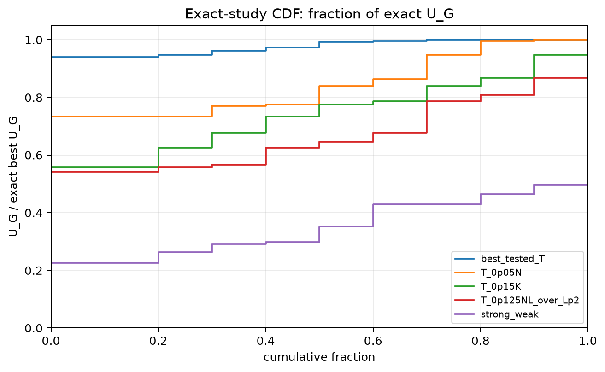
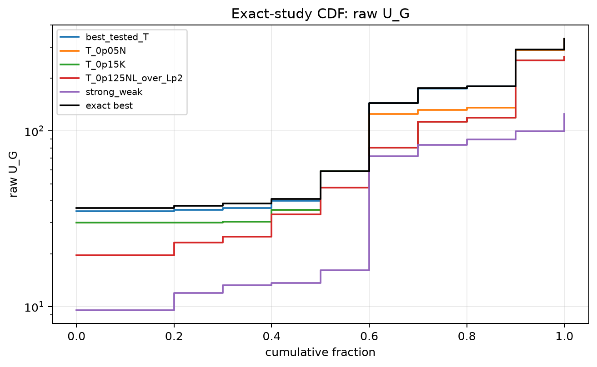
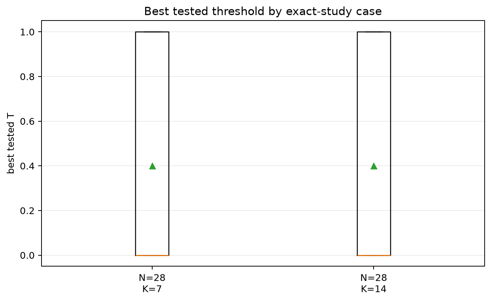
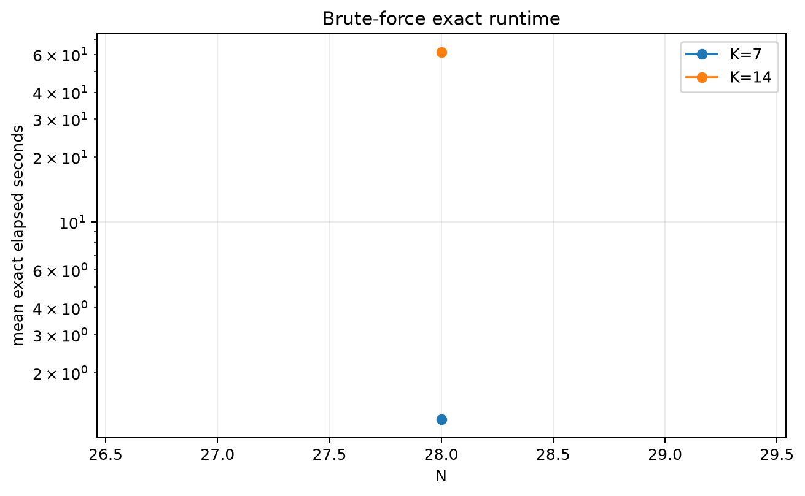
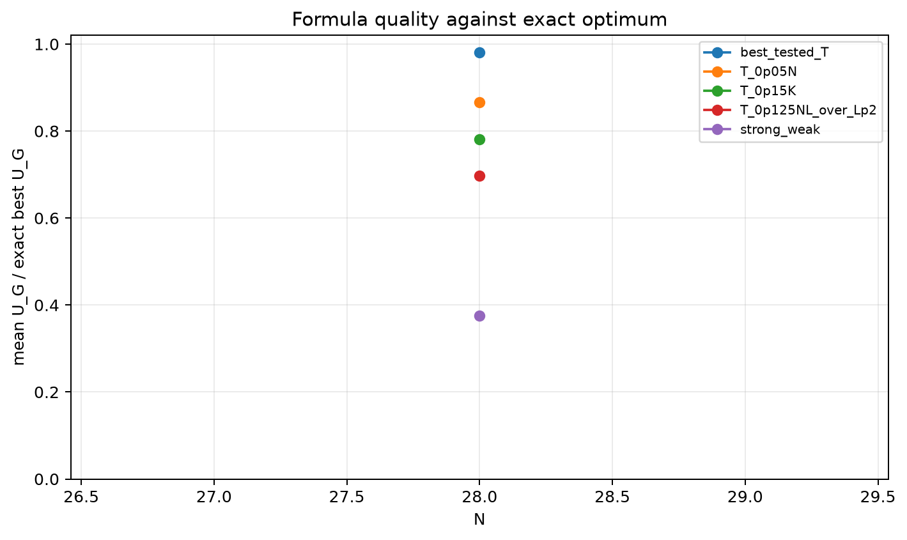

# Exact Threshold Approach Study

> Historical K semantics note: this report uses active-K semantics. Here `K` is the number of selected/kept antennas, not the number turned off. A `25% active` or `K=0.25N` case means `75% off`, not the real `25% off` task. For real off-percent experiments, `25% off => K_active=0.75N` and `50% off => K_active=0.50N`.

- N values: 28
- L: 2
- Active K percentages: 25.000, 50.000
- Samples: 5
- Generator seeds: 42
- Profiles: gaussian
- Sigma: 1.0
- Exact time limit: 180.0 seconds

The exact solver enumerates every subset of size `K` and maximizes raw `U_G`.
The threshold comparison uses the best tested shifted window from `T=0..K`.

## Direct Answer

- Exact enumeration completed for `100.0%` of cases.
- Best tested threshold-window mean fraction of exact `U_G`: `0.9812`.
- Fraction of cases where threshold window is within 99% of exact: `60.0%` on average by context.
- Exact optimum was itself a contiguous row-power window in `40.0%` of cases on average by context.

## Threshold-vs-Exact Summary

| profile | N | K | exact completed | candidates | exact time mean | best T p50 | threshold/exact mean | threshold/exact p05 | exact-window rate |
|---|---:|---:|---:|---:|---:|---:|---:|---:|---:|
| gaussian | 28 | 7 | 100.0% | 1e+06 | 1.218 | 0.000 | 0.9647 | 0.9410 | 20.0% |
| gaussian | 28 | 14 | 100.0% | 4e+07 | 61.344 | 0.000 | 0.9978 | 0.9936 | 60.0% |

## Formula And Strong/Weak Comparison

| formula | mean fraction exact | p05 fraction | exact rate | outside dense rate |
|---|---:|---:|---:|---:|
| best_tested_T | 0.9812 | 0.9673 | 40.0% | 0.0% |
| T_0p025N | 0.8658 | 0.7414 | 20.0% | 0.0% |
| T_0p10NL_over_Lp2 | 0.8658 | 0.7414 | 20.0% | 0.0% |
| T_0p05N | 0.8658 | 0.7414 | 20.0% | 0.0% |
| T_0p075NL_over_Lp2 | 0.8658 | 0.7414 | 20.0% | 0.0% |
| T_0p05NL_over_Lp2 | 0.8658 | 0.7414 | 20.0% | 0.0% |
| T_0p10K | 0.8658 | 0.7414 | 20.0% | 0.0% |
| T_0p05K | 0.8649 | 0.6846 | 10.0% | 0.0% |
| T_0p20K | 0.8191 | 0.6915 | 10.0% | 0.0% |
| T_0p15K | 0.7813 | 0.6568 | 10.0% | 0.0% |
| T_0p10N | 0.7419 | 0.6302 | 0.0% | 0.0% |
| T_0p075N | 0.6971 | 0.5591 | 0.0% | 0.0% |
| T_0p125NL_over_Lp2 | 0.6971 | 0.5591 | 0.0% | 0.0% |
| T_0p15NL_over_Lp2 | 0.6971 | 0.5591 | 0.0% | 0.0% |
| strong_weak | 0.3758 | 0.2785 | 0.0% | 50.0% |
| legacy_T100 | 0.3268 | 0.2338 | 0.0% | 0.0% |
| legacy_T25 | 0.3268 | 0.2338 | 0.0% | 0.0% |
| legacy_T50 | 0.3268 | 0.2338 | 0.0% | 0.0% |

## Exact Best Cases Found

- `N=28`, `K=14`, sample `1`: best tested `T=0` matches exact `U_G`.
- `N=28`, `K=14`, sample `2`: best tested `T=0` matches exact `U_G`.
- `N=28`, `K=7`, sample `3`: best tested `T=1` matches exact `U_G`.
- `N=28`, `K=14`, sample `3`: best tested `T=1` matches exact `U_G`.

## Worst Threshold-Window Cases Found

- `N=28`, `K=7`, sample `4`: best tested `T=0`, fraction exact `0.9395`, exact-window `False`.
- `N=28`, `K=7`, sample `0`: best tested `T=1`, fraction exact `0.9474`, exact-window `False`.
- `N=28`, `K=7`, sample `2`: best tested `T=0`, fraction exact `0.9626`, exact-window `False`.
- `N=28`, `K=7`, sample `1`: best tested `T=0`, fraction exact `0.9740`, exact-window `False`.
- `N=28`, `K=14`, sample `4`: best tested `T=0`, fraction exact `0.9931`, exact-window `False`.

## Plots

## Artifacts

- `threshold_runs.csv.gz`
- `exact_runs.csv`
- `exact_formula_runs.csv`
- `exact_summary.csv`
- `exact_formula_summary.csv`
