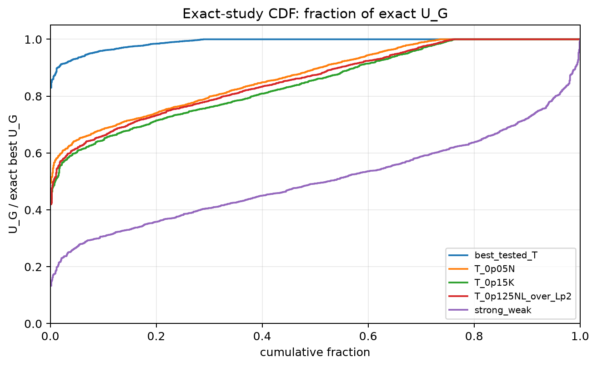
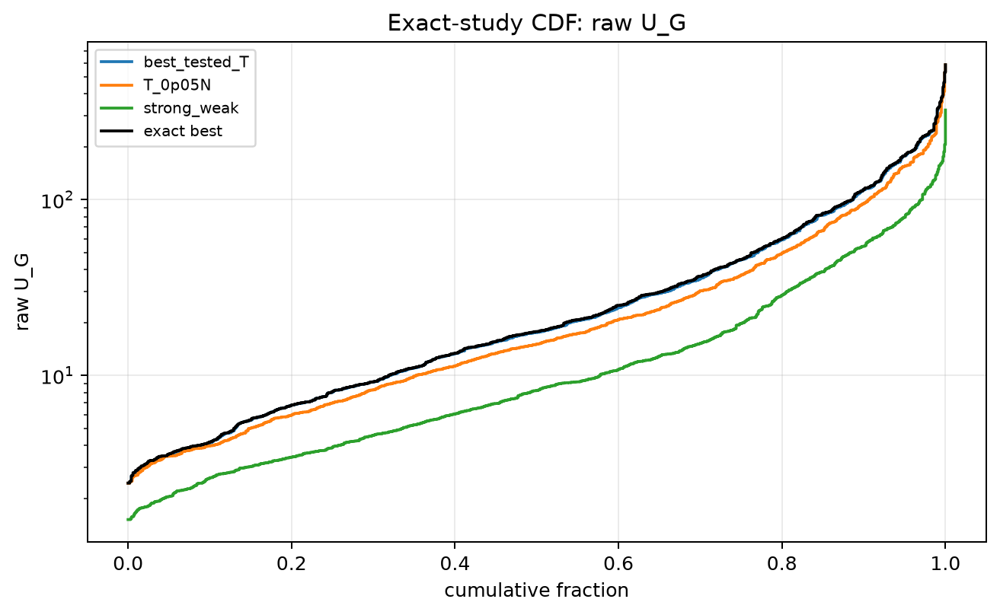
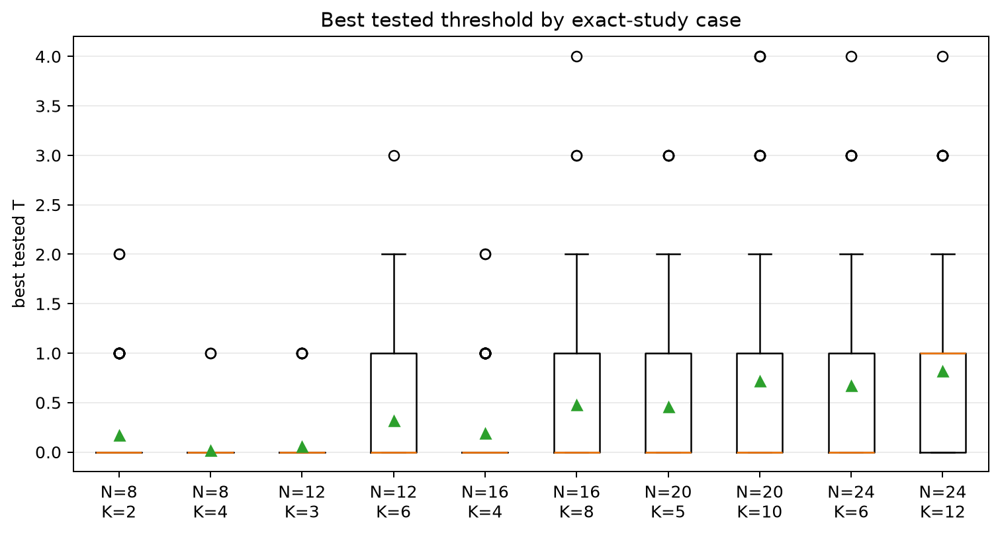
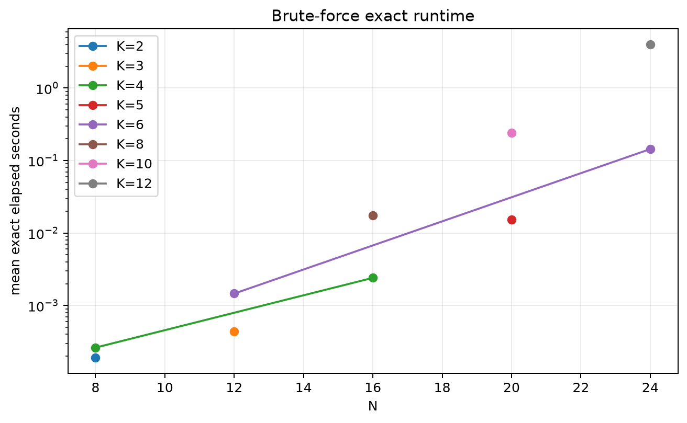
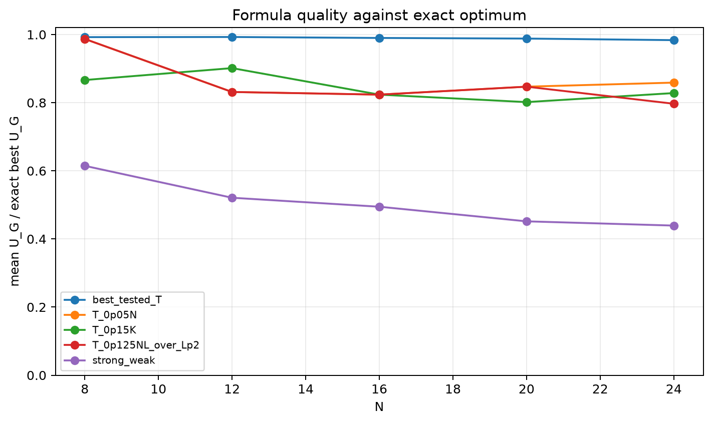

# Exact Threshold Approach Study

- N values: 8, 12, 16, 20, 24
- L: 2
- Active K percentages: 25.000, 50.000
- Samples: 100
- Generator seeds: 42
- Profiles: gaussian
- Sigma: 1.0
- Exact time limit: 120.0 seconds

The exact solver enumerates every subset of size `K` and maximizes raw `U_G`.
The threshold comparison uses the best tested shifted window from `T=0..K`.

## Direct Answer

- Exact enumeration completed for `100.0%` of cases.
- Best tested threshold-window mean fraction of exact `U_G`: `0.9894`.
- Fraction of cases where threshold window is within 99% of exact: `77.2%` on average by context.
- Exact optimum was itself a contiguous row-power window in `71.2%` of cases on average by context.

## Threshold-vs-Exact Summary

| profile | N | K | exact completed | candidates | exact time mean | best T p50 | threshold/exact mean | threshold/exact p05 | exact-window rate |
|---|---:|---:|---:|---:|---:|---:|---:|---:|---:|
| gaussian | 8 | 2 | 100.0% | 28 | 1.922e-04 | 0.000 | 0.9868 | 0.9155 | 77.0% |
| gaussian | 8 | 4 | 100.0% | 70 | 2.625e-04 | 0.000 | 0.9980 | 0.9842 | 90.0% |
| gaussian | 12 | 3 | 100.0% | 220 | 4.353e-04 | 0.000 | 0.9965 | 0.9759 | 90.0% |
| gaussian | 12 | 6 | 100.0% | 924 | 0.001 | 0.000 | 0.9890 | 0.9231 | 76.0% |
| gaussian | 16 | 4 | 100.0% | 1820 | 0.002 | 0.000 | 0.9936 | 0.9535 | 82.0% |
| gaussian | 16 | 8 | 100.0% | 12870 | 0.018 | 0.000 | 0.9863 | 0.9366 | 57.0% |
| gaussian | 20 | 5 | 100.0% | 15504 | 0.015 | 0.000 | 0.9875 | 0.9250 | 67.0% |
| gaussian | 20 | 10 | 100.0% | 184756 | 0.242 | 0.000 | 0.9888 | 0.9405 | 62.0% |
| gaussian | 24 | 6 | 100.0% | 134596 | 0.144 | 0.000 | 0.9793 | 0.9121 | 56.0% |
| gaussian | 24 | 12 | 100.0% | 3e+06 | 3.978 | 1.000 | 0.9878 | 0.9472 | 55.0% |

## Formula And Strong/Weak Comparison

| formula | mean fraction exact | p05 fraction | exact rate | outside dense rate |
|---|---:|---:|---:|---:|
| best_tested_T | 0.9894 | 0.9414 | 71.2% | 0.0% |
| T_0p05K | 0.9475 | 0.7842 | 53.9% | 0.0% |
| T_0p025N | 0.9407 | 0.7800 | 51.6% | 0.0% |
| T_0p05NL_over_Lp2 | 0.9407 | 0.7800 | 51.6% | 0.0% |
| T_0p10K | 0.9080 | 0.7657 | 43.0% | 0.0% |
| T_0p075NL_over_Lp2 | 0.8979 | 0.7482 | 38.5% | 0.0% |
| T_0p10NL_over_Lp2 | 0.8696 | 0.7076 | 26.6% | 0.0% |
| T_0p05N | 0.8696 | 0.7076 | 26.6% | 0.0% |
| T_0p125NL_over_Lp2 | 0.8572 | 0.6834 | 24.1% | 0.0% |
| T_0p15K | 0.8443 | 0.6657 | 23.8% | 0.0% |
| T_0p20K | 0.8200 | 0.6246 | 14.8% | 0.0% |
| T_0p075N | 0.7999 | 0.5945 | 8.4% | 0.0% |
| T_0p15NL_over_Lp2 | 0.7999 | 0.5945 | 8.4% | 0.0% |
| T_0p10N | 0.7797 | 0.5612 | 6.1% | 0.0% |
| strong_weak | 0.5042 | 0.3041 | 0.1% | 50.0% |
| legacy_T100 | 0.4215 | 0.2578 | 0.1% | 0.0% |
| legacy_T25 | 0.4215 | 0.2578 | 0.1% | 0.0% |
| legacy_T50 | 0.4215 | 0.2578 | 0.1% | 0.0% |

## Exact Best Cases Found

- `N=8`, `K=4`, sample `0`: best tested `T=0` matches exact `U_G`.
- `N=8`, `K=4`, sample `2`: best tested `T=0` matches exact `U_G`.
- `N=8`, `K=4`, sample `3`: best tested `T=0` matches exact `U_G`.
- `N=8`, `K=2`, sample `4`: best tested `T=0` matches exact `U_G`.
- `N=8`, `K=4`, sample `4`: best tested `T=0` matches exact `U_G`.

## Worst Threshold-Window Cases Found

- `N=24`, `K=6`, sample `40`: best tested `T=0`, fraction exact `0.8296`, exact-window `False`.
- `N=8`, `K=2`, sample `77`: best tested `T=0`, fraction exact `0.8490`, exact-window `False`.
- `N=16`, `K=8`, sample `65`: best tested `T=0`, fraction exact `0.8569`, exact-window `False`.
- `N=20`, `K=5`, sample `56`: best tested `T=0`, fraction exact `0.8593`, exact-window `False`.
- `N=24`, `K=6`, sample `15`: best tested `T=2`, fraction exact `0.8598`, exact-window `False`.

## Plots

## Artifacts

- `threshold_runs.csv.gz`
- `exact_runs.csv`
- `exact_formula_runs.csv`
- `exact_summary.csv`
- `exact_formula_summary.csv`
