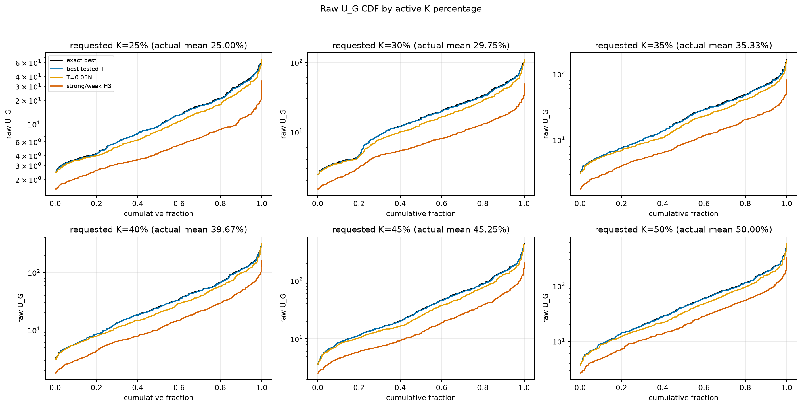
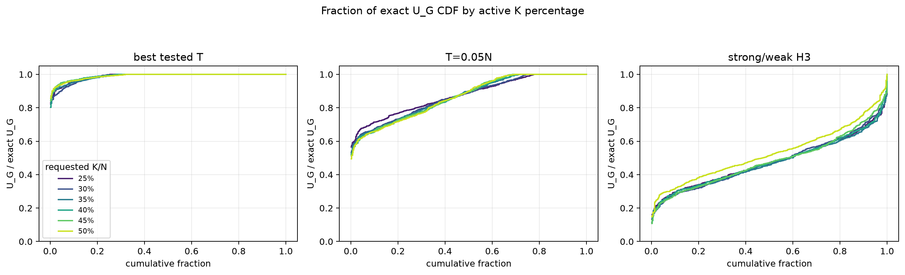
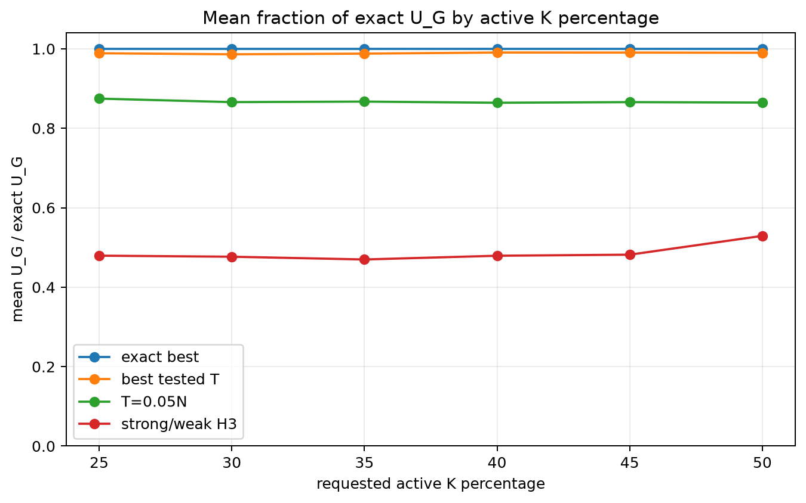
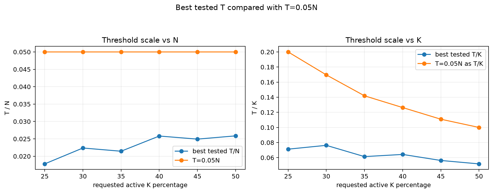

# Exact Study: K-Percentage Dependence

This report compares exact best, best tested threshold, `T=0.05N`, and strong/weak H3 across requested active K percentages.
For small `N`, different requested percentages can round to the same integer `K`; the tables include the mean actual `100*K/N` percentage.

## Direct Answer

- Best tested threshold stays close to exact across K percentages: mean fraction range `0.9862..0.9906`.
- `T=0.05N` is weaker than best tested T: mean fraction range `0.8642..0.8746`.
- Strong/weak H3 remains far below exact on this exact small-N Gaussian grid: mean fraction range `0.4697..0.5291`.
- Best tested `T/N` is small: mean range `0.0178..0.0259`, while `T=0.05N` is fixed at `0.0500`.

## Rule Quality By Requested K Percentage

| requested K% | actual K% mean | rule | mean fraction exact | p05 fraction | exact rate | mean raw U_G |
|---:|---:|---|---:|---:|---:|---:|
| 25 | 25.00 | T=0.05N | 0.8746 | 0.6787 | 22.6% | 12.128 |
| 25 | 25.00 | best tested T | 0.9888 | 0.9244 | 74.4% | 14.024 |
| 25 | 25.00 | exact best | 1.0000 | 1.0000 | 100.0% | 14.246 |
| 25 | 25.00 | strong/weak H3 | 0.4793 | 0.2546 | 0.0% | 5.775 |
| 30 | 29.75 | T=0.05N | 0.8658 | 0.6482 | 25.2% | 18.121 |
| 30 | 29.75 | best tested T | 0.9862 | 0.9085 | 70.0% | 21.138 |
| 30 | 29.75 | exact best | 1.0000 | 1.0000 | 100.0% | 21.523 |
| 30 | 29.75 | strong/weak H3 | 0.4766 | 0.2377 | 0.0% | 8.471 |
| 35 | 35.33 | T=0.05N | 0.8671 | 0.6410 | 28.4% | 25.450 |
| 35 | 35.33 | best tested T | 0.9878 | 0.9258 | 68.8% | 29.597 |
| 35 | 35.33 | exact best | 1.0000 | 1.0000 | 100.0% | 30.159 |
| 35 | 35.33 | strong/weak H3 | 0.4697 | 0.2457 | 0.0% | 12.197 |
| 40 | 39.67 | T=0.05N | 0.8642 | 0.6316 | 28.6% | 37.531 |
| 40 | 39.67 | best tested T | 0.9906 | 0.9431 | 71.2% | 43.639 |
| 40 | 39.67 | exact best | 1.0000 | 1.0000 | 100.0% | 44.268 |
| 40 | 39.67 | strong/weak H3 | 0.4791 | 0.2516 | 0.2% | 19.027 |
| 45 | 45.25 | T=0.05N | 0.8658 | 0.6264 | 31.2% | 48.399 |
| 45 | 45.25 | best tested T | 0.9905 | 0.9515 | 68.6% | 56.123 |
| 45 | 45.25 | exact best | 1.0000 | 1.0000 | 100.0% | 56.872 |
| 45 | 45.25 | strong/weak H3 | 0.4818 | 0.2367 | 0.2% | 23.920 |
| 50 | 50.00 | T=0.05N | 0.8646 | 0.6255 | 30.6% | 60.947 |
| 50 | 50.00 | best tested T | 0.9900 | 0.9405 | 68.0% | 70.791 |
| 50 | 50.00 | exact best | 1.0000 | 1.0000 | 100.0% | 71.649 |
| 50 | 50.00 | strong/weak H3 | 0.5291 | 0.2932 | 0.2% | 33.965 |

## Best T Dependence

| requested K% | actual K% mean | best T mean | best T p50 | best T/N mean | best T/K mean | T=0.05N as T/K | exact-window rate |
|---:|---:|---:|---:|---:|---:|---:|---:|
| 25 | 25.00 | 0.310 | 0.000 | 0.0178 | 0.0712 | 0.2000 | 74.4% |
| 30 | 29.75 | 0.376 | 0.000 | 0.0224 | 0.0763 | 0.1696 | 70.0% |
| 35 | 35.33 | 0.394 | 0.000 | 0.0215 | 0.0614 | 0.1419 | 68.8% |
| 40 | 39.67 | 0.474 | 0.000 | 0.0258 | 0.0643 | 0.1263 | 71.2% |
| 45 | 45.25 | 0.458 | 0.000 | 0.0249 | 0.0563 | 0.1109 | 68.6% |
| 50 | 50.00 | 0.472 | 0.000 | 0.0259 | 0.0517 | 0.1000 | 68.0% |

## Plots

## Artifacts

- `exact_k_pct_rule_runs.csv`
- `exact_k_pct_rule_summary.csv`
- `exact_k_pct_best_t_summary.csv`
