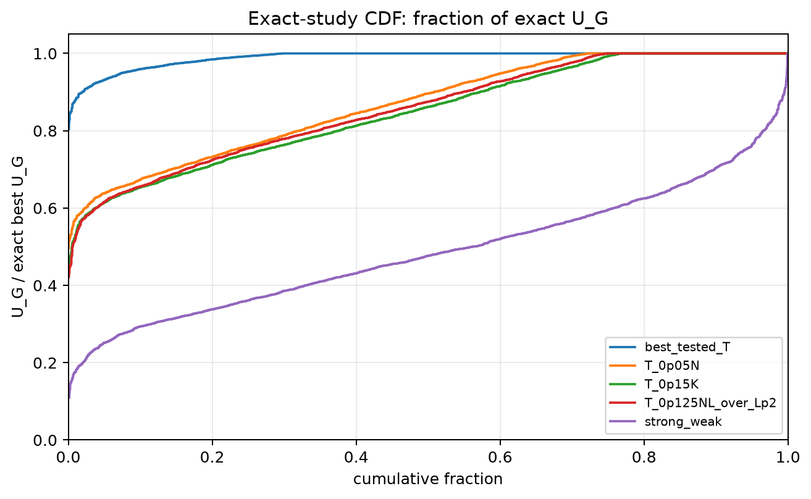
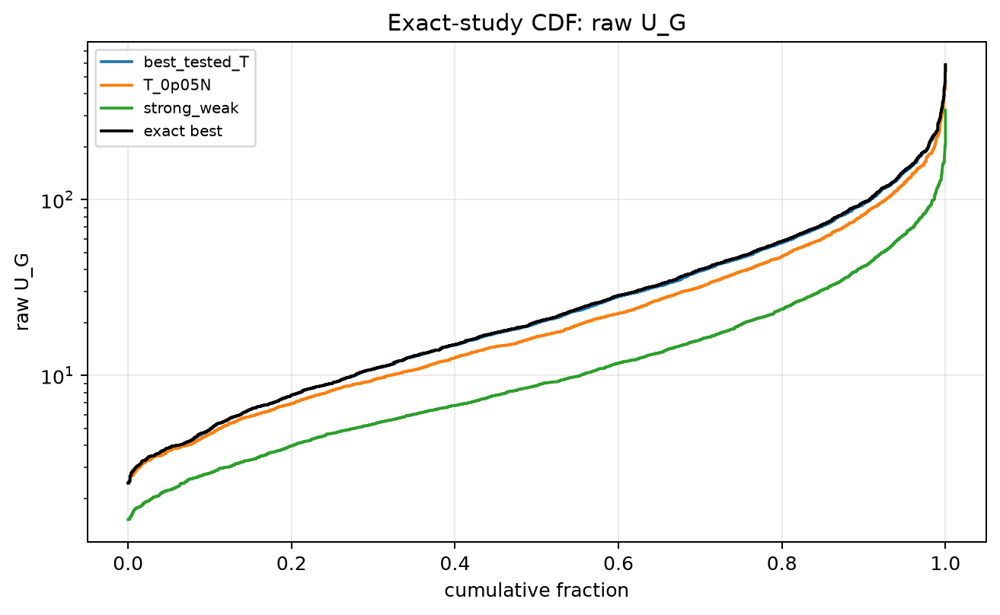
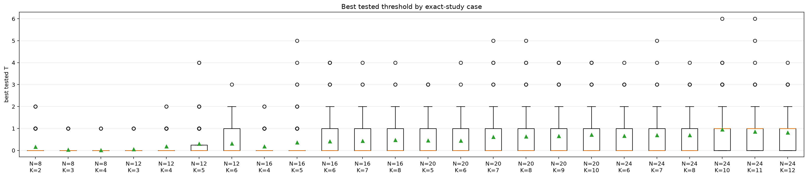
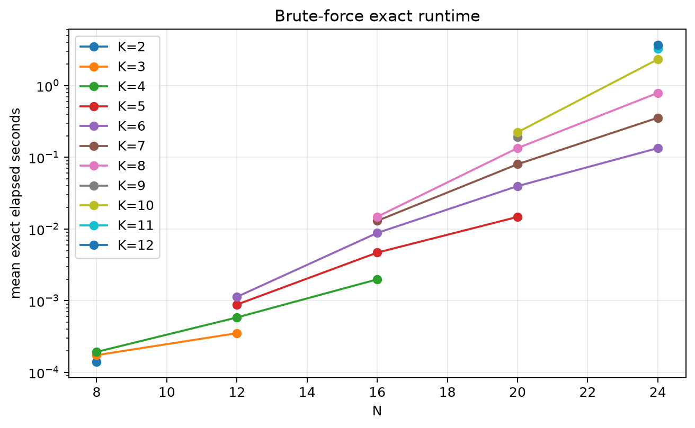
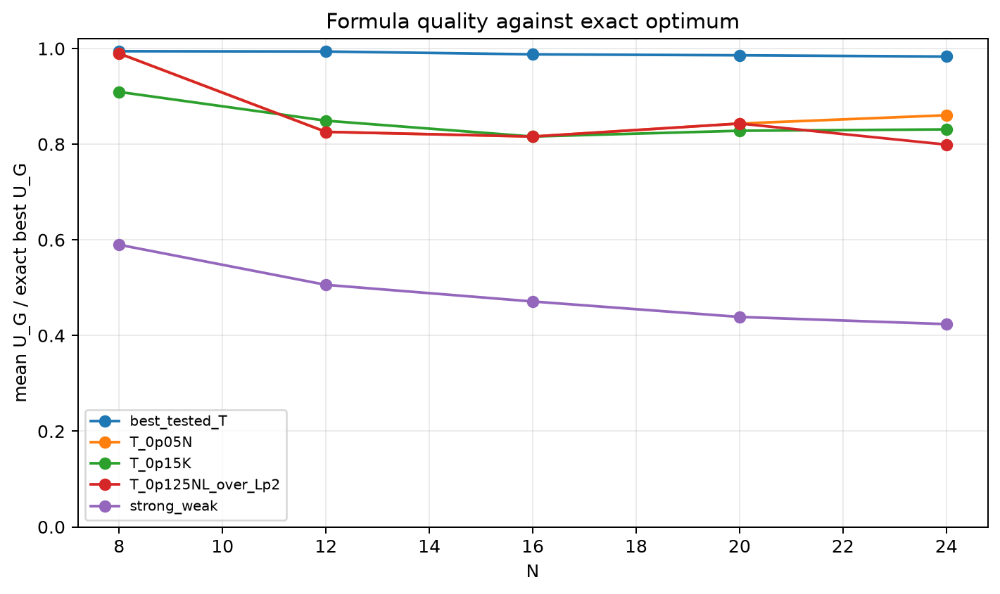

# Exact Threshold Approach Study

- N values: 8, 12, 16, 20, 24
- L: 2
- Active K percentages: 25.000, 30.000, 35.000, 40.000, 45.000, 50.000
- Samples: 100
- Generator seeds: 42
- Profiles: gaussian
- Sigma: 1.0
- Exact time limit: 120.0 seconds

The exact solver enumerates every subset of size `K` and maximizes raw `U_G`.
The threshold comparison uses the best tested shifted window from `T=0..K`.

## Direct Answer

- Exact enumeration completed for `100.0%` of cases.
- Best tested threshold-window mean fraction of exact `U_G`: `0.9890`.
- Fraction of cases where threshold window is within 99% of exact: `77.1%` on average by context.
- Exact optimum was itself a contiguous row-power window in `70.2%` of cases on average by context.

## Threshold-vs-Exact Summary

| profile | N | K | exact completed | candidates | exact time mean | best T p50 | threshold/exact mean | threshold/exact p05 | exact-window rate |
|---|---:|---:|---:|---:|---:|---:|---:|---:|---:|
| gaussian | 8 | 2 | 100.0% | 28 | 1.400e-04 | 0.000 | 0.9868 | 0.9155 | 77.0% |
| gaussian | 8 | 2 | 100.0% | 28 | 1.427e-04 | 0.000 | 0.9868 | 0.9155 | 77.0% |
| gaussian | 8 | 3 | 100.0% | 56 | 1.735e-04 | 0.000 | 0.9982 | 0.9947 | 91.0% |
| gaussian | 8 | 3 | 100.0% | 56 | 1.750e-04 | 0.000 | 0.9982 | 0.9947 | 91.0% |
| gaussian | 8 | 4 | 100.0% | 70 | 1.917e-04 | 0.000 | 0.9980 | 0.9842 | 90.0% |
| gaussian | 8 | 4 | 100.0% | 70 | 1.948e-04 | 0.000 | 0.9980 | 0.9842 | 90.0% |
| gaussian | 12 | 3 | 100.0% | 220 | 3.527e-04 | 0.000 | 0.9965 | 0.9759 | 90.0% |
| gaussian | 12 | 4 | 100.0% | 495 | 5.833e-04 | 0.000 | 0.9928 | 0.9258 | 83.0% |
| gaussian | 12 | 4 | 100.0% | 495 | 5.858e-04 | 0.000 | 0.9928 | 0.9258 | 83.0% |
| gaussian | 12 | 5 | 100.0% | 792 | 8.662e-04 | 0.000 | 0.9956 | 0.9657 | 84.0% |
| gaussian | 12 | 5 | 100.0% | 792 | 9.033e-04 | 0.000 | 0.9956 | 0.9657 | 84.0% |
| gaussian | 12 | 6 | 100.0% | 924 | 0.001 | 0.000 | 0.9890 | 0.9231 | 76.0% |
| gaussian | 16 | 4 | 100.0% | 1820 | 0.002 | 0.000 | 0.9936 | 0.9535 | 82.0% |
| gaussian | 16 | 5 | 100.0% | 4368 | 0.005 | 0.000 | 0.9890 | 0.9085 | 76.0% |
| gaussian | 16 | 6 | 100.0% | 8008 | 0.009 | 0.000 | 0.9859 | 0.9289 | 65.0% |
| gaussian | 16 | 6 | 100.0% | 8008 | 0.009 | 0.000 | 0.9859 | 0.9289 | 65.0% |
| gaussian | 16 | 7 | 100.0% | 11440 | 0.013 | 0.000 | 0.9862 | 0.9126 | 63.0% |
| gaussian | 16 | 8 | 100.0% | 12870 | 0.015 | 0.000 | 0.9863 | 0.9366 | 57.0% |
| gaussian | 20 | 5 | 100.0% | 15504 | 0.015 | 0.000 | 0.9875 | 0.9250 | 67.0% |
| gaussian | 20 | 6 | 100.0% | 38760 | 0.040 | 0.000 | 0.9837 | 0.8997 | 63.0% |
| gaussian | 20 | 7 | 100.0% | 77520 | 0.080 | 0.000 | 0.9834 | 0.9121 | 57.0% |
| gaussian | 20 | 8 | 100.0% | 125970 | 0.134 | 0.000 | 0.9859 | 0.9376 | 58.0% |
| gaussian | 20 | 9 | 100.0% | 167960 | 0.192 | 0.000 | 0.9855 | 0.9405 | 50.0% |
| gaussian | 20 | 10 | 100.0% | 184756 | 0.224 | 0.000 | 0.9888 | 0.9405 | 62.0% |
| gaussian | 24 | 6 | 100.0% | 134596 | 0.134 | 0.000 | 0.9793 | 0.9121 | 56.0% |
| gaussian | 24 | 7 | 100.0% | 346104 | 0.356 | 0.000 | 0.9786 | 0.8978 | 51.0% |
| gaussian | 24 | 8 | 100.0% | 735471 | 0.791 | 0.000 | 0.9787 | 0.9236 | 48.0% |
| gaussian | 24 | 10 | 100.0% | 2e+06 | 2.327 | 1.000 | 0.9875 | 0.9234 | 58.0% |
| gaussian | 24 | 11 | 100.0% | 2e+06 | 3.252 | 1.000 | 0.9871 | 0.9476 | 56.0% |
| gaussian | 24 | 12 | 100.0% | 3e+06 | 3.669 | 1.000 | 0.9878 | 0.9472 | 55.0% |

## Formula And Strong/Weak Comparison

| formula | mean fraction exact | p05 fraction | exact rate | outside dense rate |
|---|---:|---:|---:|---:|
| best_tested_T | 0.9890 | 0.9382 | 70.2% | 0.0% |
| T_0p05K | 0.9460 | 0.7754 | 52.2% | 0.0% |
| T_0p025N | 0.9395 | 0.7758 | 50.7% | 0.0% |
| T_0p05NL_over_Lp2 | 0.9395 | 0.7758 | 50.7% | 0.0% |
| T_0p10K | 0.9047 | 0.7592 | 41.1% | 0.0% |
| T_0p075NL_over_Lp2 | 0.8965 | 0.7458 | 38.2% | 0.0% |
| T_0p10NL_over_Lp2 | 0.8670 | 0.7004 | 27.8% | 0.0% |
| T_0p05N | 0.8670 | 0.7004 | 27.8% | 0.0% |
| T_0p125NL_over_Lp2 | 0.8547 | 0.6779 | 25.1% | 0.0% |
| T_0p15K | 0.8467 | 0.6672 | 23.1% | 0.0% |
| T_0p20K | 0.8181 | 0.6191 | 13.4% | 0.0% |
| T_0p075N | 0.7985 | 0.5900 | 8.5% | 0.0% |
| T_0p15NL_over_Lp2 | 0.7985 | 0.5900 | 8.5% | 0.0% |
| T_0p10N | 0.7785 | 0.5572 | 6.7% | 0.0% |
| strong_weak | 0.4859 | 0.2806 | 0.1% | 30.0% |
| legacy_T100 | 0.4220 | 0.2433 | 0.1% | 0.0% |
| legacy_T25 | 0.4220 | 0.2433 | 0.1% | 0.0% |
| legacy_T50 | 0.4220 | 0.2433 | 0.1% | 0.0% |

## Exact Best Cases Found

- `N=8`, `K=3`, sample `0`: best tested `T=0` matches exact `U_G`.
- `N=8`, `K=3`, sample `0`: best tested `T=0` matches exact `U_G`.
- `N=8`, `K=4`, sample `0`: best tested `T=0` matches exact `U_G`.
- `N=8`, `K=4`, sample `0`: best tested `T=0` matches exact `U_G`.
- `N=8`, `K=3`, sample `1`: best tested `T=0` matches exact `U_G`.

## Worst Threshold-Window Cases Found

- `N=16`, `K=6`, sample `37`: best tested `T=3`, fraction exact `0.8035`, exact-window `False`.
- `N=16`, `K=6`, sample `37`: best tested `T=3`, fraction exact `0.8035`, exact-window `False`.
- `N=24`, `K=7`, sample `5`: best tested `T=0`, fraction exact `0.8216`, exact-window `False`.
- `N=20`, `K=7`, sample `6`: best tested `T=0`, fraction exact `0.8264`, exact-window `False`.
- `N=24`, `K=6`, sample `40`: best tested `T=0`, fraction exact `0.8296`, exact-window `False`.

## Plots

## Artifacts

- `threshold_runs.csv.gz`
- `exact_runs.csv`
- `exact_formula_runs.csv`
- `exact_summary.csv`
- `exact_formula_summary.csv`
