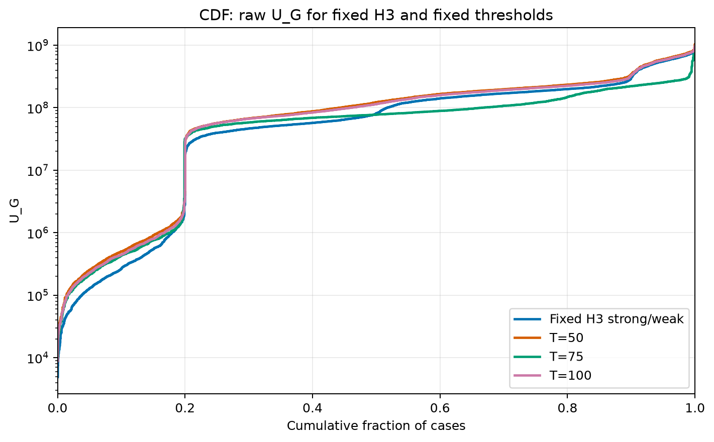
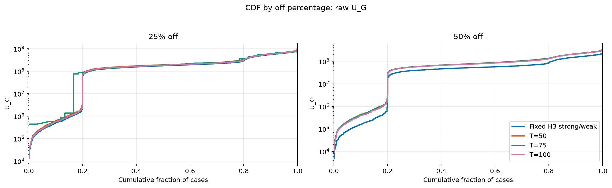
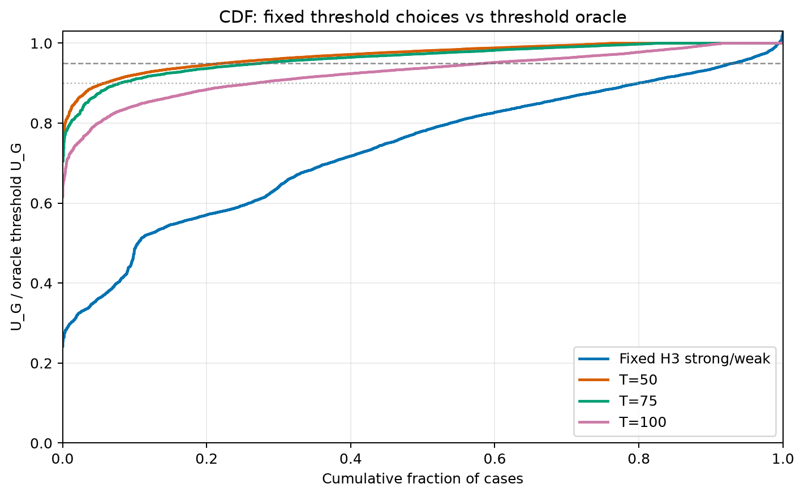
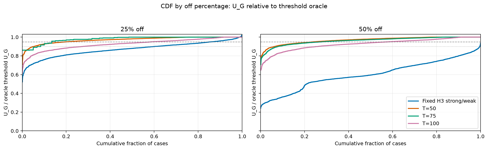
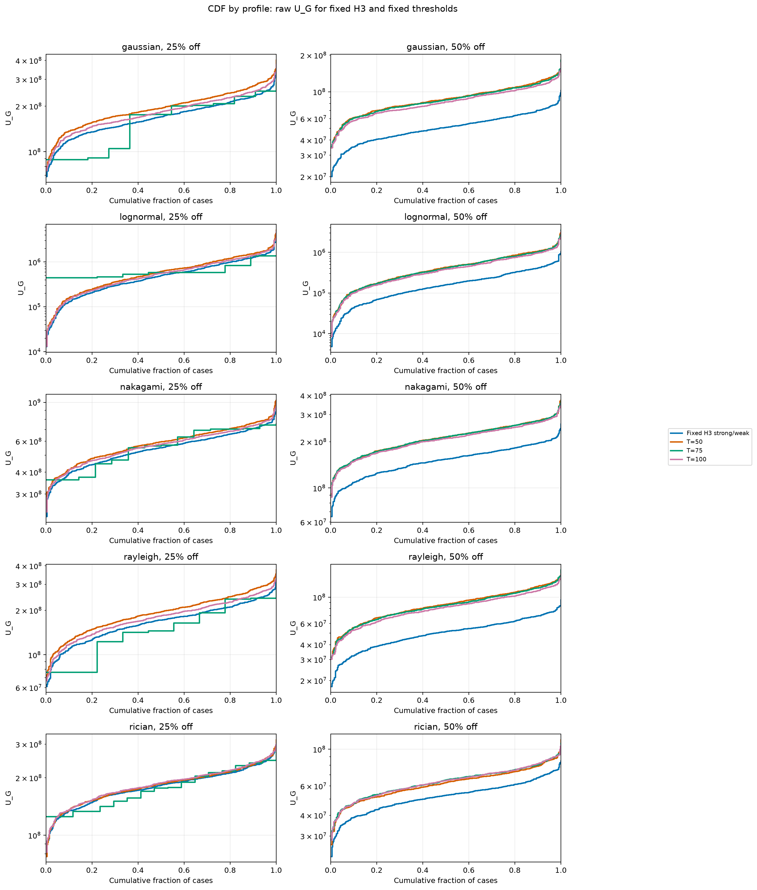
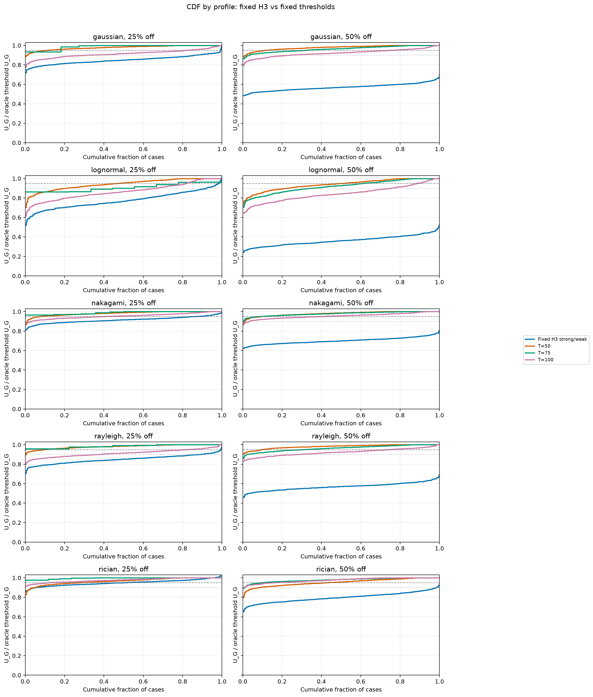

# Clear Threshold Exploration Report

Data source: `results/threshold_exploration_L2`.

## Direct Answer

- A reliable single-metric formula for `T` was **not supported** by this experiment. The strongest simple distribution-metric correlations with per-case best `T` stay weak, roughly below `0.31` in absolute value.
- The useful threshold band for `L=2, N=1000` is nevertheless clear: best per-case `T` values mostly live around `40..80`, with an overall median of `50` and central 80% interval about `38..86`.
- Among fixed thresholds available for every case, `T=50` is the best global choice: mean `U_G(T)/oracle_T = 0.9689`, 5th percentile `0.8952`, and mean gap `3.11%`.
- Rician-like cases shift to the right: `T=75..100` is better there. For all other tested profiles, `T=50` is the safest fixed value.
- Interpreted as a rule for this experiment: use `T ≈ 0.05N` as a first fixed prior; if the channel family is known to be Rician-like, check `T ≈ 0.075N..0.10N`. The current metrics are not enough to choose this shift automatically with confidence.

## Overall Fixed Threshold Ranking

Raw `U_G` CDFs below do not use the best-tested/oracle threshold normalization.

For reference, the next normalized plots divide every curve by the best tested
threshold on the same case.

| T | coverage | mean U_G/oracle | p05 U_G/oracle | winner rate | mean gap % |
|---:|---:|---:|---:|---:|---:|
| 50 | 1.000 | 0.9689 | 0.8952 | 0.2355 | 3.11 |
| 100 | 1.000 | 0.9254 | 0.8008 | 0.0833 | 7.46 |
| 25 | 1.000 | 0.8973 | 0.7493 | 0.0465 | 10.27 |
| 10 | 1.000 | 0.7427 | 0.4674 | 0.0020 | 25.73 |
| 200 | 1.000 | 0.6865 | 0.4562 | 5.0000e-04 | 31.35 |
| 5 | 1.000 | 0.6370 | 0.3140 | 0.0000 | 36.30 |
| 2 | 1.000 | 0.5310 | 0.1884 | 0.0000 | 46.90 |
| 1 | 1.000 | 0.4716 | 0.1283 | 0.0000 | 52.84 |

## Best-T Diapason By Profile

| profile | off % | K | p10 | p25 | median | p75 | p90 | mean T/N | mean T/off_count |
|---|---:|---:|---:|---:|---:|---:|---:|---:|---:|
| gaussian | 25.000 | 750 | 38.0 | 38.0 | 48.0 | 50.2 | 78.0 | 0.0507 | 0.2026 |
| gaussian | 50.000 | 500 | 25.0 | 44.0 | 50.0 | 75.0 | 77.0 | 0.0530 | 0.1060 |
| lognormal | 25.000 | 750 | 32.0 | 38.0 | 50.0 | 64.0 | 80.0 | 0.0533 | 0.2134 |
| lognormal | 50.000 | 500 | 28.9 | 38.0 | 50.0 | 66.0 | 75.0 | 0.0518 | 0.1035 |
| nakagami | 25.000 | 750 | 38.0 | 44.0 | 50.0 | 77.0 | 84.0 | 0.0588 | 0.2352 |
| nakagami | 50.000 | 500 | 38.0 | 47.8 | 50.0 | 75.0 | 83.0 | 0.0602 | 0.1205 |
| rayleigh | 25.000 | 750 | 38.0 | 38.0 | 47.5 | 50.0 | 77.0 | 0.0494 | 0.1977 |
| rayleigh | 50.000 | 500 | 33.5 | 44.0 | 50.0 | 74.0 | 76.0 | 0.0530 | 0.1061 |
| rician | 25.000 | 750 | 50.0 | 50.0 | 79.0 | 88.0 | 100.0 | 0.0748 | 0.2993 |
| rician | 50.000 | 500 | 50.0 | 75.0 | 80.5 | 100.0 | 103.2 | 0.0862 | 0.1723 |

## Fixed H3 Strong/Weak Comparison

Fixed H3 here means the existing strong/weak idea: split the disabled antennas between the weakest and strongest row-power tails. The table compares it against the threshold oracle and against fixed `T=50`.

Raw `U_G` CDF by profile:

Normalized CDF by profile:

| profile | off % | K | H3/oracle | H3 p05/oracle | T50/oracle | T50/H3 | T75/oracle | T100/oracle |
|---|---:|---:|---:|---:|---:|---:|---:|---:|
| gaussian | 25.000 | 750 | 0.8502 | 0.7804 | 0.9790 | 1.155 | 0.9923 | 0.9150 |
| gaussian | 50.000 | 500 | 0.5711 | 0.5152 | 0.9790 | 1.722 | 0.9640 | 0.9234 |
| lognormal | 25.000 | 750 | 0.7767 | 0.6444 | 0.9432 | 1.231 | 0.9197 | 0.8675 |
| lognormal | 50.000 | 500 | 0.3629 | 0.2839 | 0.9402 | 2.643 | 0.9196 | 0.8453 |
| nakagami | 25.000 | 750 | 0.9150 | 0.8602 | 0.9825 | 1.075 | 0.9909 | 0.9556 |
| nakagami | 50.000 | 500 | 0.7020 | 0.6497 | 0.9809 | 1.401 | 0.9793 | 0.9569 |
| rayleigh | 25.000 | 750 | 0.8507 | 0.7806 | 0.9812 | 1.156 | 0.9887 | 0.9140 |
| rayleigh | 50.000 | 500 | 0.5707 | 0.5084 | 0.9823 | 1.729 | 0.9646 | 0.9233 |
| rician | 25.000 | 750 | 0.9501 | 0.9007 | 0.9665 | 1.018 | 0.9972 | 0.9768 |
| rician | 50.000 | 500 | 0.7992 | 0.7195 | 0.9544 | 1.199 | 0.9788 | 0.9766 |

## Interpretation

- Overall fixed H3 reaches only `0.7349` of the threshold oracle on average.
- Fixed `T=50` reaches `0.9689` of the threshold oracle on average and is `1.433x` H3 on average.
- Fixed `T=75` is close globally at `0.9619`, and is especially useful for 50% off and Rician-like cases.
- Fixed `T=100` is useful for Rician but too large for the full mixed suite, with global mean `0.9254`.
- The best normalization is closer to absolute `T/N` than to `T/off_count`: the best medians stay near `T=50` for both 25% and 50% off.

## Generated Supporting Files

- `threshold_best_t_distribution.csv`
- `threshold_fixed_t_summary.csv`
- `threshold_global_fixed_t_summary.csv`
- `threshold_h3_comparison.csv`
- `threshold_h3_summary.csv`
- `threshold_cdf_raw_u_g_fixed_vs_h3.png`
- `threshold_cdf_raw_u_g_fixed_vs_h3_by_off_pct.png`
- `threshold_cdf_raw_u_g_fixed_vs_h3_by_profile.png`
- `threshold_cdf_fixed_vs_h3.png`
- `threshold_cdf_fixed_vs_h3_by_off_pct.png`
- `threshold_cdf_fixed_vs_h3_by_profile.png`
