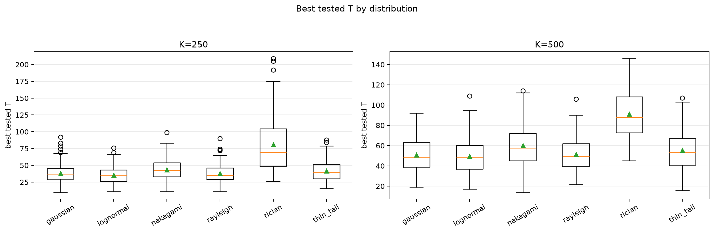
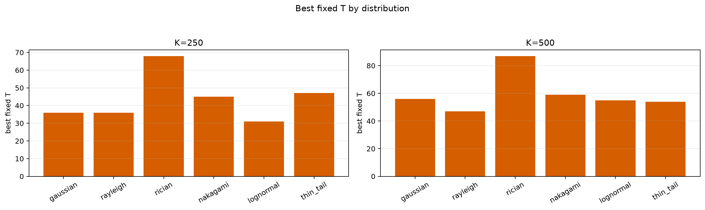
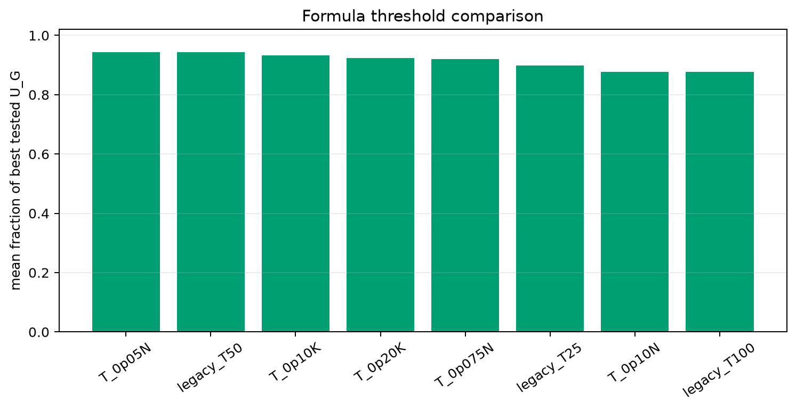

# Threshold Full Sweep: All Distributions

> Historical K semantics note: this report uses active-K semantics. Here `K` is the number of selected/kept antennas, not the number turned off. A `25% active` or `K=0.25N` case means `75% off`, not the real `25% off` task. For real off-percent experiments, `25% off => K_active=0.75N` and `50% off => K_active=0.50N`.

- N: 1000
- L: 2
- K values: 500, 250
- Samples: 100
- Generator seeds: 42
- Profiles: gaussian, rayleigh, rician, nakagami, lognormal, thin_tail
- Sigma: 1.0

## Direct Answer

- Best simple formula overall: `T_0p05N` with mean fraction of best tested `U_G = 0.9439`.
- A single global formula is acceptable only if its per-distribution rows stay close in the table below; otherwise use the reported 99% diapason per distribution.
- Scaling is reported both as `T/N` and `T/K`; compare those columns to see which is more stable.

## Distribution Comparison

| profile | K | best fixed T | 99% diapason | best tested T median | T/N mean | T/K mean | best formula | formula fraction |
|---|---:|---:|---|---:|---:|---:|---|---:|
| gaussian | 250 | 36 | 30..48 | 36.000 | 0.0383 | 0.1532 | T_0p05N | 0.9514 |
| gaussian | 500 | 56 | 36..69 | 48.000 | 0.0510 | 0.1020 | T_0p05N | 0.9611 |
| rayleigh | 250 | 36 | 29..50 | 35.000 | 0.0383 | 0.1532 | T_0p05N | 0.9554 |
| rayleigh | 500 | 47 | 40..68 | 49.500 | 0.0515 | 0.1030 | T_0p05N | 0.9647 |
| rician | 250 | 68 | 49..89 | 69.000 | 0.0808 | 0.3233 | T_0p075N | 0.9403 |
| rician | 500 | 87 | 67..112 | 88.000 | 0.0912 | 0.1824 | T_0p075N | 0.9659 |
| nakagami | 250 | 45 | 35..61 | 42.500 | 0.0438 | 0.1752 | T_0p05N | 0.9695 |
| nakagami | 500 | 59 | 45..79 | 57.000 | 0.0602 | 0.1204 | T_0p05N | 0.9700 |
| lognormal | 250 | 31 | 30..32 | 34.500 | 0.0357 | 0.1426 | T_0p05N | 0.8765 |
| lognormal | 500 | 55 | 50..61 | 48.000 | 0.0497 | 0.0993 | T_0p05N | 0.9059 |
| thin_tail | 250 | 47 | 38..54 | 40.000 | 0.0419 | 0.1677 | T_0p05N | 0.9429 |
| thin_tail | 500 | 54 | 47..65 | 53.500 | 0.0554 | 0.1107 | T_0p05N | 0.9498 |

## Combined Plots

## Artifacts

- `all_best_thresholds.csv`
- `all_threshold_best_t_stats.csv`
- `all_distribution_comparison.csv`
- `all_formula_comparison.csv`
