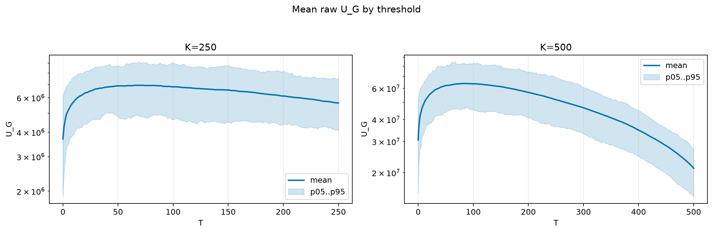
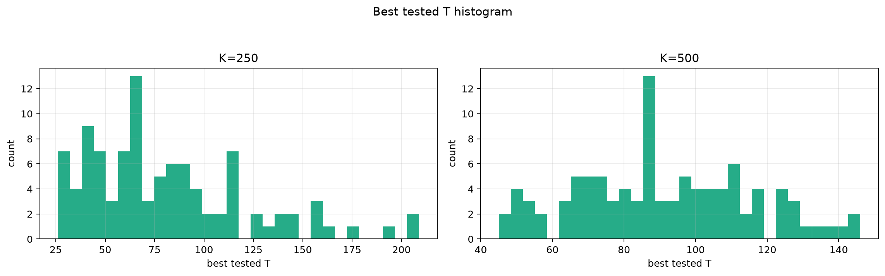
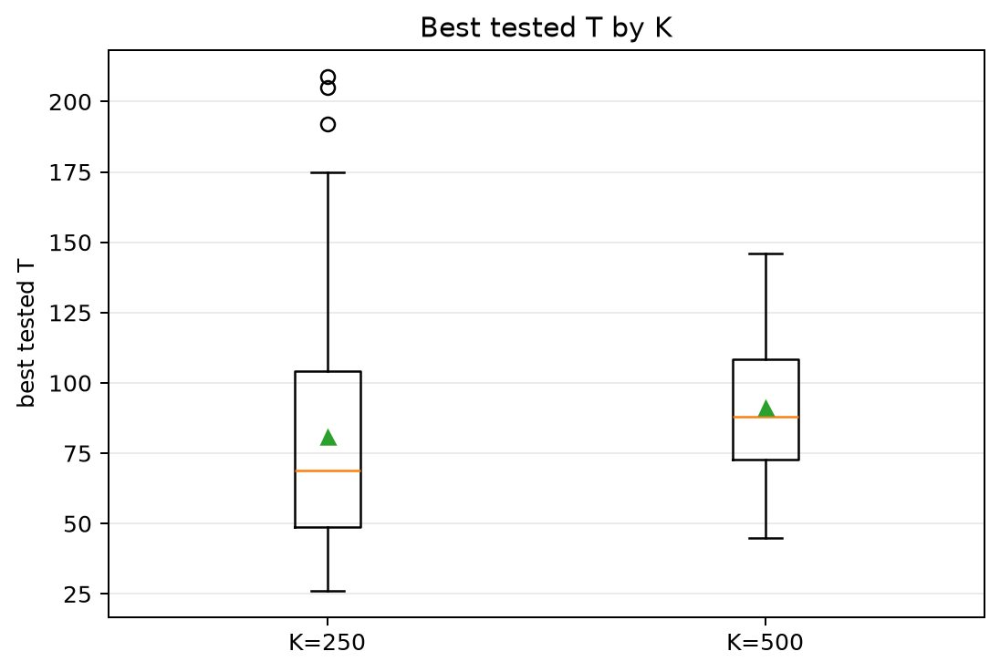
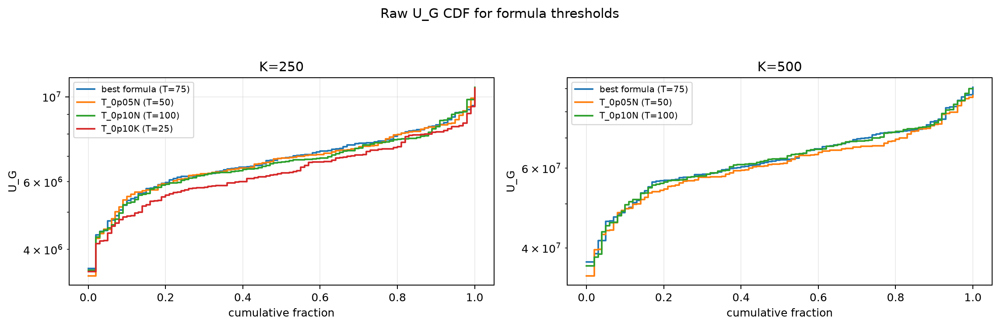

# Threshold Full Sweep: rician

- N: 1000
- L: 2
- K values: 500, 250
- Samples: 100
- Generator seeds: 42
- Sigma: 1.0

The experiment sweeps every integer `T` from `0` to `K` and evaluates raw `U_G`.

## Answer

- `K=250`: best fixed `T=68`; 99% mean-`U_G` diapason `49..89`; best tested `T` median `69.0` (p05..p95 `30.0..157.4`).
- `K=500`: best fixed `T=87`; 99% mean-`U_G` diapason `67..112`; best tested `T` median `88.0` (p05..p95 `51.0..131.1`).

## Best Fixed Thresholds And Formula Checks

| K | best fixed T | 99% diapason | best tested T median | best tested T std | best formula | formula T | formula fraction |
|---:|---:|---|---:|---:|---|---:|---:|
| 250 | 68 | 49..89 | 69.000 | 41.113 | T_0p075N | 75 | 0.9403 |
| 500 | 87 | 67..112 | 88.000 | 24.134 | T_0p075N | 75 | 0.9659 |

## Plots

## Artifacts

- `threshold_runs.csv`
- `best_thresholds.csv`
- `threshold_summary.csv`
- `threshold_best_t_stats.csv`
- `threshold_formula_comparison.csv`
