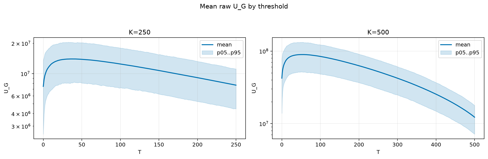
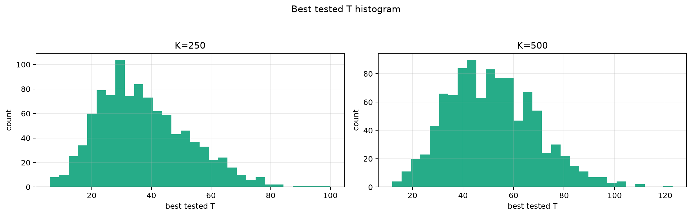
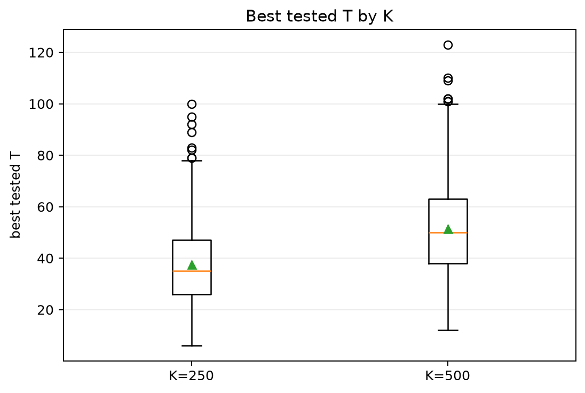
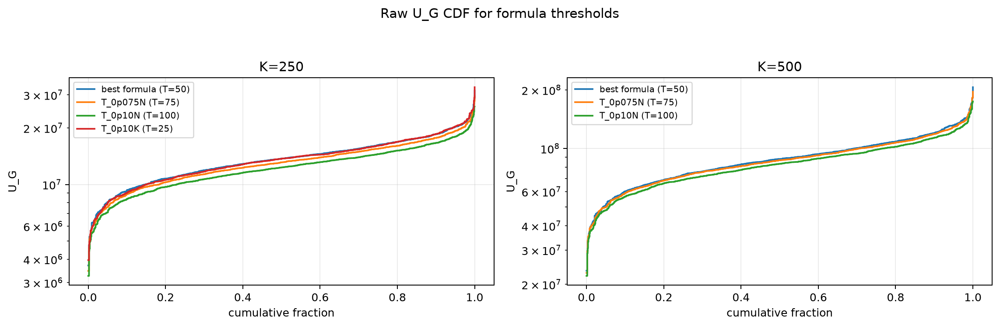

# Threshold Full Sweep: gaussian

- N: 1000
- L: 2
- K values: 500, 250
- Samples: 1000
- Generator seeds: 42
- Sigma: 1.0

The experiment sweeps every integer `T` from `0` to `K` and evaluates raw `U_G`.

## Answer

- `K=250`: best fixed `T=36`; 99% mean-`U_G` diapason `27..51`; best tested `T` median `35.0` (p05..p95 `17.0..65.0`).
- `K=500`: best fixed `T=54`; 99% mean-`U_G` diapason `39..70`; best tested `T` median `50.0` (p05..p95 `26.0..82.0`).

## Best Fixed Thresholds And Formula Checks

| K | best fixed T | 99% diapason | best tested T median | best tested T std | best formula | formula T | formula fraction |
|---:|---:|---|---:|---:|---|---:|---:|
| 250 | 36 | 27..51 | 35.000 | 15.164 | T_0p05N | 50 | 0.9520 |
| 500 | 54 | 39..70 | 50.000 | 17.471 | T_0p05N | 50 | 0.9629 |

## Plots

## Artifacts

- `threshold_runs.csv`
- `best_thresholds.csv`
- `threshold_summary.csv`
- `threshold_best_t_stats.csv`
- `threshold_formula_comparison.csv`
