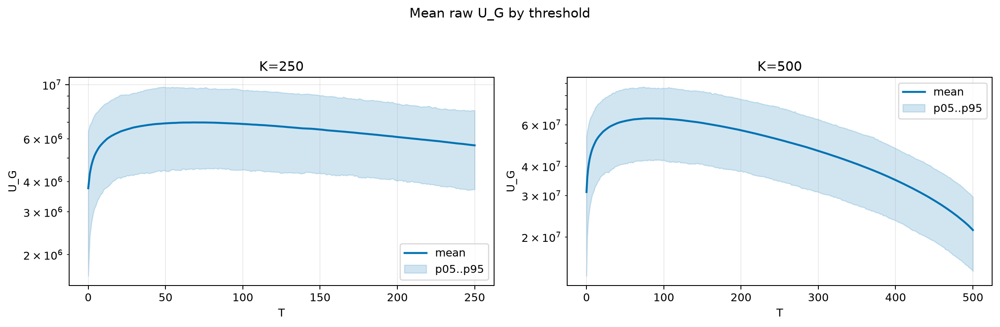
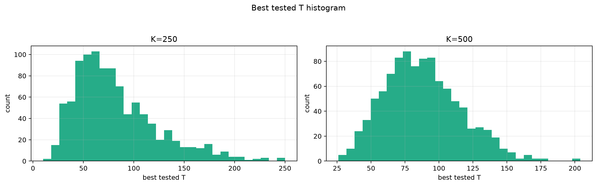
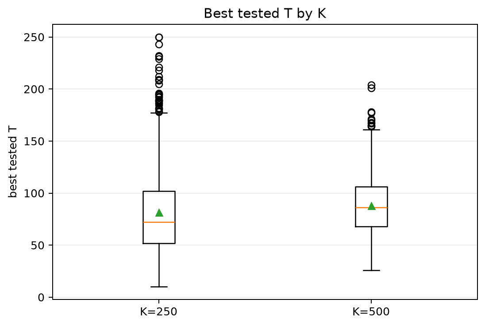
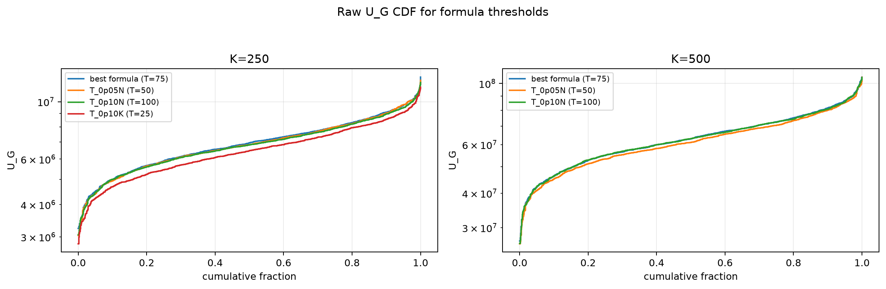

# Threshold Full Sweep: rician

> Historical K semantics note: this report uses active-K semantics. Here `K` is the number of selected/kept antennas, not the number turned off. A `25% active` or `K=0.25N` case means `75% off`, not the real `25% off` task. For real off-percent experiments, `25% off => K_active=0.75N` and `50% off => K_active=0.50N`.

- N: 1000
- L: 2
- K values: 500, 250
- Samples: 1000
- Generator seeds: 42
- Sigma: 1.0

The experiment sweeps every integer `T` from `0` to `K` and evaluates raw `U_G`.

## Answer

- `K=250`: best fixed `T=70`; 99% mean-`U_G` diapason `49..94`; best tested `T` median `72.0` (p05..p95 `31.0..168.0`).
- `K=500`: best fixed `T=81`; 99% mean-`U_G` diapason `61..112`; best tested `T` median `86.0` (p05..p95 `46.0..138.0`).

## Best Fixed Thresholds And Formula Checks

| K | best fixed T | 99% diapason | best tested T median | best tested T std | best formula | formula T | formula fraction |
|---:|---:|---|---:|---:|---|---:|---:|
| 250 | 70 | 49..94 | 72.000 | 41.391 | T_0p075N | 75 | 0.9406 |
| 500 | 81 | 61..112 | 86.000 | 28.193 | T_0p075N | 75 | 0.9642 |

## Plots

## Artifacts

- `threshold_runs.csv`
- `best_thresholds.csv`
- `threshold_summary.csv`
- `threshold_best_t_stats.csv`
- `threshold_formula_comparison.csv`
