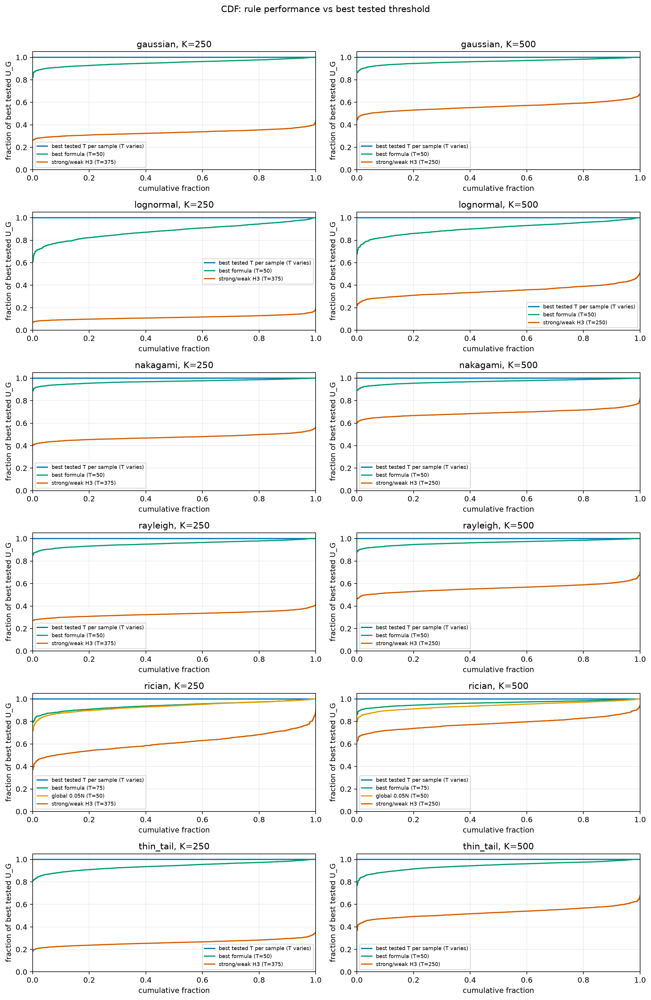
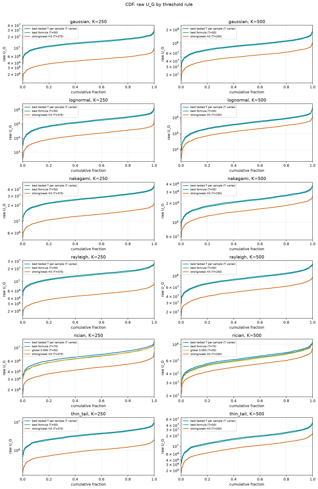

# Threshold Rule CDF Comparison

- N: 1000
- L: 2
- K values: 500, 250
- Samples: 1000
- Generator seeds: 42
- Profiles: gaussian, rayleigh, rician, nakagami, lognormal, thin_tail
- Sigma: 1.0

## Direct Answer

- Best simple global formula remains `T_0p05N` with mean fraction of best tested `U_G` `0.9435`.
- The blue reference curve is the sample-specific best tested `T` from the dense sweep.
- Profile-aware formula choice is `T=0.05N` for all tested profiles except Rician, where `T=0.075N` is better.
- Strong/weak H3 is a weak match for this `U_G` objective in the dense-threshold study; it often shifts too far into the middle of the power ranking.

## Overall Rule Ranking

| rule | mean fraction | p05 fraction avg | mean gap % |
|---|---:|---:|---:|
| best tested T per sample | 1.0000 | 1.0000 | 0.00 |
| best formula | 0.9461 | 0.8832 | 5.39 |
| global 0.05N | 0.9435 | 0.8778 | 5.65 |
| strong/weak H3 | 0.4672 | 0.4081 | 53.28 |

## Distribution Summary

| profile | K | best tested T median | best tested T p05..p95 | best formula | formula T | formula mean frac | strong/weak T | strong/weak mean frac | strong/weak p05 frac |
|---|---:|---:|---|---|---:|---:|---:|---:|---:|
| gaussian | 250 | 35.0 | 17.0..65.0 | T_0p05N | 50 | 0.9520 | 375 | 0.3323 | 0.2900 |
| gaussian | 500 | 50.0 | 26.0..82.0 | T_0p05N | 50 | 0.9629 | 250 | 0.5629 | 0.5032 |
| lognormal | 250 | 35.0 | 16.0..63.0 | T_0p05N | 50 | 0.8814 | 375 | 0.1143 | 0.0869 |
| lognormal | 500 | 50.0 | 23.0..84.0 | T_0p05N | 50 | 0.9072 | 250 | 0.3498 | 0.2816 |
| nakagami | 250 | 42.0 | 21.0..70.0 | T_0p05N | 50 | 0.9700 | 375 | 0.4753 | 0.4319 |
| nakagami | 500 | 59.0 | 33.0..90.0 | T_0p05N | 50 | 0.9702 | 250 | 0.6932 | 0.6442 |
| rayleigh | 250 | 37.0 | 17.0..64.0 | T_0p05N | 50 | 0.9549 | 375 | 0.3305 | 0.2904 |
| rayleigh | 500 | 50.0 | 28.0..78.0 | T_0p05N | 50 | 0.9648 | 250 | 0.5604 | 0.5042 |
| rician | 250 | 72.0 | 31.0..168.0 | T_0p075N | 75 | 0.9406 | 375 | 0.6125 | 0.4860 |
| rician | 500 | 86.0 | 46.0..138.0 | T_0p075N | 75 | 0.9642 | 250 | 0.7848 | 0.6979 |
| thin_tail | 250 | 41.0 | 20.0..69.0 | T_0p05N | 50 | 0.9398 | 375 | 0.2610 | 0.2183 |
| thin_tail | 500 | 58.0 | 32.0..94.0 | T_0p05N | 50 | 0.9445 | 250 | 0.5295 | 0.4626 |

## CDF Evidence

## Artifacts

- `threshold_rule_comparison.csv`
- `threshold_rule_summary.csv`
- `threshold_rule_cdf_fraction.png`
- `threshold_rule_cdf_u_g.png`
- Per-distribution `threshold_rule_cdf_fraction.png` and `threshold_rule_cdf_u_g.png` files.
