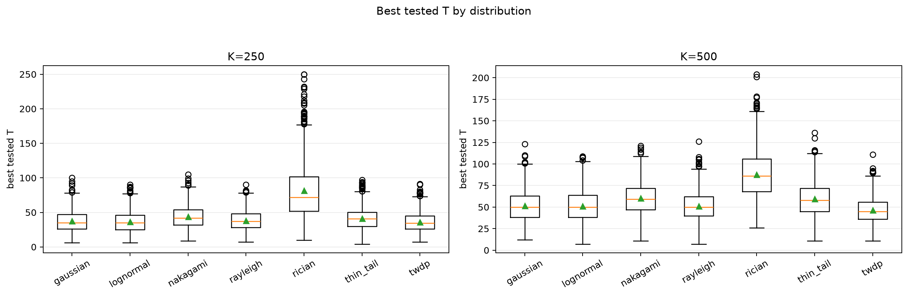
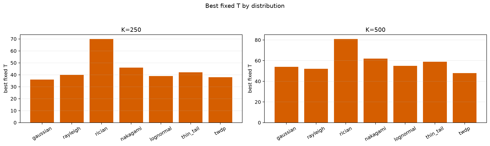
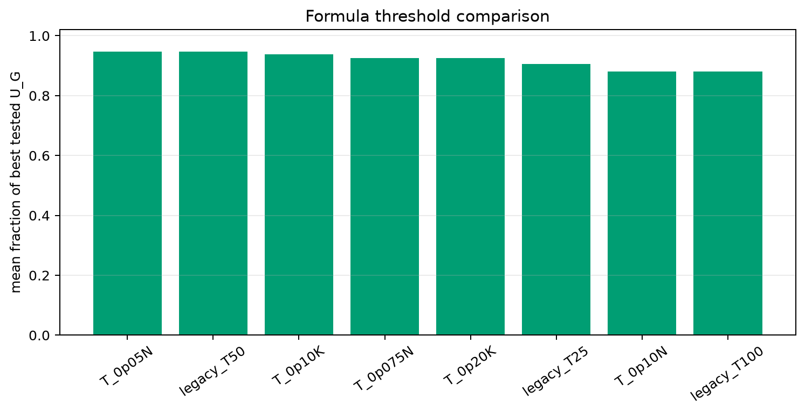

# Threshold Full Sweep: All Distributions

- N: 1000
- L: 2
- K values: 500, 250
- Samples: 1000
- Generator seeds: 42
- Profiles: gaussian, rayleigh, rician, nakagami, lognormal, thin_tail, twdp
- Sigma: 1.0

## Direct Answer

- Best simple formula overall: `T_0p05N` with mean fraction of best tested `U_G = 0.9478`.
- A single global formula is acceptable only if its per-distribution rows stay close in the table below; otherwise use the reported 99% diapason per distribution.
- Scaling is reported both as `T/N` and `T/K`; compare those columns to see which is more stable.

## Distribution Comparison

| profile | K | best fixed T | 99% diapason | best tested T median | T/N mean | T/K mean | best formula | formula fraction |
|---|---:|---:|---|---:|---:|---:|---|---:|
| gaussian | 250 | 36 | 27..51 | 35.000 | 0.0375 | 0.1499 | T_0p05N | 0.9520 |
| gaussian | 500 | 54 | 39..70 | 50.000 | 0.0515 | 0.1030 | T_0p05N | 0.9629 |
| rayleigh | 250 | 40 | 29..53 | 37.000 | 0.0383 | 0.1531 | T_0p05N | 0.9549 |
| rayleigh | 500 | 52 | 40..68 | 50.000 | 0.0513 | 0.1026 | T_0p05N | 0.9648 |
| rician | 250 | 70 | 49..94 | 72.000 | 0.0816 | 0.3263 | T_0p075N | 0.9406 |
| rician | 500 | 81 | 61..112 | 86.000 | 0.0880 | 0.1760 | T_0p075N | 0.9642 |
| nakagami | 250 | 46 | 31..61 | 42.000 | 0.0439 | 0.1755 | T_0p05N | 0.9700 |
| nakagami | 500 | 62 | 44..81 | 59.000 | 0.0603 | 0.1206 | T_0p05N | 0.9702 |
| lognormal | 250 | 39 | 32..45 | 35.000 | 0.0365 | 0.1461 | T_0p05N | 0.8814 |
| lognormal | 500 | 55 | 44..65 | 50.000 | 0.0514 | 0.1028 | T_0p05N | 0.9072 |
| thin_tail | 250 | 42 | 33..53 | 41.000 | 0.0415 | 0.1659 | T_0p05N | 0.9398 |
| thin_tail | 500 | 59 | 46..75 | 58.000 | 0.0594 | 0.1189 | T_0p05N | 0.9445 |
| twdp | 250 | 38 | 25..53 | 34.500 | 0.0363 | 0.1450 | T_0p05N | 0.9694 |
| twdp | 500 | 48 | 33..65 | 45.000 | 0.0464 | 0.0928 | T_0p05N | 0.9777 |

## Combined Plots

## Artifacts

- `all_best_thresholds.csv`
- `all_threshold_best_t_stats.csv`
- `all_distribution_comparison.csv`
- `all_formula_comparison.csv`
