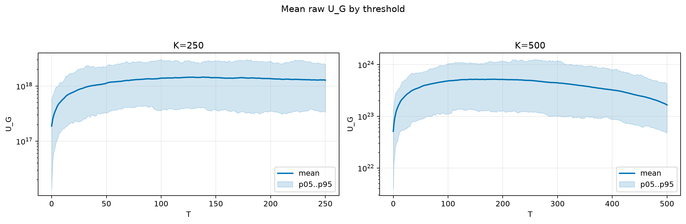
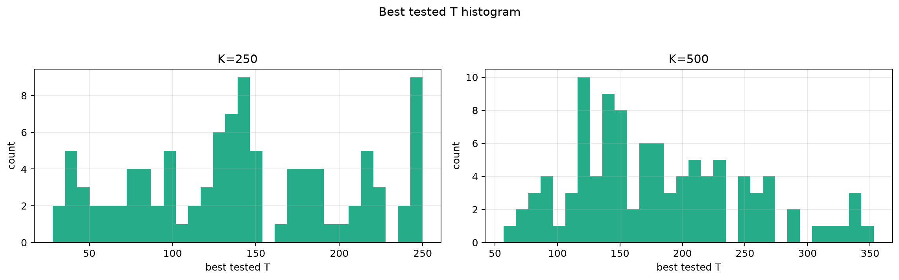
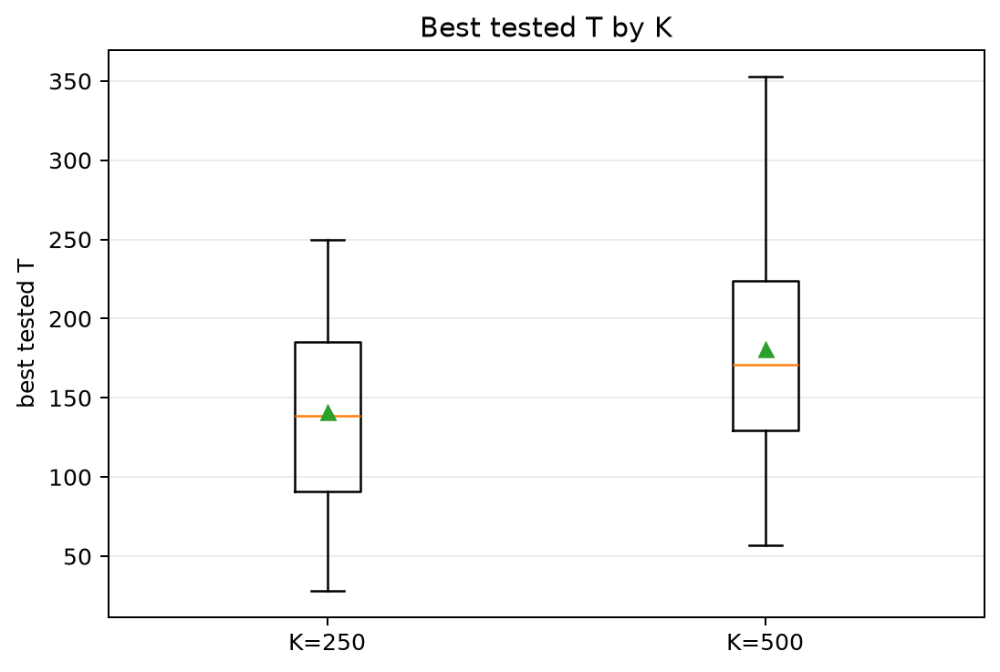
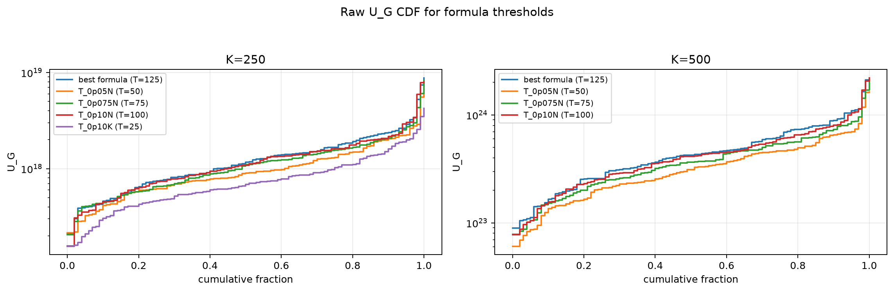
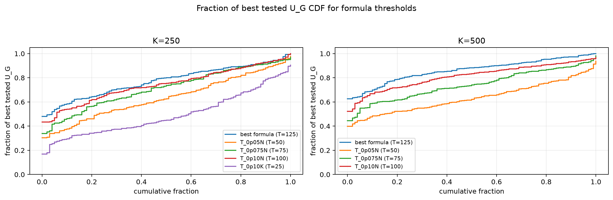

# Threshold Full Sweep: rician

- N: 1000
- L: 10
- K values: 250, 500
- Samples: 100
- Generator seeds: 42
- Sigma: 1.0

The experiment sweeps every integer `T` from `0` to `K` and evaluates raw `U_G`.

## Answer

- `K=250`: best fixed `T=139`; 99% mean-`U_G` diapason `137..143`; best tested `T` median `138.5` (p05..p95 `38.0..246.0`).
- `K=500`: best fixed `T=183`; 99% mean-`U_G` diapason `171..192`; best tested `T` median `171.0` (p05..p95 `81.8..314.6`).

## Best Fixed Thresholds And Formula Checks

| K | best fixed T | 99% diapason | best tested T median | best tested T std | best formula | formula T | formula fraction |
|---:|---:|---|---:|---:|---|---:|---:|
| 250 | 139 | 137..143 | 138.500 | 63.644 | T_0p15NL_over_Lp2 | 125 | 0.7769 |
| 500 | 183 | 171..192 | 171.000 | 69.062 | T_0p15NL_over_Lp2 | 125 | 0.8636 |

## Plots

## Artifacts

- `threshold_runs.csv.gz`
- `best_thresholds.csv`
- `threshold_summary.csv`
- `threshold_best_t_stats.csv`
- `threshold_formula_comparison.csv`
