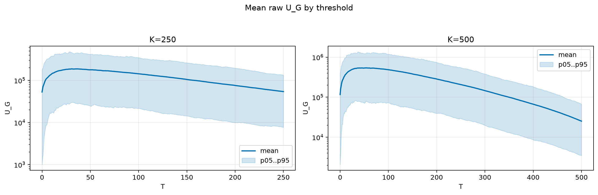
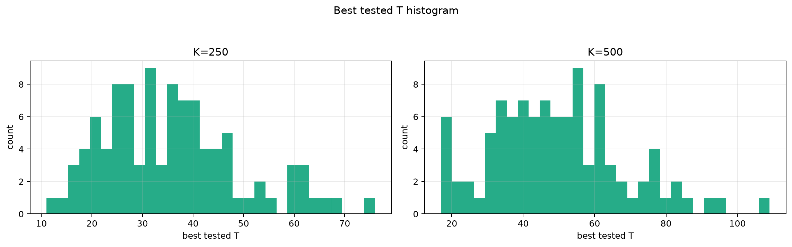
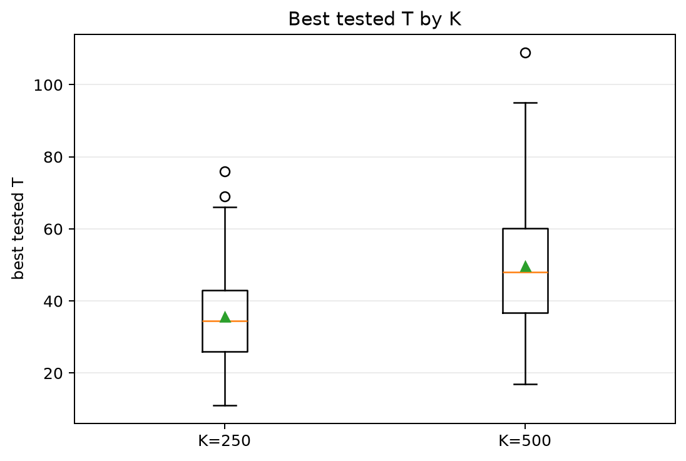
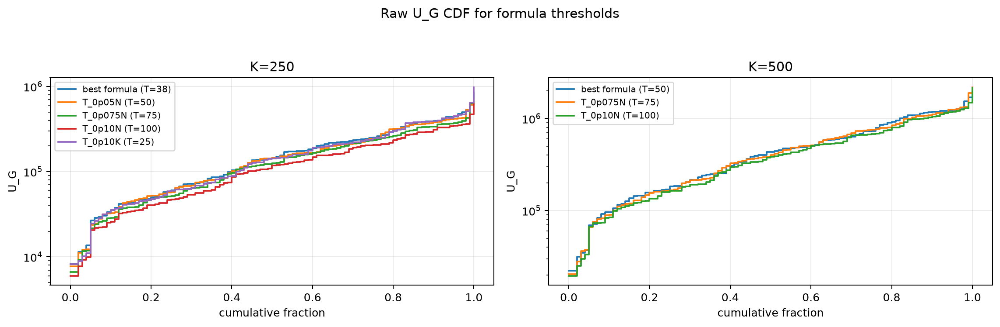
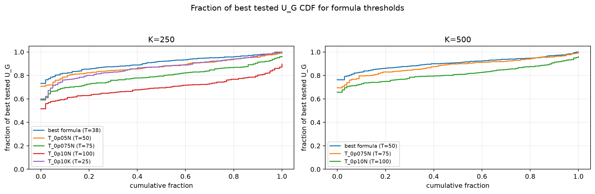

# Threshold Full Sweep: lognormal

- N: 1000
- L: 2
- K values: 250, 500
- Samples: 100
- Generator seeds: 42
- Sigma: 1.0

The experiment sweeps every integer `T` from `0` to `K` and evaluates raw `U_G`.

## Answer

- `K=250`: best fixed `T=31`; 99% mean-`U_G` diapason `30..32`; best tested `T` median `34.5` (p05..p95 `17.9..62.0`).
- `K=500`: best fixed `T=55`; 99% mean-`U_G` diapason `50..61`; best tested `T` median `48.0` (p05..p95 `20.0..83.0`).

## Best Fixed Thresholds And Formula Checks

| K | best fixed T | 99% diapason | best tested T median | best tested T std | best formula | formula T | formula fraction |
|---:|---:|---|---:|---:|---|---:|---:|
| 250 | 31 | 30..32 | 34.500 | 13.532 | T_0p075NL_over_Lp2 | 38 | 0.9077 |
| 500 | 55 | 50..61 | 48.000 | 18.521 | T_0p05N | 50 | 0.9059 |

## Plots

## Artifacts

- `threshold_runs.csv.gz`
- `best_thresholds.csv`
- `threshold_summary.csv`
- `threshold_best_t_stats.csv`
- `threshold_formula_comparison.csv`
