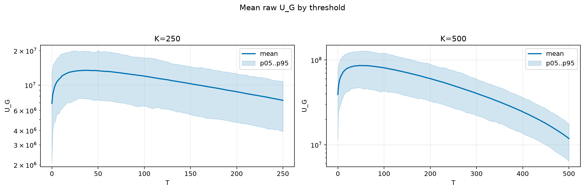
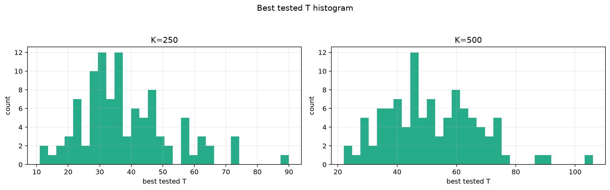
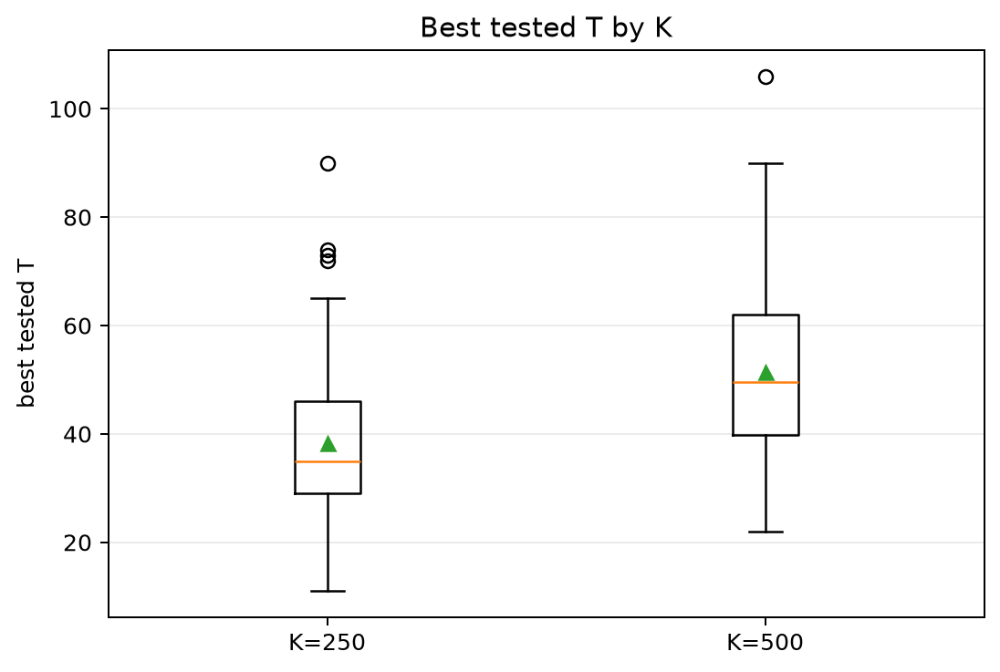
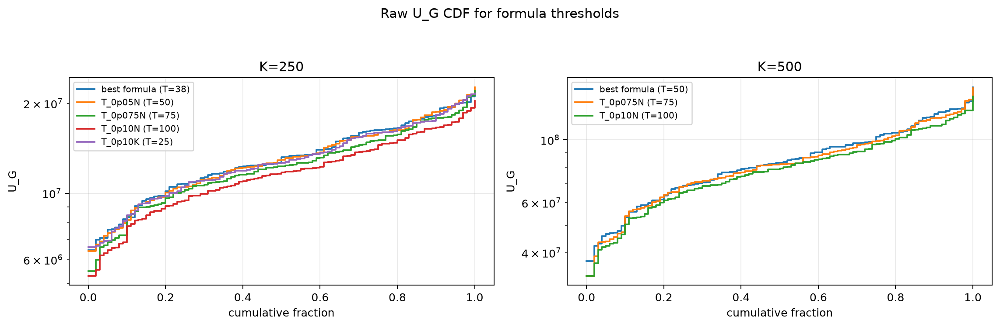
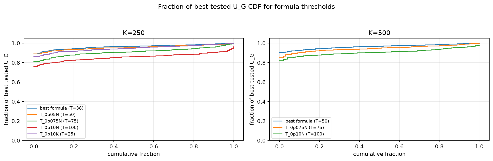

# Threshold Full Sweep: rayleigh

- N: 1000
- L: 2
- K values: 250, 500
- Samples: 100
- Generator seeds: 42
- Sigma: 1.0

The experiment sweeps every integer `T` from `0` to `K` and evaluates raw `U_G`.

## Answer

- `K=250`: best fixed `T=36`; 99% mean-`U_G` diapason `29..50`; best tested `T` median `35.0` (p05..p95 `18.9..64.0`).
- `K=500`: best fixed `T=47`; 99% mean-`U_G` diapason `40..68`; best tested `T` median `49.5` (p05..p95 `28.9..75.0`).

## Best Fixed Thresholds And Formula Checks

| K | best fixed T | 99% diapason | best tested T median | best tested T std | best formula | formula T | formula fraction |
|---:|---:|---|---:|---:|---|---:|---:|
| 250 | 36 | 29..50 | 35.000 | 14.459 | T_0p075NL_over_Lp2 | 38 | 0.9643 |
| 500 | 47 | 40..68 | 49.500 | 15.573 | T_0p05N | 50 | 0.9647 |

## Plots

## Artifacts

- `threshold_runs.csv.gz`
- `best_thresholds.csv`
- `threshold_summary.csv`
- `threshold_best_t_stats.csv`
- `threshold_formula_comparison.csv`
