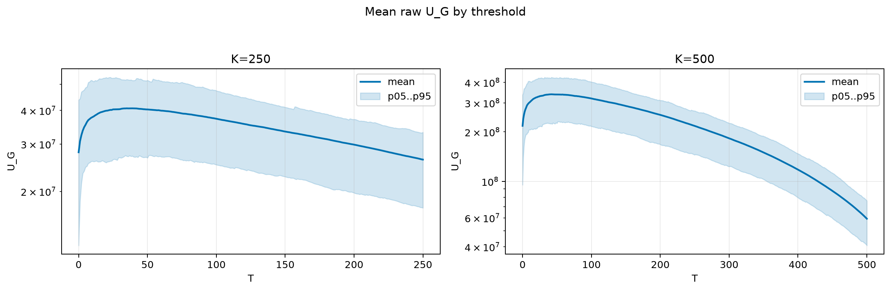
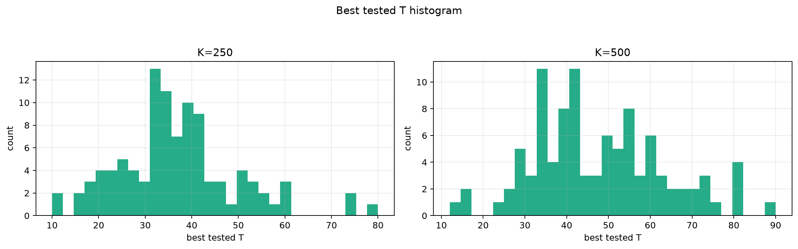
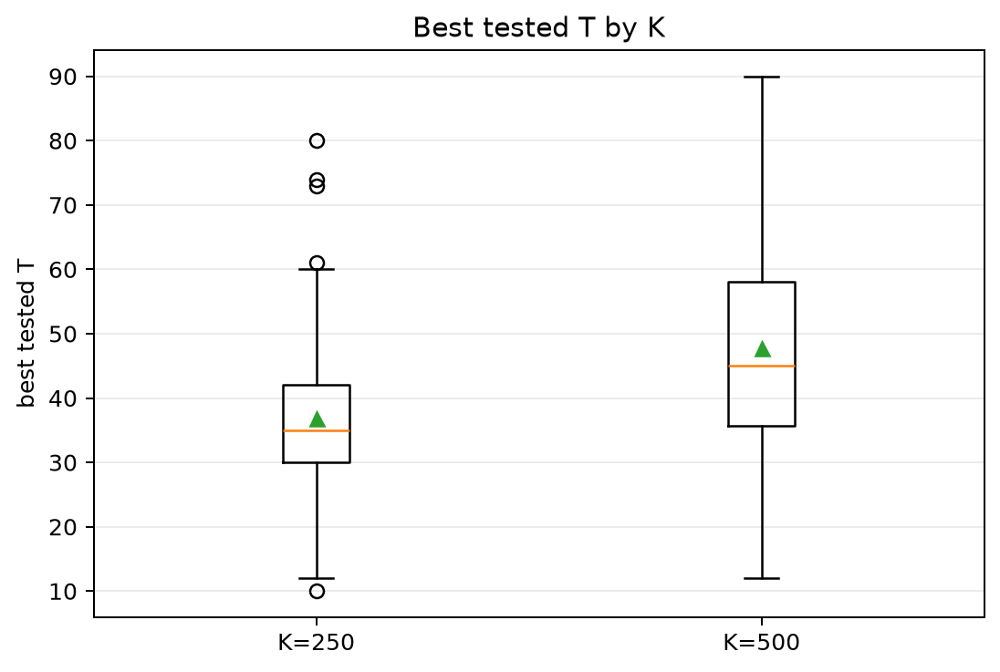
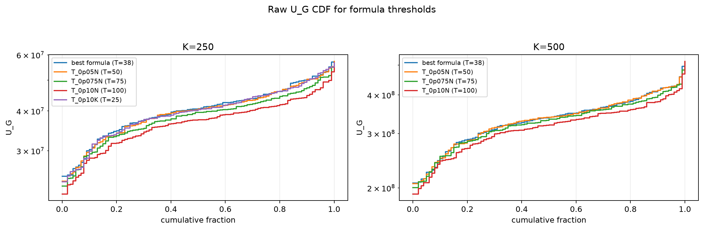
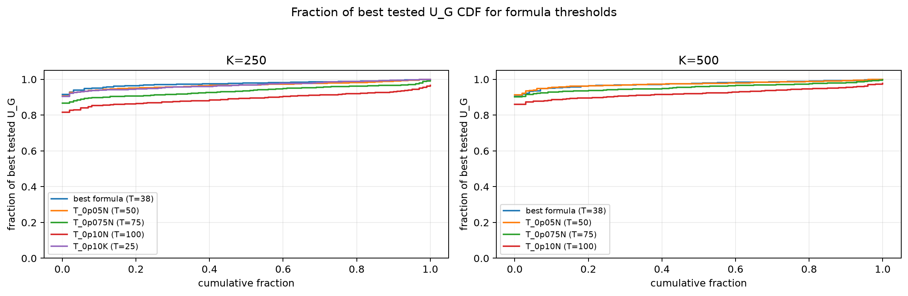

# Threshold Full Sweep: twdp

- N: 1000
- L: 2
- K values: 250, 500
- Samples: 100
- Generator seeds: 42
- Sigma: 1.0

The experiment sweeps every integer `T` from `0` to `K` and evaluates raw `U_G`.

## Answer

- `K=250`: best fixed `T=35`; 99% mean-`U_G` diapason `25..50`; best tested `T` median `35.0` (p05..p95 `17.9..59.0`).
- `K=500`: best fixed `T=42`; 99% mean-`U_G` diapason `33..66`; best tested `T` median `45.0` (p05..p95 `25.0..76.2`).

## Best Fixed Thresholds And Formula Checks

| K | best fixed T | 99% diapason | best tested T median | best tested T std | best formula | formula T | formula fraction |
|---:|---:|---|---:|---:|---|---:|---:|
| 250 | 35 | 25..50 | 35.000 | 12.836 | T_0p075NL_over_Lp2 | 38 | 0.9766 |
| 500 | 42 | 33..66 | 45.000 | 15.781 | T_0p075NL_over_Lp2 | 38 | 0.9749 |

## Plots

## Artifacts

- `threshold_runs.csv.gz`
- `best_thresholds.csv`
- `threshold_summary.csv`
- `threshold_best_t_stats.csv`
- `threshold_formula_comparison.csv`
