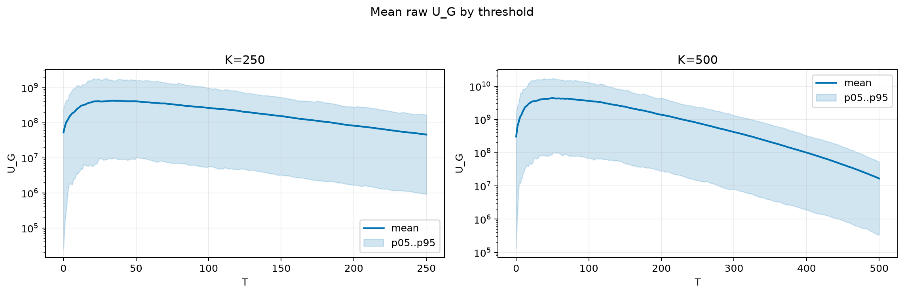
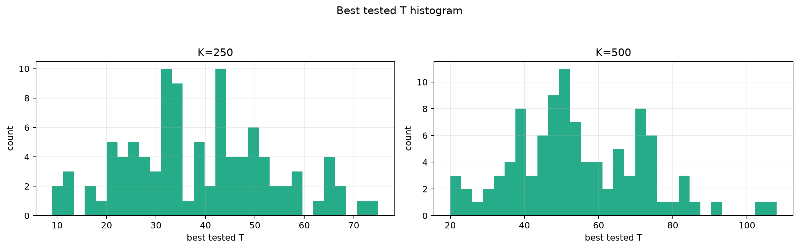
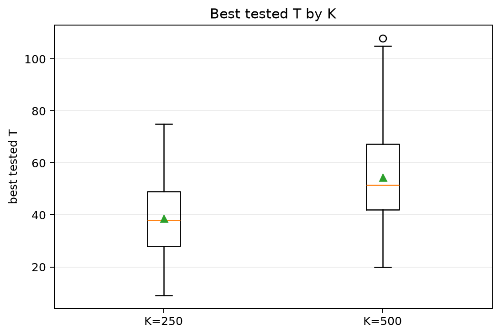
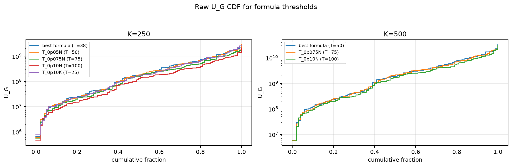
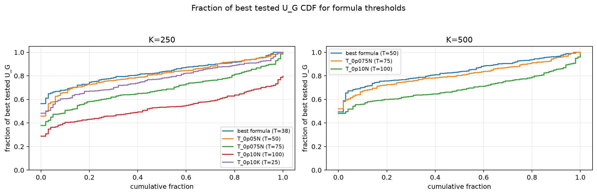

# Threshold Full Sweep: lognormal

- N: 1000
- L: 4
- K values: 250, 500
- Samples: 100
- Generator seeds: 42
- Sigma: 1.0

The experiment sweeps every integer `T` from `0` to `K` and evaluates raw `U_G`.

## Answer

- `K=250`: best fixed `T=34`; 99% mean-`U_G` diapason `33..38`; best tested `T` median `38.0` (p05..p95 `15.9..66.0`).
- `K=500`: best fixed `T=50`; 99% mean-`U_G` diapason `50..50`; best tested `T` median `51.5` (p05..p95 `27.9..82.1`).

## Best Fixed Thresholds And Formula Checks

| K | best fixed T | 99% diapason | best tested T median | best tested T std | best formula | formula T | formula fraction |
|---:|---:|---|---:|---:|---|---:|---:|
| 250 | 34 | 33..38 | 38.000 | 14.833 | T_0p15K | 38 | 0.8323 |
| 500 | 50 | 50..50 | 51.500 | 17.558 | T_0p05N | 50 | 0.8403 |

## Plots

## Artifacts

- `threshold_runs.csv.gz`
- `best_thresholds.csv`
- `threshold_summary.csv`
- `threshold_best_t_stats.csv`
- `threshold_formula_comparison.csv`
