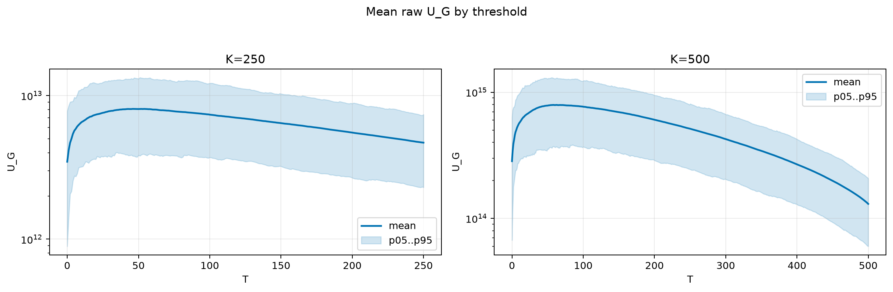
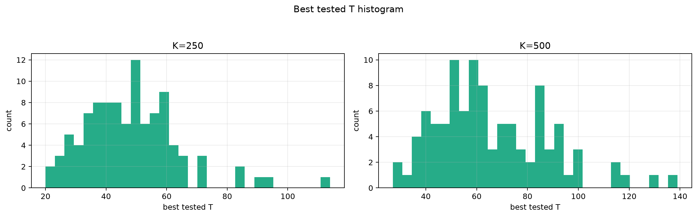
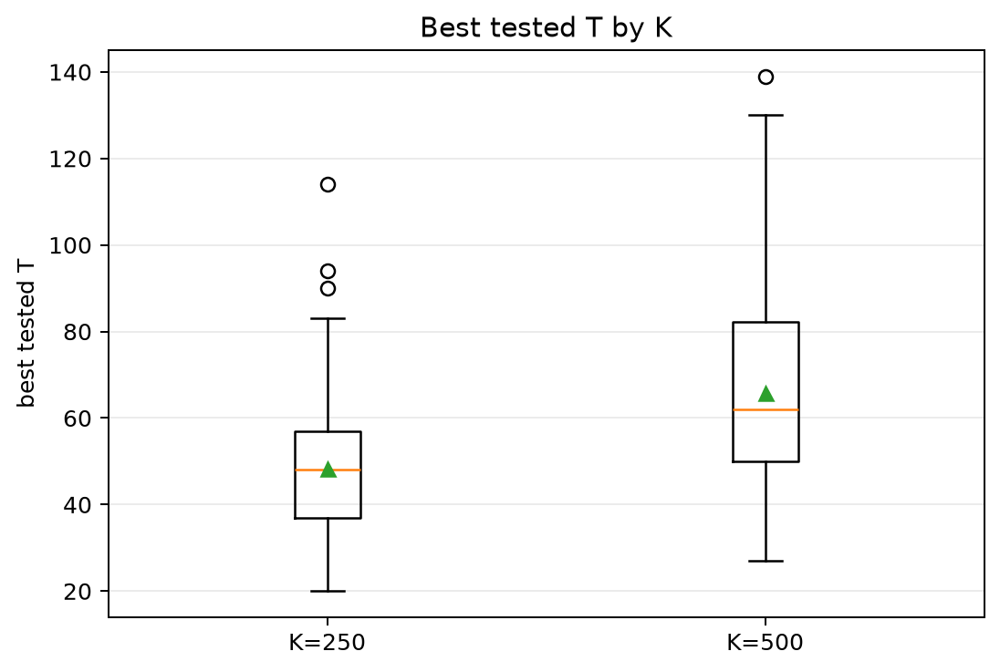
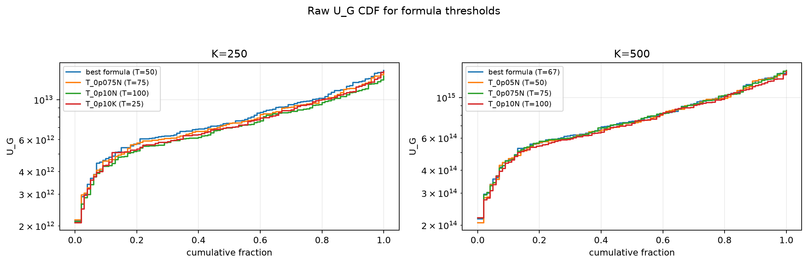
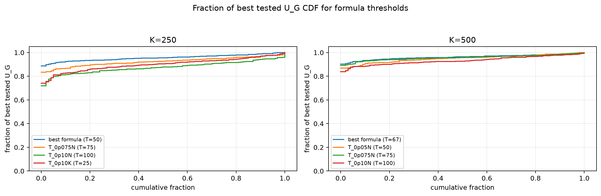

# Threshold Full Sweep: nakagami

- N: 1000
- L: 4
- K values: 250, 500
- Samples: 100
- Generator seeds: 42
- Sigma: 1.0

The experiment sweeps every integer `T` from `0` to `K` and evaluates raw `U_G`.

## Answer

- `K=250`: best fixed `T=46`; 99% mean-`U_G` diapason `38..59`; best tested `T` median `48.0` (p05..p95 `26.9..72.5`).
- `K=500`: best fixed `T=58`; 99% mean-`U_G` diapason `51..79`; best tested `T` median `62.0` (p05..p95 `37.0..99.7`).

## Best Fixed Thresholds And Formula Checks

| K | best fixed T | 99% diapason | best tested T median | best tested T std | best formula | formula T | formula fraction |
|---:|---:|---|---:|---:|---|---:|---:|
| 250 | 46 | 38..59 | 48.000 | 15.782 | T_0p05N | 50 | 0.9561 |
| 500 | 58 | 51..79 | 62.000 | 22.420 | T_0p10NL_over_Lp2 | 67 | 0.9623 |

## Plots

## Artifacts

- `threshold_runs.csv.gz`
- `best_thresholds.csv`
- `threshold_summary.csv`
- `threshold_best_t_stats.csv`
- `threshold_formula_comparison.csv`
