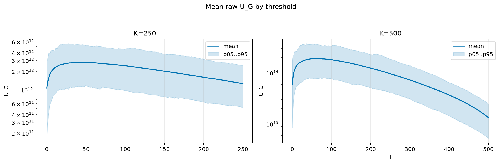
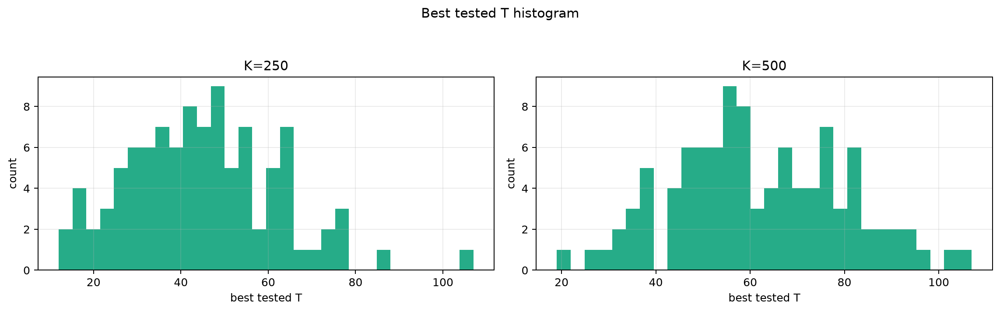
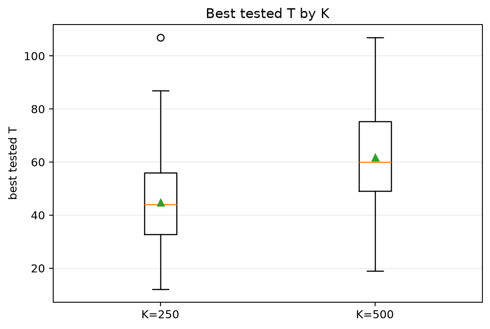
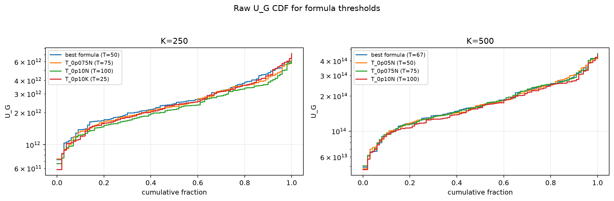
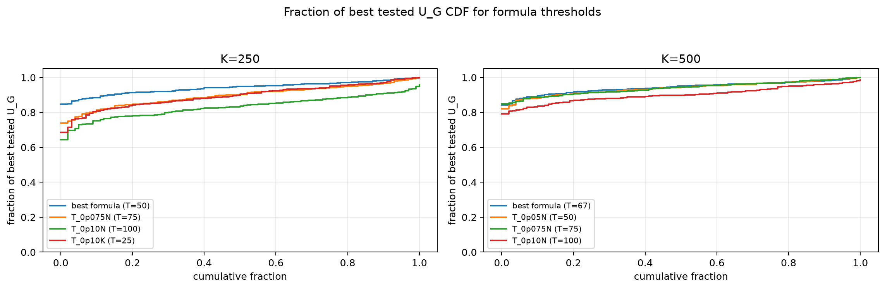

# Threshold Full Sweep: rayleigh

- N: 1000
- L: 4
- K values: 250, 500
- Samples: 100
- Generator seeds: 42
- Sigma: 1.0

The experiment sweeps every integer `T` from `0` to `K` and evaluates raw `U_G`.

## Answer

- `K=250`: best fixed `T=43`; 99% mean-`U_G` diapason `35..53`; best tested `T` median `44.0` (p05..p95 `18.0..75.0`).
- `K=500`: best fixed `T=61`; 99% mean-`U_G` diapason `52..70`; best tested `T` median `60.0` (p05..p95 `33.9..92.0`).

## Best Fixed Thresholds And Formula Checks

| K | best fixed T | 99% diapason | best tested T median | best tested T std | best formula | formula T | formula fraction |
|---:|---:|---|---:|---:|---|---:|---:|
| 250 | 43 | 35..53 | 44.000 | 17.353 | T_0p05N | 50 | 0.9417 |
| 500 | 61 | 52..70 | 60.000 | 18.050 | T_0p10NL_over_Lp2 | 67 | 0.9439 |

## Plots

## Artifacts

- `threshold_runs.csv.gz`
- `best_thresholds.csv`
- `threshold_summary.csv`
- `threshold_best_t_stats.csv`
- `threshold_formula_comparison.csv`
