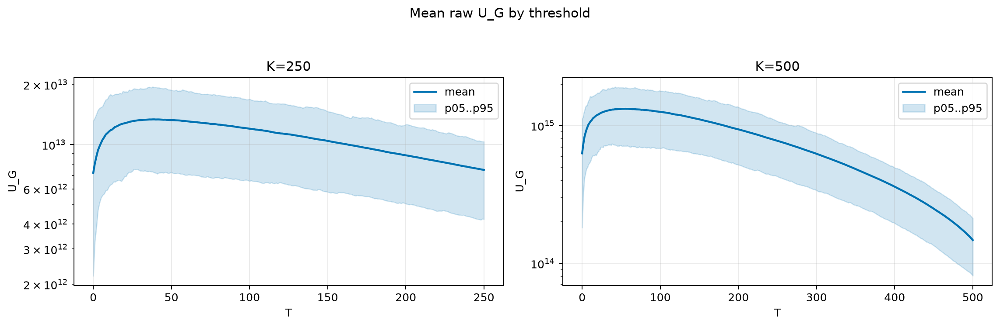
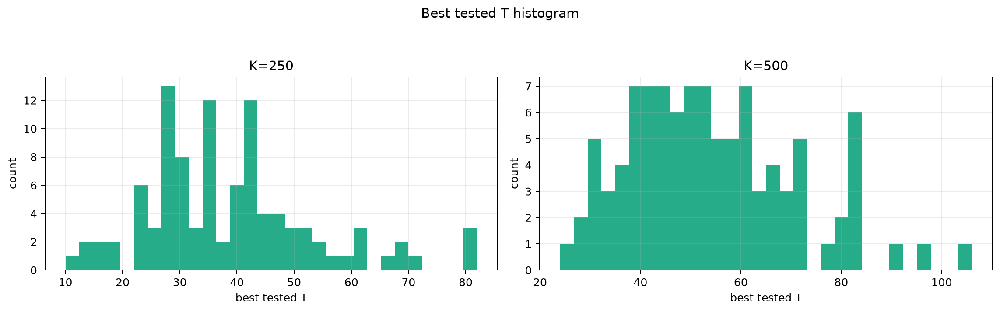
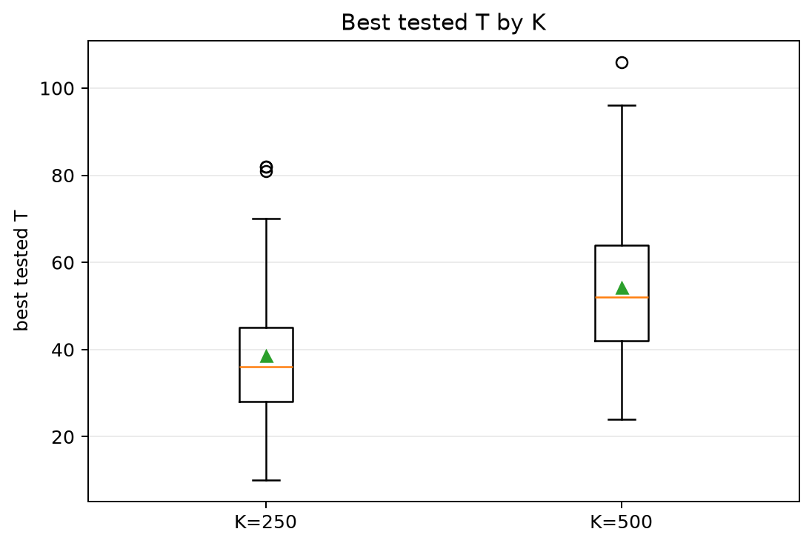
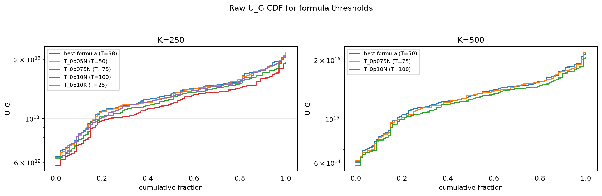
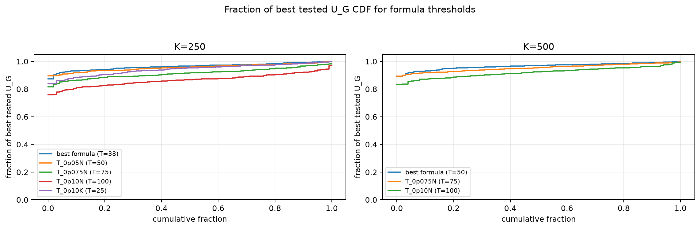

# Threshold Full Sweep: twdp

- N: 1000
- L: 4
- K values: 250, 500
- Samples: 100
- Generator seeds: 42
- Sigma: 1.0

The experiment sweeps every integer `T` from `0` to `K` and evaluates raw `U_G`.

## Answer

- `K=250`: best fixed `T=39`; 99% mean-`U_G` diapason `30..52`; best tested `T` median `36.0` (p05..p95 `17.9..68.0`).
- `K=500`: best fixed `T=56`; 99% mean-`U_G` diapason `42..71`; best tested `T` median `52.0` (p05..p95 `31.0..84.0`).

## Best Fixed Thresholds And Formula Checks

| K | best fixed T | 99% diapason | best tested T median | best tested T std | best formula | formula T | formula fraction |
|---:|---:|---|---:|---:|---|---:|---:|
| 250 | 39 | 30..52 | 36.000 | 14.766 | T_0p15K | 38 | 0.9641 |
| 500 | 56 | 42..71 | 52.000 | 16.676 | T_0p05N | 50 | 0.9665 |

## Plots

## Artifacts

- `threshold_runs.csv.gz`
- `best_thresholds.csv`
- `threshold_summary.csv`
- `threshold_best_t_stats.csv`
- `threshold_formula_comparison.csv`
