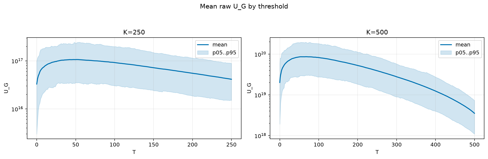
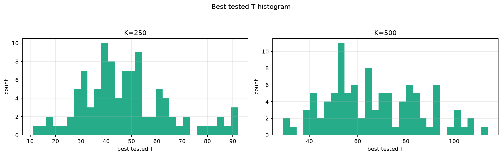
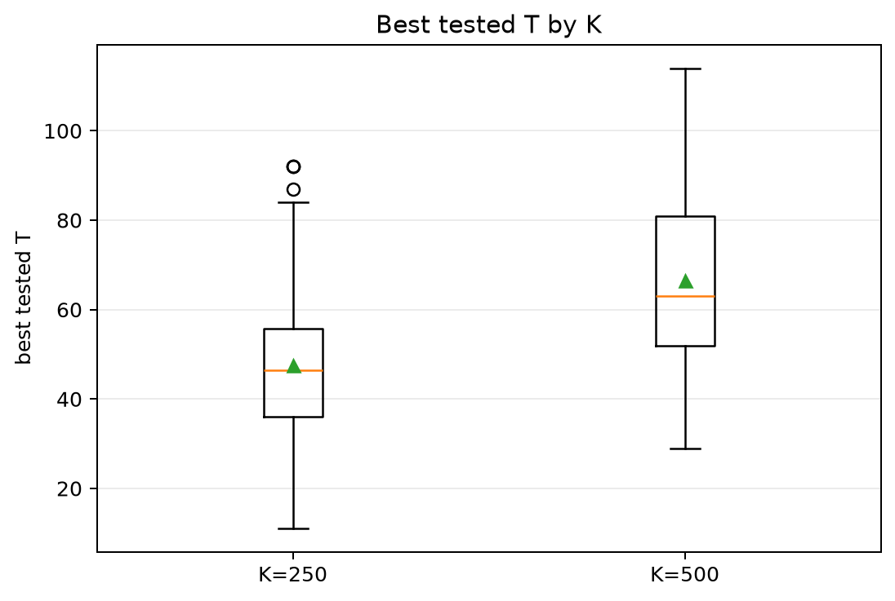
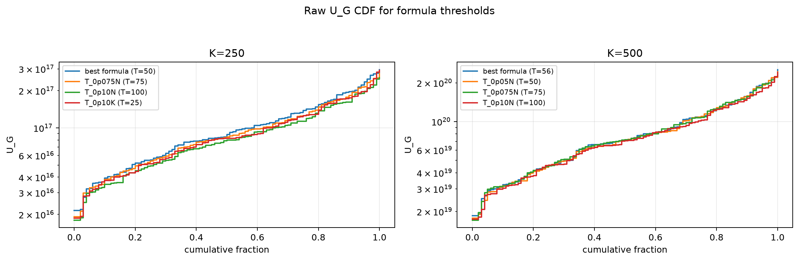
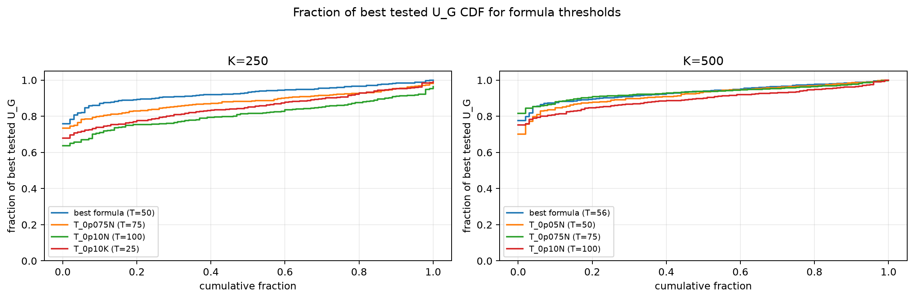

# Threshold Full Sweep: gaussian

- N: 1000
- L: 6
- K values: 250, 500
- Samples: 100
- Generator seeds: 42
- Sigma: 1.0

The experiment sweeps every integer `T` from `0` to `K` and evaluates raw `U_G`.

## Answer

- `K=250`: best fixed `T=51`; 99% mean-`U_G` diapason `41..55`; best tested `T` median `46.5` (p05..p95 `21.9..84.0`).
- `K=500`: best fixed `T=67`; 99% mean-`U_G` diapason `51..79`; best tested `T` median `63.0` (p05..p95 `39.9..100.1`).

## Best Fixed Thresholds And Formula Checks

| K | best fixed T | 99% diapason | best tested T median | best tested T std | best formula | formula T | formula fraction |
|---:|---:|---|---:|---:|---|---:|---:|
| 250 | 51 | 41..55 | 46.500 | 17.424 | T_0p05N | 50 | 0.9272 |
| 500 | 67 | 51..79 | 63.000 | 19.277 | T_0p075NL_over_Lp2 | 56 | 0.9342 |

## Plots

## Artifacts

- `threshold_runs.csv.gz`
- `best_thresholds.csv`
- `threshold_summary.csv`
- `threshold_best_t_stats.csv`
- `threshold_formula_comparison.csv`
