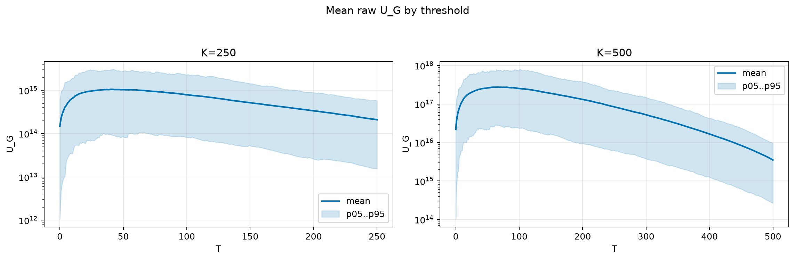
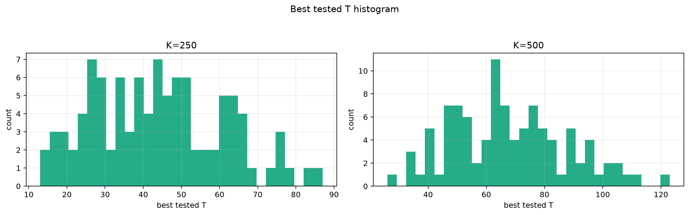
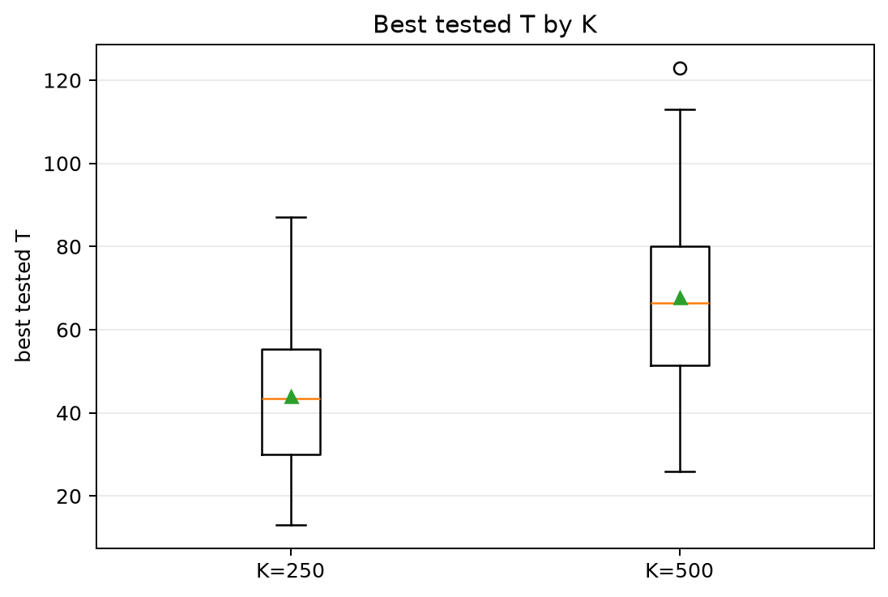
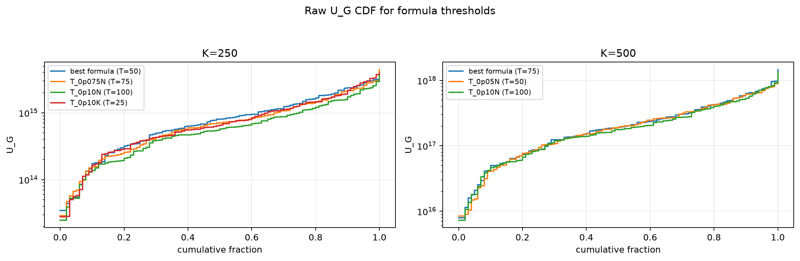
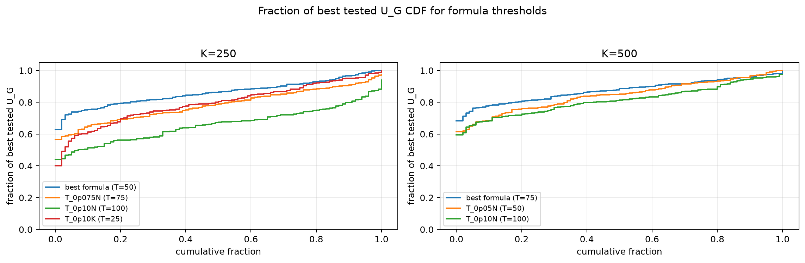

# Threshold Full Sweep: thin_tail

- N: 1000
- L: 6
- K values: 250, 500
- Samples: 100
- Generator seeds: 42
- Sigma: 1.0

The experiment sweeps every integer `T` from `0` to `K` and evaluates raw `U_G`.

## Answer

- `K=250`: best fixed `T=40`; 99% mean-`U_G` diapason `40..42`; best tested `T` median `43.5` (p05..p95 `17.9..76.0`).
- `K=500`: best fixed `T=66`; 99% mean-`U_G` diapason `58..72`; best tested `T` median `66.5` (p05..p95 `38.9..102.1`).

## Best Fixed Thresholds And Formula Checks

| K | best fixed T | 99% diapason | best tested T median | best tested T std | best formula | formula T | formula fraction |
|---:|---:|---|---:|---:|---|---:|---:|
| 250 | 40 | 40..42 | 43.500 | 17.143 | T_0p05N | 50 | 0.8618 |
| 500 | 66 | 58..72 | 66.500 | 20.036 | T_0p075N | 75 | 0.8756 |

## Plots

## Artifacts

- `threshold_runs.csv.gz`
- `best_thresholds.csv`
- `threshold_summary.csv`
- `threshold_best_t_stats.csv`
- `threshold_formula_comparison.csv`
