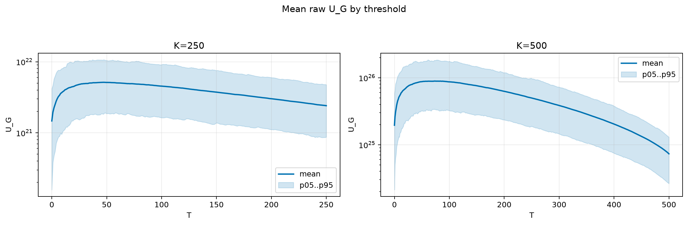
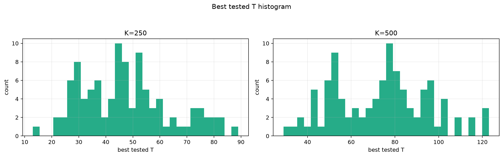
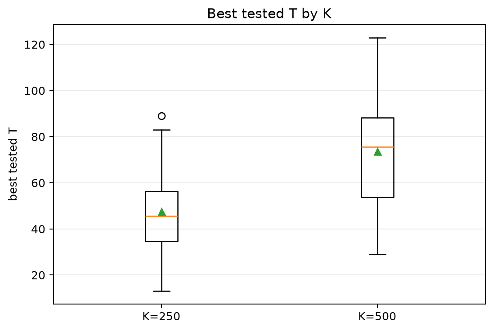
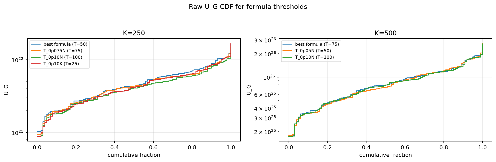
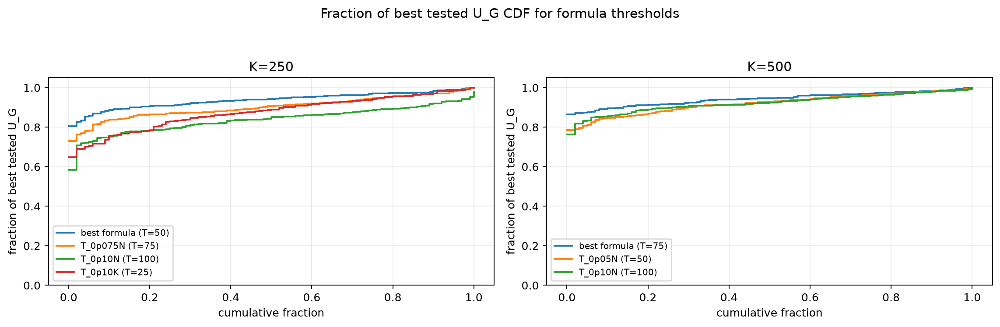

# Threshold Full Sweep: nakagami

- N: 1000
- L: 8
- K values: 250, 500
- Samples: 100
- Generator seeds: 42
- Sigma: 1.0

The experiment sweeps every integer `T` from `0` to `K` and evaluates raw `U_G`.

## Answer

- `K=250`: best fixed `T=47`; 99% mean-`U_G` diapason `42..55`; best tested `T` median `45.5` (p05..p95 `25.9..78.0`).
- `K=500`: best fixed `T=73`; 99% mean-`U_G` diapason `55..91`; best tested `T` median `75.5` (p05..p95 `41.9..108.4`).

## Best Fixed Thresholds And Formula Checks

| K | best fixed T | 99% diapason | best tested T median | best tested T std | best formula | formula T | formula fraction |
|---:|---:|---|---:|---:|---|---:|---:|
| 250 | 47 | 42..55 | 45.500 | 16.392 | T_0p05N | 50 | 0.9378 |
| 500 | 73 | 55..91 | 75.500 | 21.877 | T_0p075N | 75 | 0.9442 |

## Plots

## Artifacts

- `threshold_runs.csv.gz`
- `best_thresholds.csv`
- `threshold_summary.csv`
- `threshold_best_t_stats.csv`
- `threshold_formula_comparison.csv`
