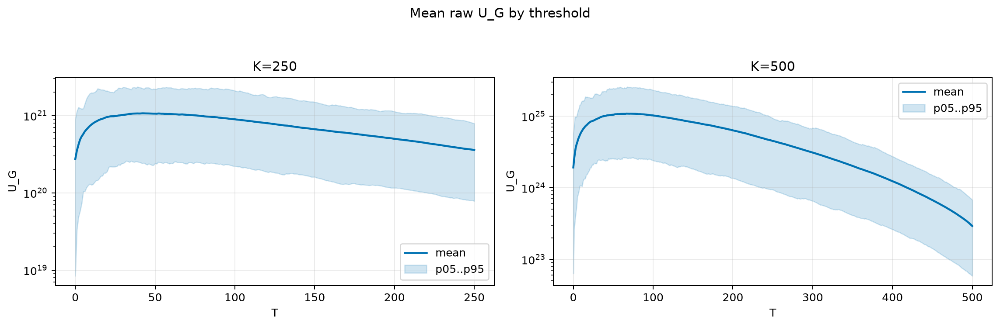
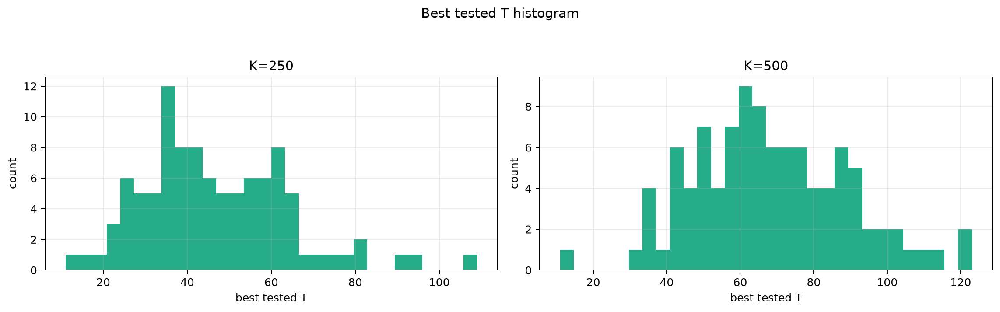
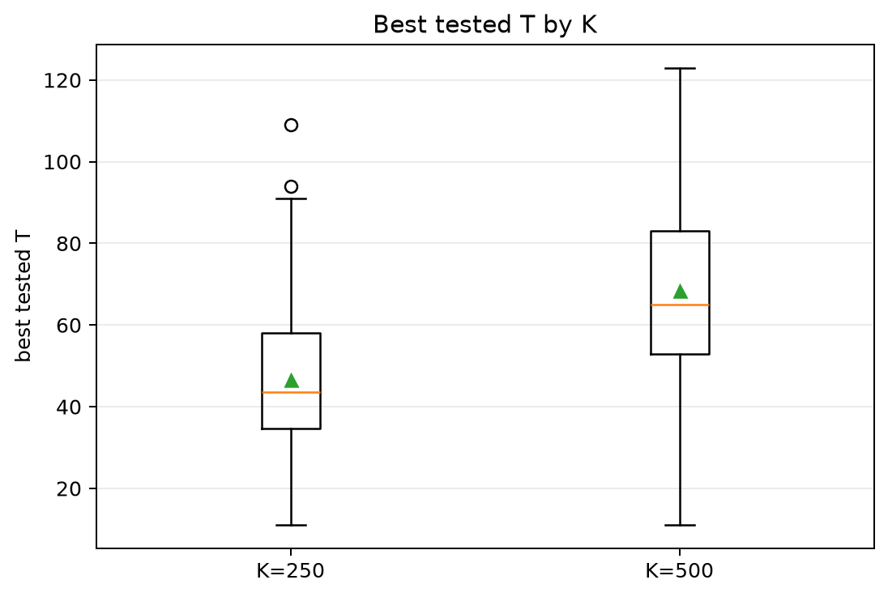
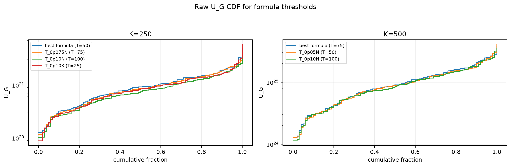
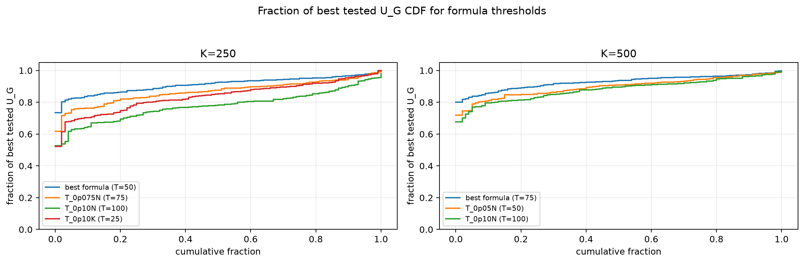

# Threshold Full Sweep: rayleigh

- N: 1000
- L: 8
- K values: 250, 500
- Samples: 100
- Generator seeds: 42
- Sigma: 1.0

The experiment sweeps every integer `T` from `0` to `K` and evaluates raw `U_G`.

## Answer

- `K=250`: best fixed `T=42`; 99% mean-`U_G` diapason `36..50`; best tested `T` median `43.5` (p05..p95 `23.0..78.1`).
- `K=500`: best fixed `T=67`; 99% mean-`U_G` diapason `66..78`; best tested `T` median `65.0` (p05..p95 `37.0..102.2`).

## Best Fixed Thresholds And Formula Checks

| K | best fixed T | 99% diapason | best tested T median | best tested T std | best formula | formula T | formula fraction |
|---:|---:|---|---:|---:|---|---:|---:|
| 250 | 42 | 36..50 | 43.500 | 17.387 | T_0p05N | 50 | 0.9123 |
| 500 | 67 | 66..78 | 65.000 | 20.826 | T_0p075N | 75 | 0.9287 |

## Plots

## Artifacts

- `threshold_runs.csv.gz`
- `best_thresholds.csv`
- `threshold_summary.csv`
- `threshold_best_t_stats.csv`
- `threshold_formula_comparison.csv`
