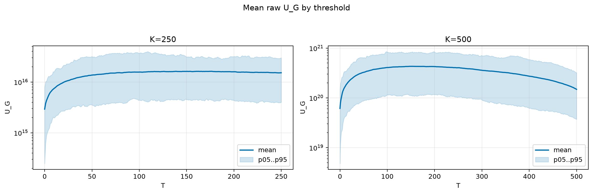
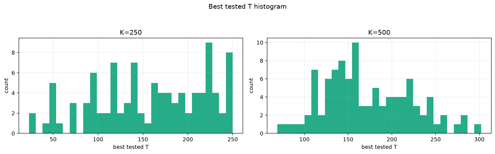
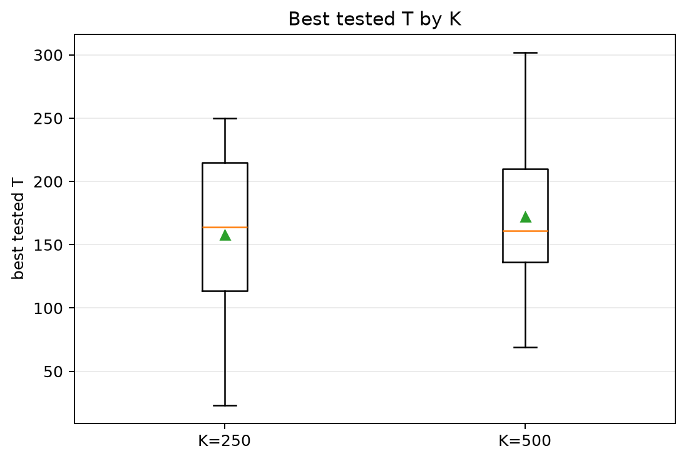
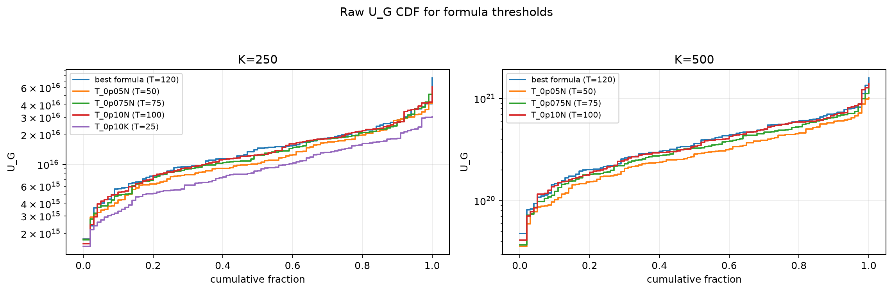
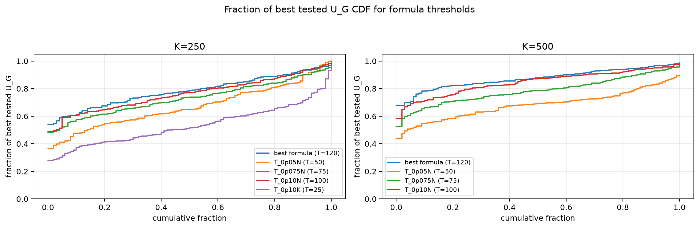

# Threshold Full Sweep: rician

- N: 1000
- L: 8
- K values: 250, 500
- Samples: 100
- Generator seeds: 42
- Sigma: 1.0

The experiment sweeps every integer `T` from `0` to `K` and evaluates raw `U_G`.

## Answer

- `K=250`: best fixed `T=176`; 99% mean-`U_G` diapason `158..177`; best tested `T` median `164.0` (p05..p95 `49.0..245.1`).
- `K=500`: best fixed `T=151`; 99% mean-`U_G` diapason `138..180`; best tested `T` median `161.0` (p05..p95 `103.8..259.1`).

## Best Fixed Thresholds And Formula Checks

| K | best fixed T | 99% diapason | best tested T median | best tested T std | best formula | formula T | formula fraction |
|---:|---:|---|---:|---:|---|---:|---:|
| 250 | 176 | 158..177 | 164.000 | 62.260 | T_0p15NL_over_Lp2 | 120 | 0.7853 |
| 500 | 151 | 138..180 | 161.000 | 50.177 | T_0p15NL_over_Lp2 | 120 | 0.8752 |

## Plots

## Artifacts

- `threshold_runs.csv.gz`
- `best_thresholds.csv`
- `threshold_summary.csv`
- `threshold_best_t_stats.csv`
- `threshold_formula_comparison.csv`
