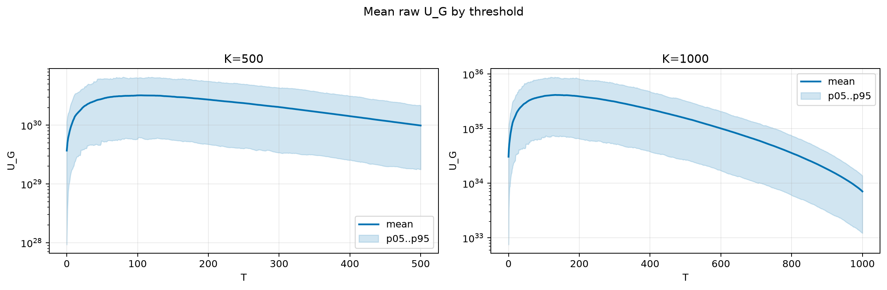
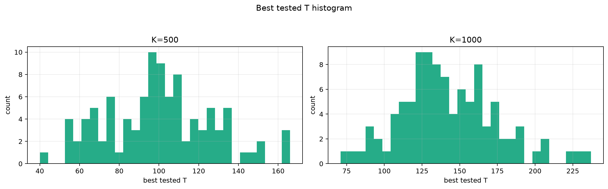
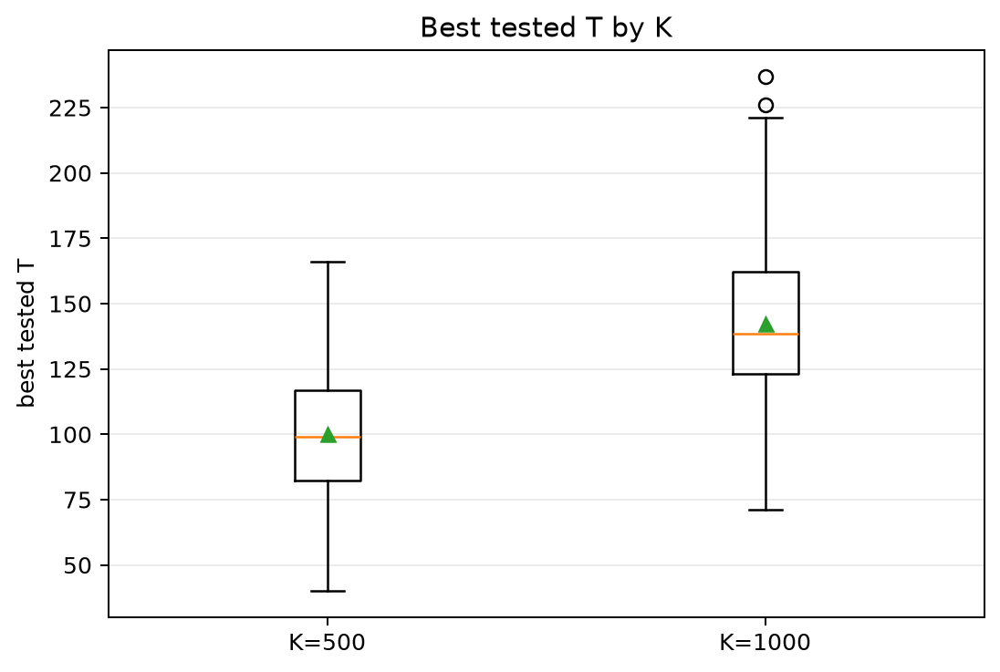
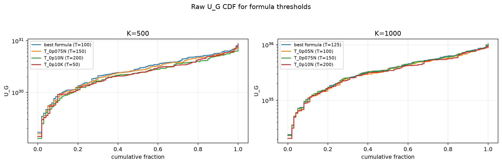
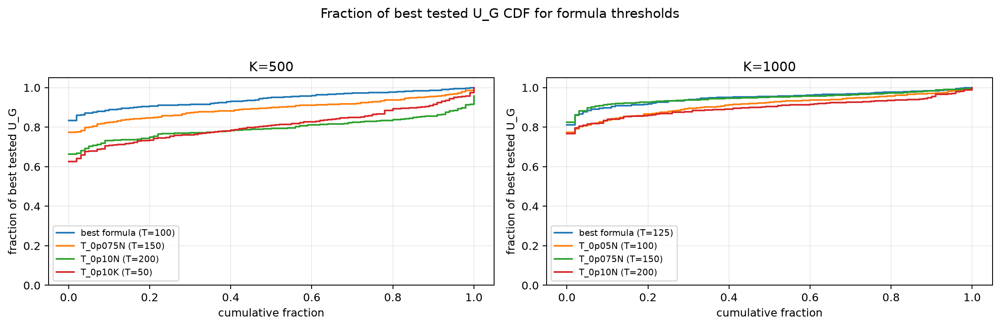

# Threshold Full Sweep: gaussian

- N: 2000
- L: 10
- K values: 500, 1000
- Samples: 100
- Generator seeds: 42
- Sigma: 1.0

The experiment sweeps every integer `T` from `0` to `K` and evaluates raw `U_G`.

## Answer

- `K=500`: best fixed `T=102`; 99% mean-`U_G` diapason `97..124`; best tested `T` median `99.0` (p05..p95 `57.9..145.3`).
- `K=1000`: best fixed `T=132`; 99% mean-`U_G` diapason `123..152`; best tested `T` median `138.5` (p05..p95 `92.0..200.2`).

## Best Fixed Thresholds And Formula Checks

| K | best fixed T | 99% diapason | best tested T median | best tested T std | best formula | formula T | formula fraction |
|---:|---:|---|---:|---:|---|---:|---:|
| 500 | 102 | 97..124 | 99.000 | 26.827 | T_0p05N | 100 | 0.9417 |
| 1000 | 132 | 123..152 | 138.500 | 32.062 | T_0p075NL_over_Lp2 | 125 | 0.9495 |

## Plots

## Artifacts

- `threshold_runs.csv.gz`
- `best_thresholds.csv`
- `threshold_summary.csv`
- `threshold_best_t_stats.csv`
- `threshold_formula_comparison.csv`
