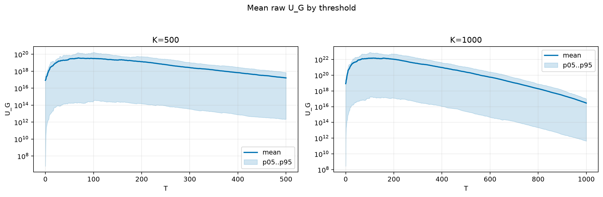
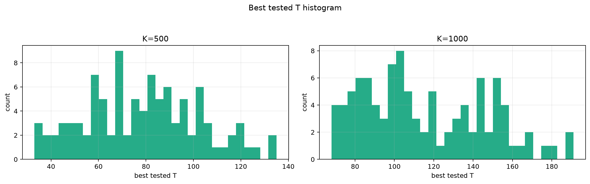
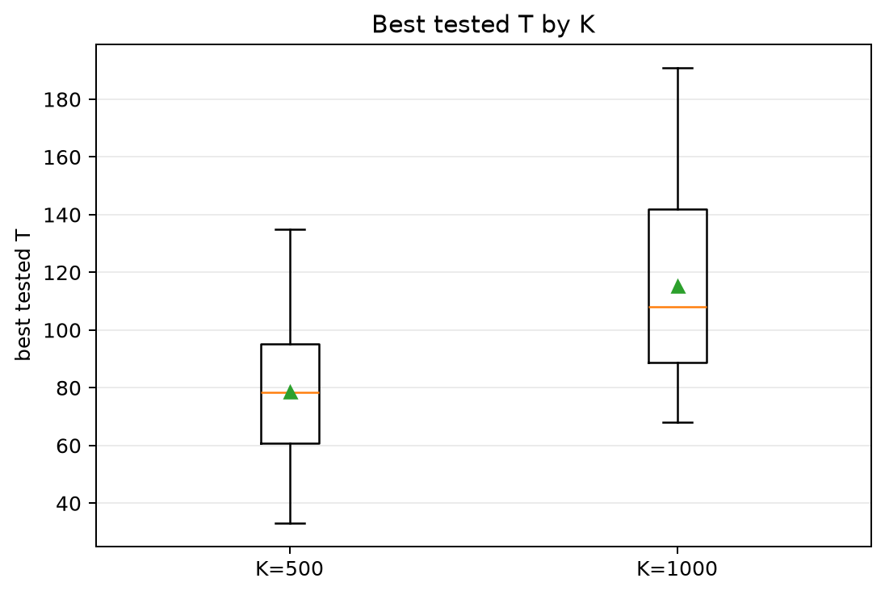
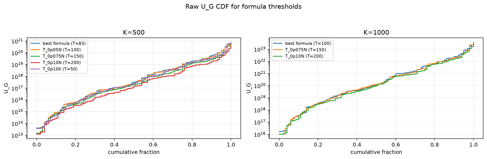
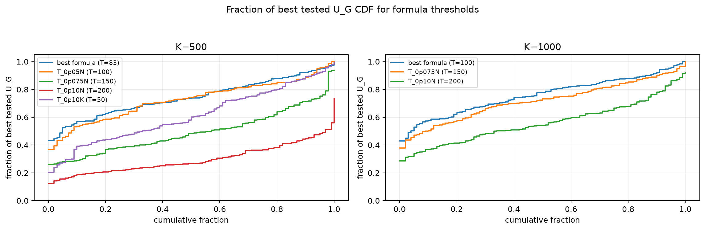

# Threshold Full Sweep: lognormal

- N: 2000
- L: 10
- K values: 500, 1000
- Samples: 100
- Generator seeds: 42
- Sigma: 1.0

The experiment sweeps every integer `T` from `0` to `K` and evaluates raw `U_G`.

## Answer

- `K=500`: best fixed `T=68`; 99% mean-`U_G` diapason `68..69`; best tested `T` median `78.5` (p05..p95 `40.0..118.1`).
- `K=1000`: best fixed `T=158`; 99% mean-`U_G` diapason `158..158`; best tested `T` median `108.0` (p05..p95 `74.0..167.1`).

## Best Fixed Thresholds And Formula Checks

| K | best fixed T | 99% diapason | best tested T median | best tested T std | best formula | formula T | formula fraction |
|---:|---:|---|---:|---:|---|---:|---:|
| 500 | 68 | 68..69 | 78.500 | 24.063 | T_0p05NL_over_Lp2 | 83 | 0.7459 |
| 1000 | 158 | 158..158 | 108.000 | 31.111 | T_0p05N | 100 | 0.7625 |

## Plots

## Artifacts

- `threshold_runs.csv.gz`
- `best_thresholds.csv`
- `threshold_summary.csv`
- `threshold_best_t_stats.csv`
- `threshold_formula_comparison.csv`
