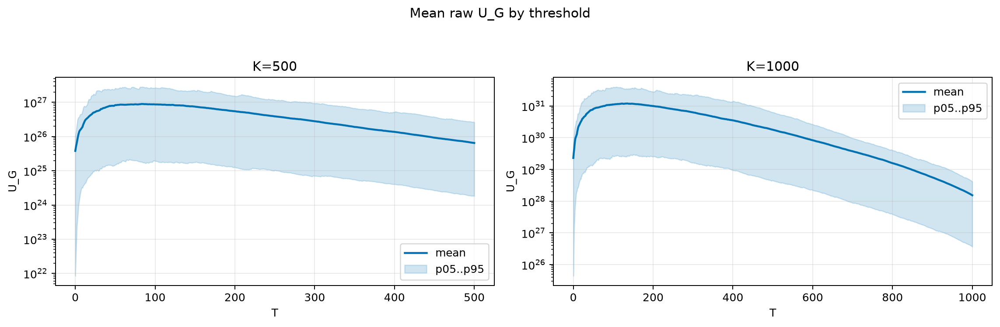
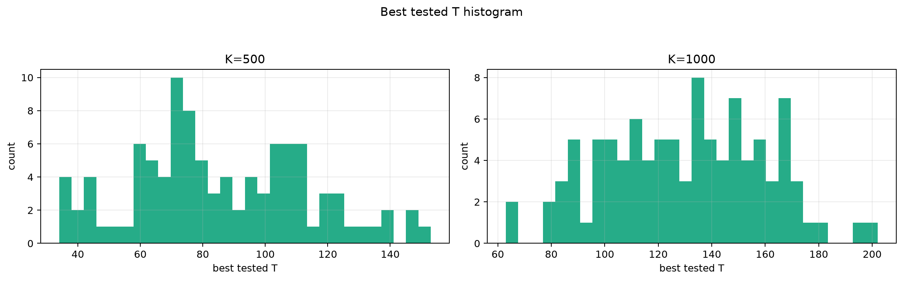
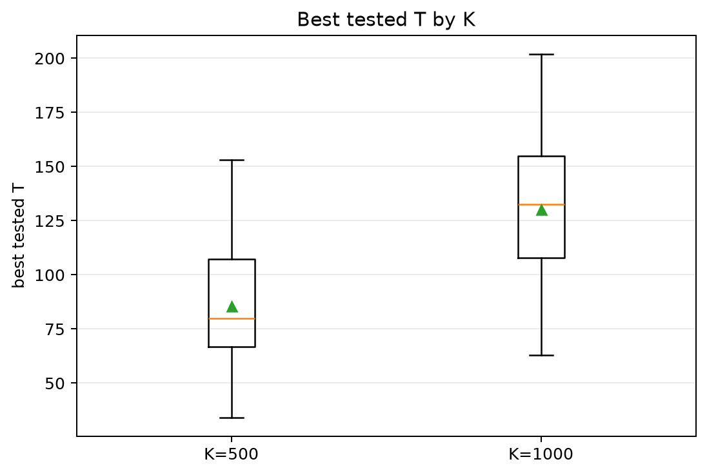
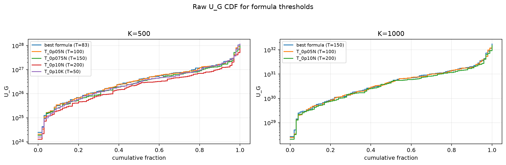
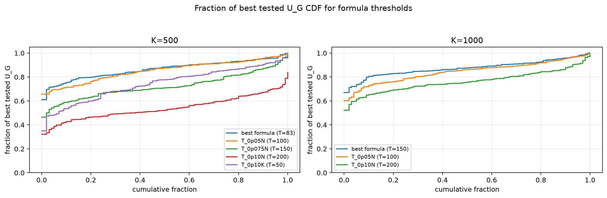

# Threshold Full Sweep: thin_tail

- N: 2000
- L: 10
- K values: 500, 1000
- Samples: 100
- Generator seeds: 42
- Sigma: 1.0

The experiment sweeps every integer `T` from `0` to `K` and evaluates raw `U_G`.

## Answer

- `K=500`: best fixed `T=84`; 99% mean-`U_G` diapason `83..86`; best tested `T` median `80.0` (p05..p95 `39.9..135.2`).
- `K=1000`: best fixed `T=135`; 99% mean-`U_G` diapason `133..136`; best tested `T` median `132.5` (p05..p95 `83.9..174.0`).

## Best Fixed Thresholds And Formula Checks

| K | best fixed T | 99% diapason | best tested T median | best tested T std | best formula | formula T | formula fraction |
|---:|---:|---|---:|---:|---|---:|---:|
| 500 | 84 | 83..86 | 80.000 | 28.201 | T_0p05NL_over_Lp2 | 83 | 0.8664 |
| 1000 | 135 | 133..136 | 132.500 | 29.830 | T_0p075N | 150 | 0.8759 |

## Plots

## Artifacts

- `threshold_runs.csv.gz`
- `best_thresholds.csv`
- `threshold_summary.csv`
- `threshold_best_t_stats.csv`
- `threshold_formula_comparison.csv`
