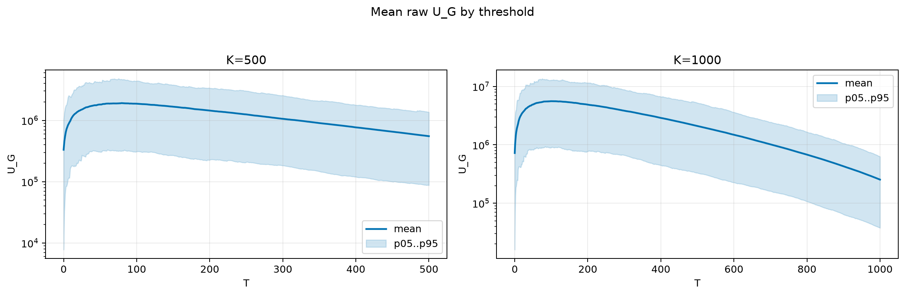
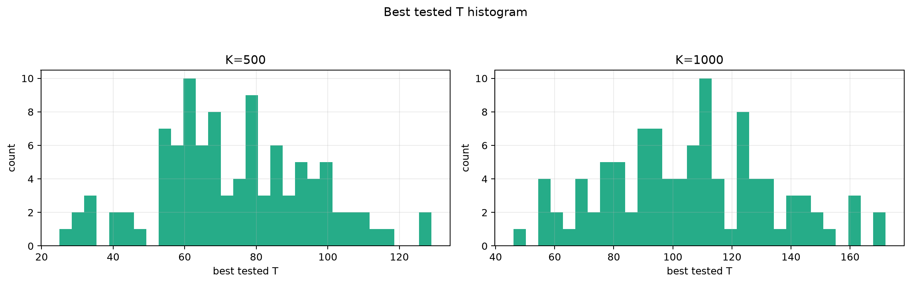
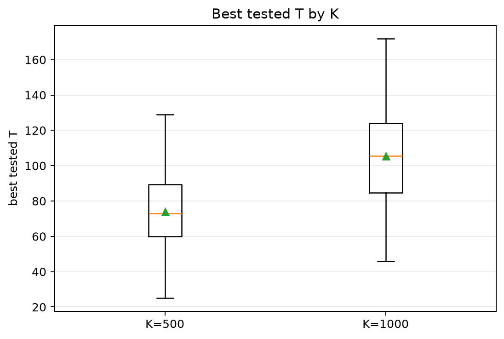
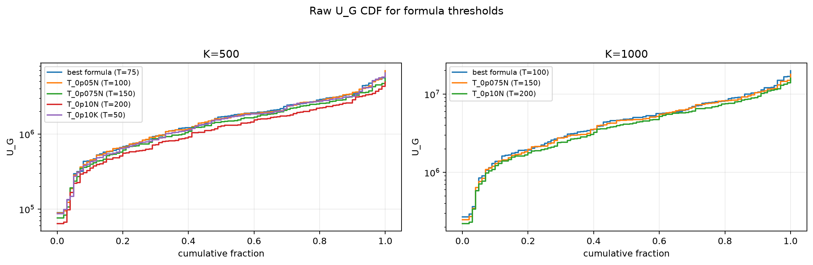
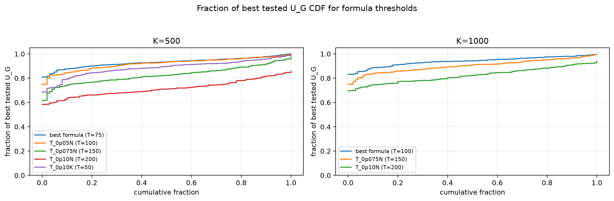

# Threshold Full Sweep: lognormal

- N: 2000
- L: 2
- K values: 500, 1000
- Samples: 100
- Generator seeds: 42
- Sigma: 1.0

The experiment sweeps every integer `T` from `0` to `K` and evaluates raw `U_G`.

## Answer

- `K=500`: best fixed `T=79`; 99% mean-`U_G` diapason `76..86`; best tested `T` median `73.0` (p05..p95 `34.9..109.0`).
- `K=1000`: best fixed `T=99`; 99% mean-`U_G` diapason `92..117`; best tested `T` median `105.5` (p05..p95 `60.9..151.4`).

## Best Fixed Thresholds And Formula Checks

| K | best fixed T | 99% diapason | best tested T median | best tested T std | best formula | formula T | formula fraction |
|---:|---:|---|---:|---:|---|---:|---:|
| 500 | 79 | 76..86 | 73.000 | 21.655 | T_0p075NL_over_Lp2 | 75 | 0.9310 |
| 1000 | 99 | 92..117 | 105.500 | 27.826 | T_0p05N | 100 | 0.9398 |

## Plots

## Artifacts

- `threshold_runs.csv.gz`
- `best_thresholds.csv`
- `threshold_summary.csv`
- `threshold_best_t_stats.csv`
- `threshold_formula_comparison.csv`
