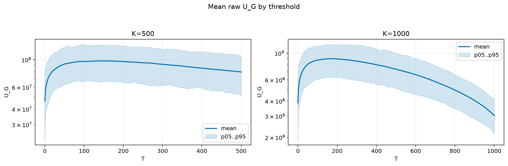
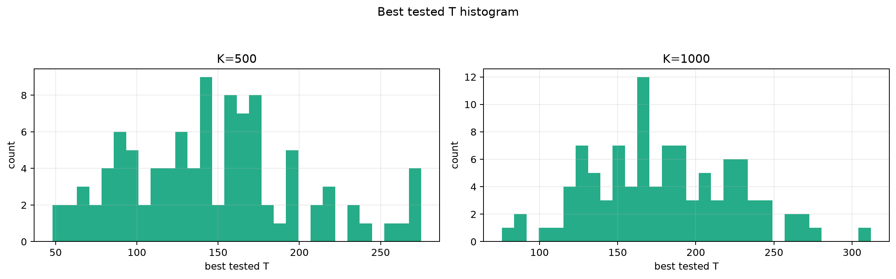
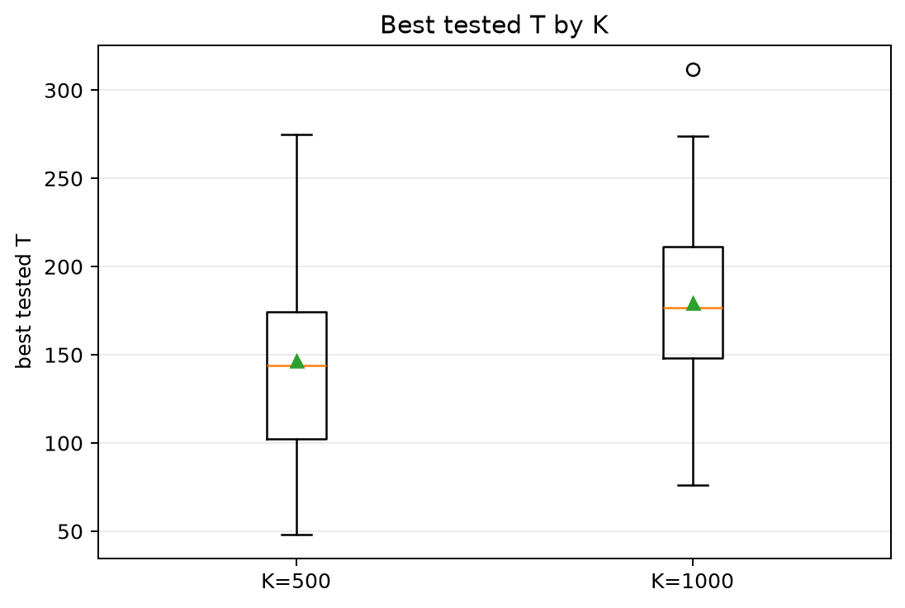
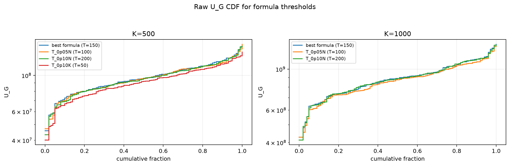
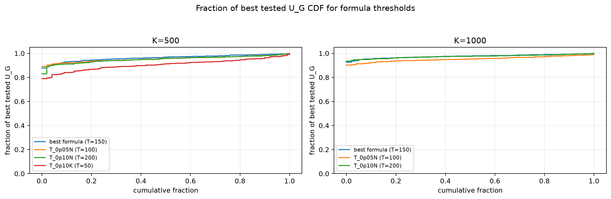

# Threshold Full Sweep: rician

- N: 2000
- L: 2
- K values: 500, 1000
- Samples: 100
- Generator seeds: 42
- Sigma: 1.0

The experiment sweeps every integer `T` from `0` to `K` and evaluates raw `U_G`.

## Answer

- `K=500`: best fixed `T=143`; 99% mean-`U_G` diapason `113..195`; best tested `T` median `144.0` (p05..p95 `69.8..253.3`).
- `K=1000`: best fixed `T=165`; 99% mean-`U_G` diapason `132..216`; best tested `T` median `176.5` (p05..p95 `115.8..257.2`).

## Best Fixed Thresholds And Formula Checks

| K | best fixed T | 99% diapason | best tested T median | best tested T std | best formula | formula T | formula fraction |
|---:|---:|---|---:|---:|---|---:|---:|
| 500 | 143 | 113..195 | 144.000 | 53.560 | T_0p075N | 150 | 0.9634 |
| 1000 | 165 | 132..216 | 176.500 | 45.885 | T_0p075N | 150 | 0.9758 |

## Plots

## Artifacts

- `threshold_runs.csv.gz`
- `best_thresholds.csv`
- `threshold_summary.csv`
- `threshold_best_t_stats.csv`
- `threshold_formula_comparison.csv`
