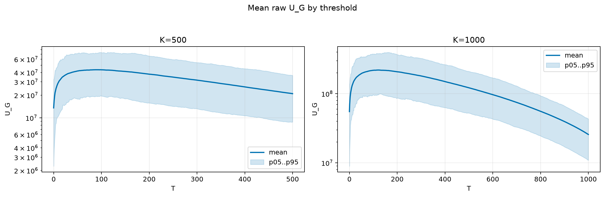
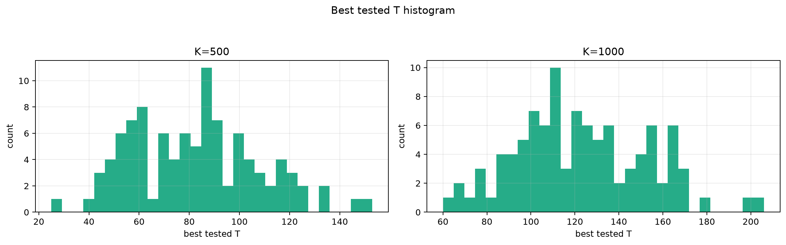
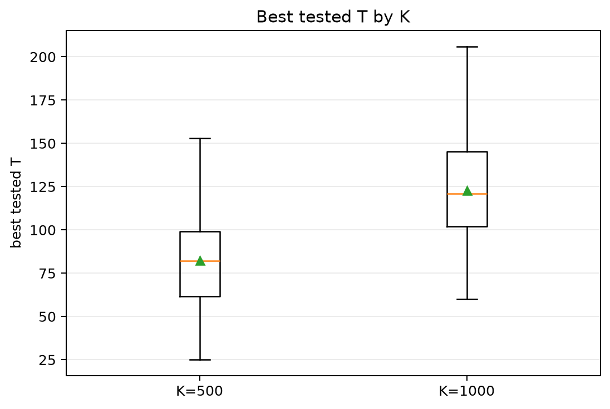
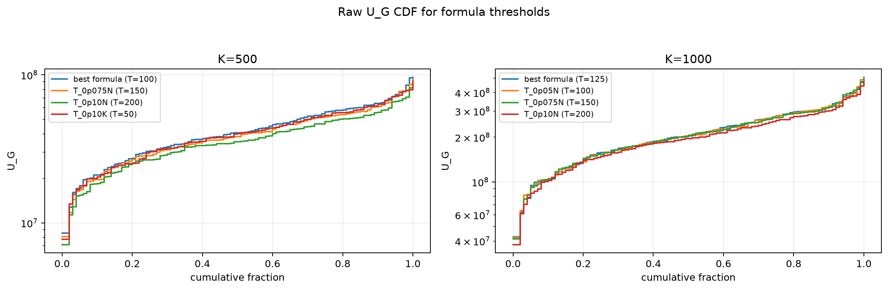
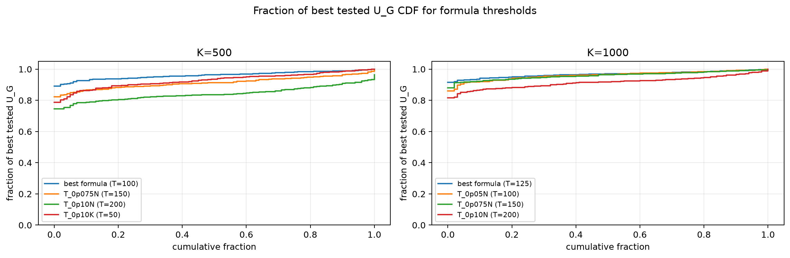

# Threshold Full Sweep: thin_tail

> Historical K semantics note: this report uses active-K semantics. Here `K` is the number of selected/kept antennas, not the number turned off. A `25% active` or `K=0.25N` case means `75% off`, not the real `25% off` task. For real off-percent experiments, `25% off => K_active=0.75N` and `50% off => K_active=0.50N`.

- N: 2000
- L: 2
- K values: 500, 1000
- Samples: 100
- Generator seeds: 42
- Sigma: 1.0

The experiment sweeps every integer `T` from `0` to `K` and evaluates raw `U_G`.

## Answer

- `K=500`: best fixed `T=89`; 99% mean-`U_G` diapason `75..109`; best tested `T` median `82.0` (p05..p95 `48.9..124.1`).
- `K=1000`: best fixed `T=123`; 99% mean-`U_G` diapason `98..149`; best tested `T` median `121.0` (p05..p95 `76.9..168.1`).

## Best Fixed Thresholds And Formula Checks

| K | best fixed T | 99% diapason | best tested T median | best tested T std | best formula | formula T | formula fraction |
|---:|---:|---|---:|---:|---|---:|---:|
| 500 | 89 | 75..109 | 82.000 | 25.325 | T_0p05N | 100 | 0.9611 |
| 1000 | 123 | 98..149 | 121.000 | 29.847 | T_0p125NL_over_Lp2 | 125 | 0.9673 |

## Plots

## Artifacts

- `threshold_runs.csv.gz`
- `best_thresholds.csv`
- `threshold_summary.csv`
- `threshold_best_t_stats.csv`
- `threshold_formula_comparison.csv`
