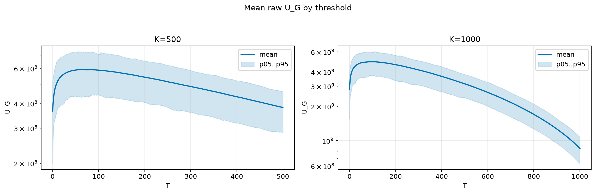
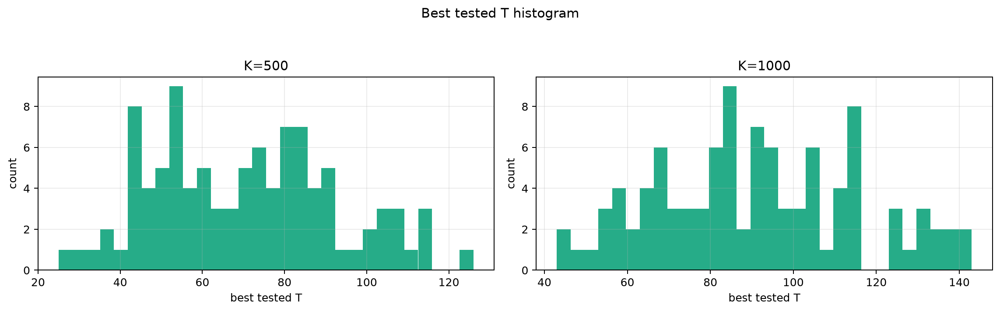
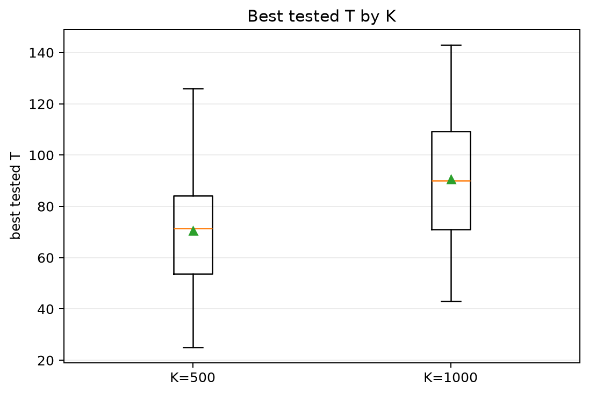
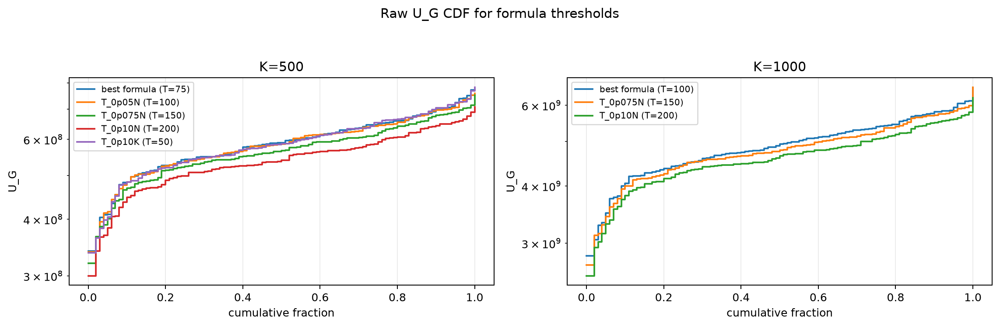
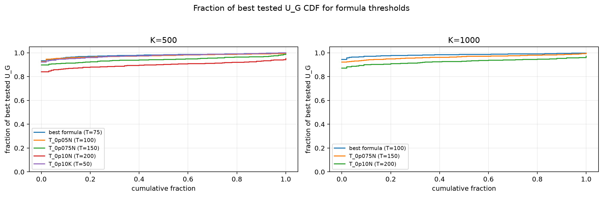

# Threshold Full Sweep: twdp

- N: 2000
- L: 2
- K values: 500, 1000
- Samples: 100
- Generator seeds: 42
- Sigma: 1.0

The experiment sweeps every integer `T` from `0` to `K` and evaluates raw `U_G`.

## Answer

- `K=500`: best fixed `T=83`; 99% mean-`U_G` diapason `45..108`; best tested `T` median `71.5` (p05..p95 `38.9..108.1`).
- `K=1000`: best fixed `T=92`; 99% mean-`U_G` diapason `66..131`; best tested `T` median `90.0` (p05..p95 `54.9..133.1`).

## Best Fixed Thresholds And Formula Checks

| K | best fixed T | 99% diapason | best tested T median | best tested T std | best formula | formula T | formula fraction |
|---:|---:|---|---:|---:|---|---:|---:|
| 500 | 83 | 45..108 | 71.500 | 22.157 | T_0p075NL_over_Lp2 | 75 | 0.9801 |
| 1000 | 92 | 66..131 | 90.000 | 24.362 | T_0p05N | 100 | 0.9839 |

## Plots

## Artifacts

- `threshold_runs.csv.gz`
- `best_thresholds.csv`
- `threshold_summary.csv`
- `threshold_best_t_stats.csv`
- `threshold_formula_comparison.csv`
