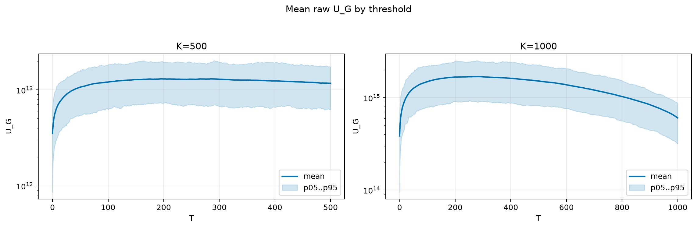
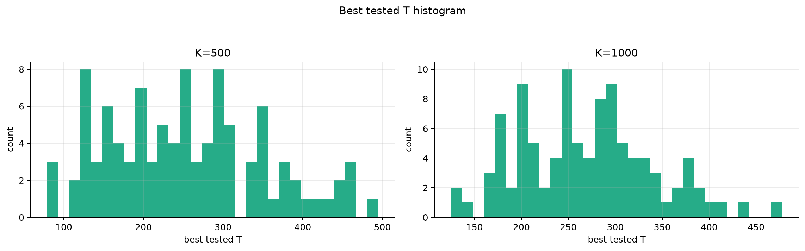
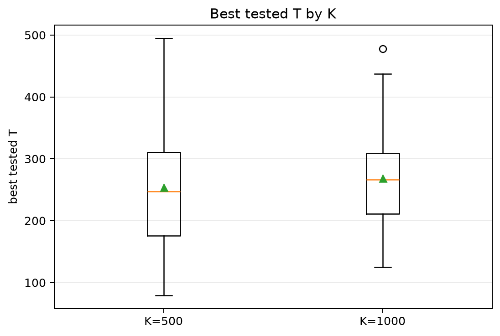
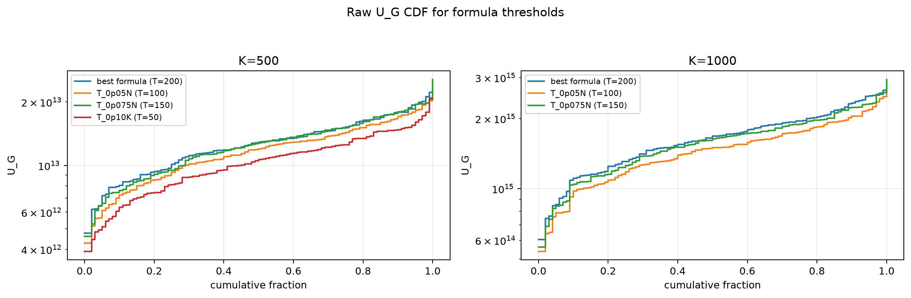
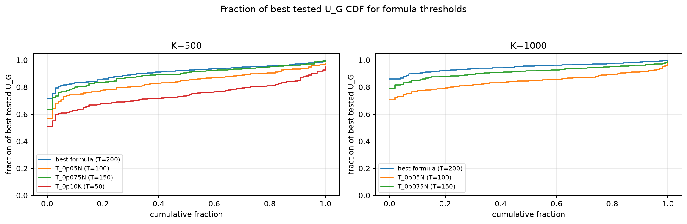

# Threshold Full Sweep: rician

- N: 2000
- L: 4
- K values: 500, 1000
- Samples: 100
- Generator seeds: 42
- Sigma: 1.0

The experiment sweeps every integer `T` from `0` to `K` and evaluates raw `U_G`.

## Answer

- `K=500`: best fixed `T=284`; 99% mean-`U_G` diapason `243..301`; best tested `T` median `247.5` (p05..p95 `124.2..442.3`).
- `K=1000`: best fixed `T=280`; 99% mean-`U_G` diapason `210..310`; best tested `T` median `266.5` (p05..p95 `171.6..384.3`).

## Best Fixed Thresholds And Formula Checks

| K | best fixed T | 99% diapason | best tested T median | best tested T std | best formula | formula T | formula fraction |
|---:|---:|---|---:|---:|---|---:|---:|
| 500 | 284 | 243..301 | 247.500 | 99.543 | T_0p10N | 200 | 0.9115 |
| 1000 | 280 | 210..310 | 266.500 | 70.514 | T_0p10N | 200 | 0.9484 |

## Plots

## Artifacts

- `threshold_runs.csv.gz`
- `best_thresholds.csv`
- `threshold_summary.csv`
- `threshold_best_t_stats.csv`
- `threshold_formula_comparison.csv`
