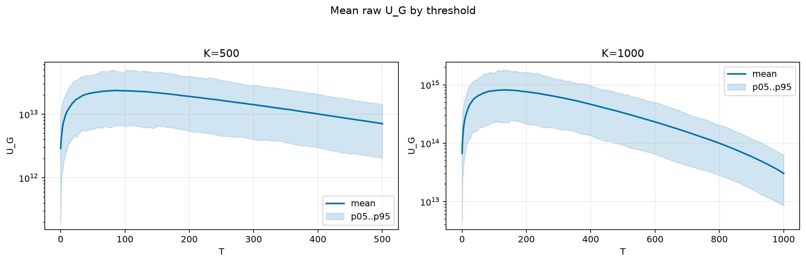
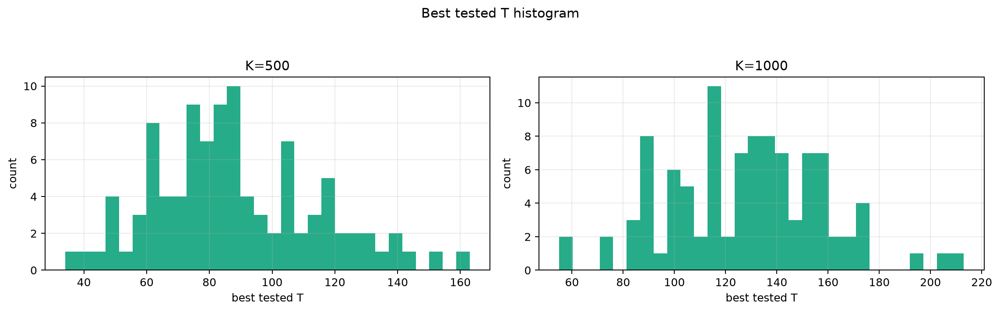
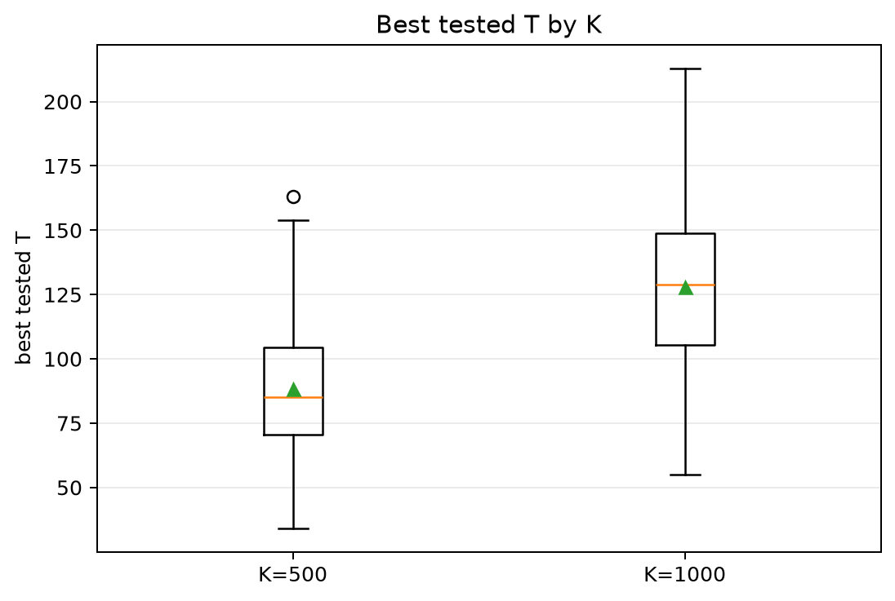
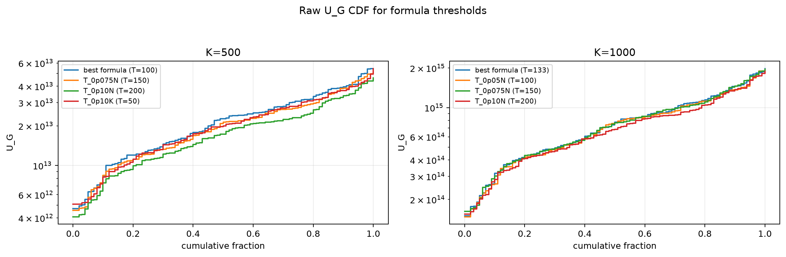
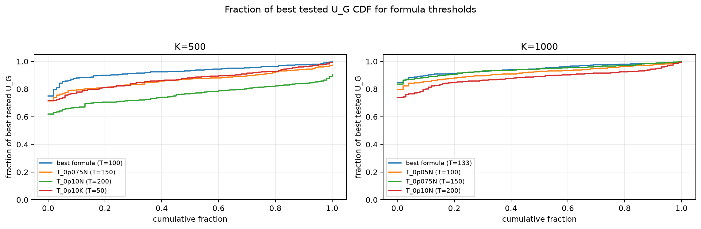

# Threshold Full Sweep: thin_tail

- N: 2000
- L: 4
- K values: 500, 1000
- Samples: 100
- Generator seeds: 42
- Sigma: 1.0

The experiment sweeps every integer `T` from `0` to `K` and evaluates raw `U_G`.

## Answer

- `K=500`: best fixed `T=85`; 99% mean-`U_G` diapason `78..91`; best tested `T` median `85.0` (p05..p95 `50.9..134.2`).
- `K=1000`: best fixed `T=135`; 99% mean-`U_G` diapason `120..146`; best tested `T` median `129.0` (p05..p95 `84.0..174.1`).

## Best Fixed Thresholds And Formula Checks

| K | best fixed T | 99% diapason | best tested T median | best tested T std | best formula | formula T | formula fraction |
|---:|---:|---|---:|---:|---|---:|---:|
| 500 | 85 | 78..91 | 85.000 | 25.956 | T_0p05N | 100 | 0.9296 |
| 1000 | 135 | 120..146 | 129.000 | 30.321 | T_0p10NL_over_Lp2 | 133 | 0.9471 |

## Plots

## Artifacts

- `threshold_runs.csv.gz`
- `best_thresholds.csv`
- `threshold_summary.csv`
- `threshold_best_t_stats.csv`
- `threshold_formula_comparison.csv`
