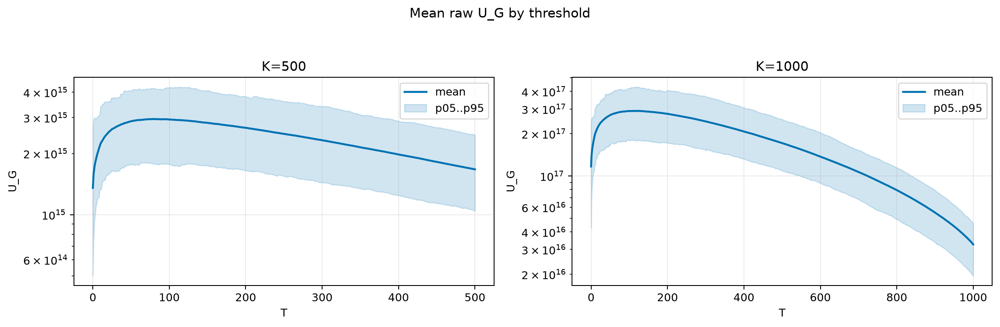
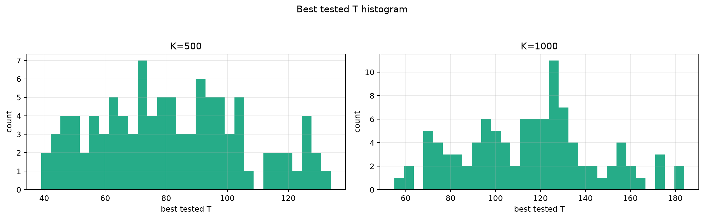
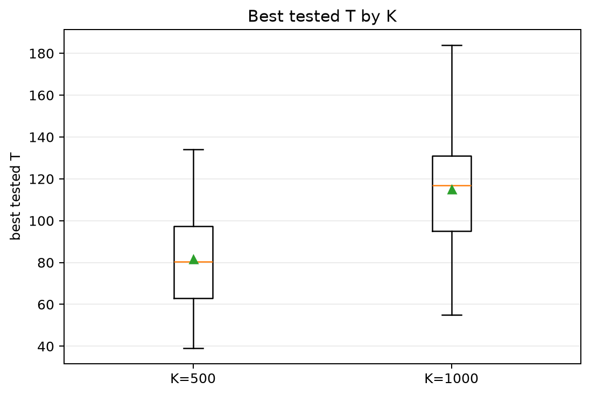
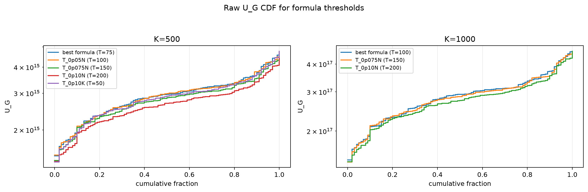
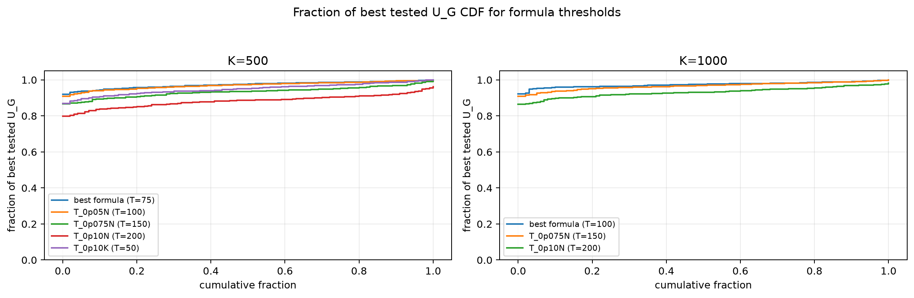

# Threshold Full Sweep: twdp

> Historical K semantics note: this report uses active-K semantics. Here `K` is the number of selected/kept antennas, not the number turned off. A `25% active` or `K=0.25N` case means `75% off`, not the real `25% off` task. For real off-percent experiments, `25% off => K_active=0.75N` and `50% off => K_active=0.50N`.

- N: 2000
- L: 4
- K values: 500, 1000
- Samples: 100
- Generator seeds: 42
- Sigma: 1.0

The experiment sweeps every integer `T` from `0` to `K` and evaluates raw `U_G`.

## Answer

- `K=500`: best fixed `T=78`; 99% mean-`U_G` diapason `63..108`; best tested `T` median `80.5` (p05..p95 `45.9..125.0`).
- `K=1000`: best fixed `T=118`; 99% mean-`U_G` diapason `88..144`; best tested `T` median `117.0` (p05..p95 `70.9..165.3`).

## Best Fixed Thresholds And Formula Checks

| K | best fixed T | 99% diapason | best tested T median | best tested T std | best formula | formula T | formula fraction |
|---:|---:|---|---:|---:|---|---:|---:|
| 500 | 78 | 63..108 | 80.500 | 24.102 | T_0p15K | 75 | 0.9729 |
| 1000 | 118 | 88..144 | 117.000 | 29.350 | T_0p05N | 100 | 0.9742 |

## Plots

## Artifacts

- `threshold_runs.csv.gz`
- `best_thresholds.csv`
- `threshold_summary.csv`
- `threshold_best_t_stats.csv`
- `threshold_formula_comparison.csv`
