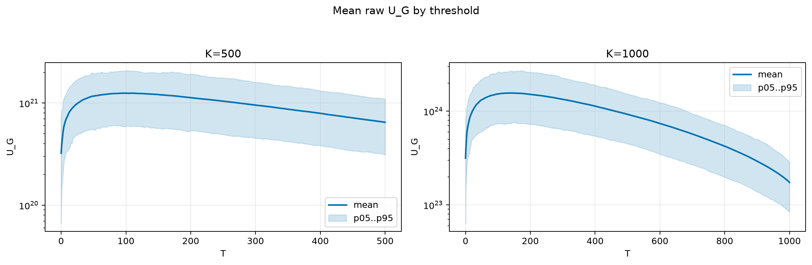
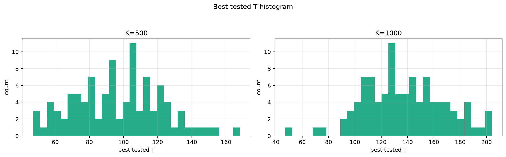
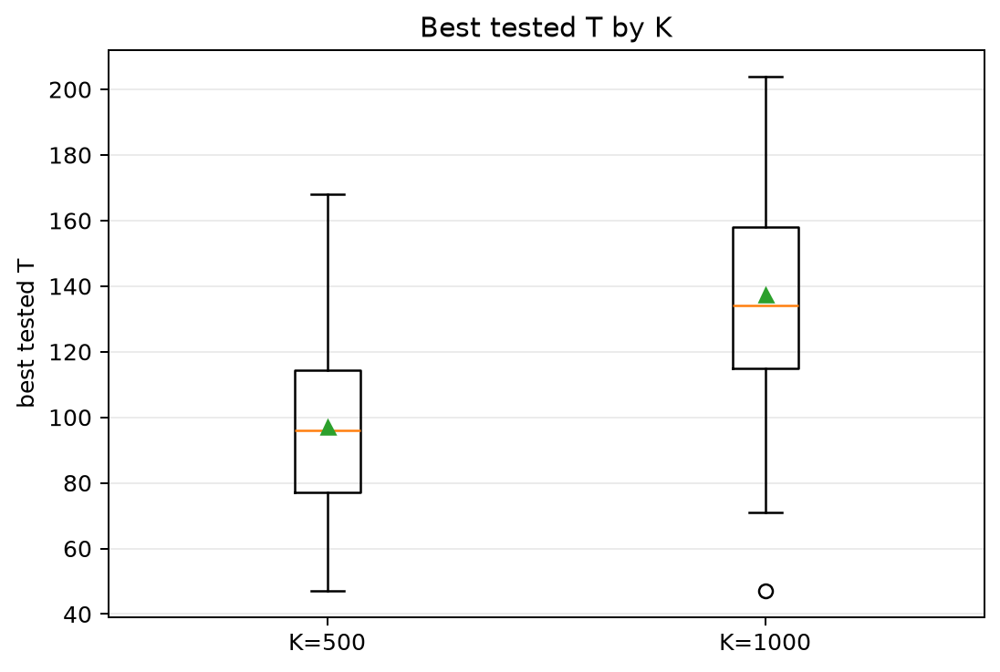
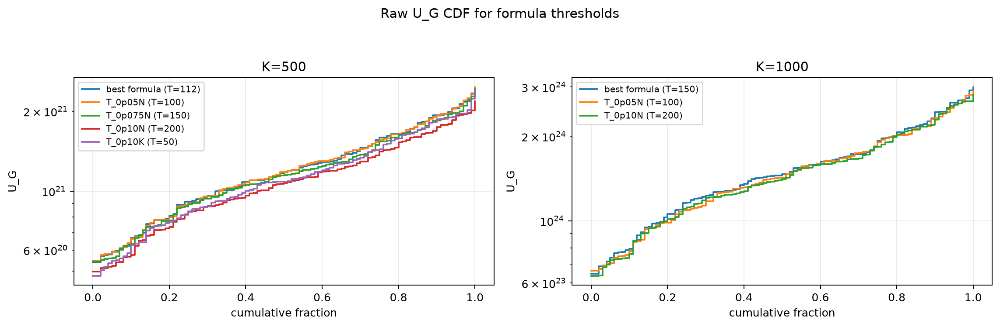
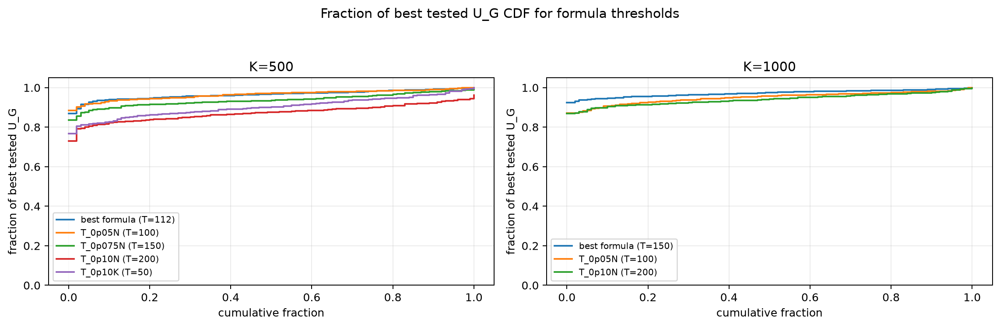

# Threshold Full Sweep: nakagami

- N: 2000
- L: 6
- K values: 500, 1000
- Samples: 100
- Generator seeds: 42
- Sigma: 1.0

The experiment sweeps every integer `T` from `0` to `K` and evaluates raw `U_G`.

## Answer

- `K=500`: best fixed `T=95`; 99% mean-`U_G` diapason `81..125`; best tested `T` median `96.0` (p05..p95 `57.9..139.1`).
- `K=1000`: best fixed `T=140`; 99% mean-`U_G` diapason `111..172`; best tested `T` median `134.0` (p05..p95 `95.8..188.2`).

## Best Fixed Thresholds And Formula Checks

| K | best fixed T | 99% diapason | best tested T median | best tested T std | best formula | formula T | formula fraction |
|---:|---:|---|---:|---:|---|---:|---:|
| 500 | 95 | 81..125 | 96.000 | 25.629 | T_0p075NL_over_Lp2 | 112 | 0.9653 |
| 1000 | 140 | 111..172 | 134.000 | 30.759 | T_0p075N | 150 | 0.9719 |

## Plots

## Artifacts

- `threshold_runs.csv.gz`
- `best_thresholds.csv`
- `threshold_summary.csv`
- `threshold_best_t_stats.csv`
- `threshold_formula_comparison.csv`
