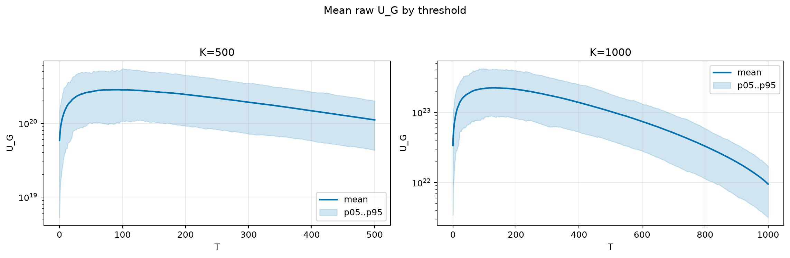
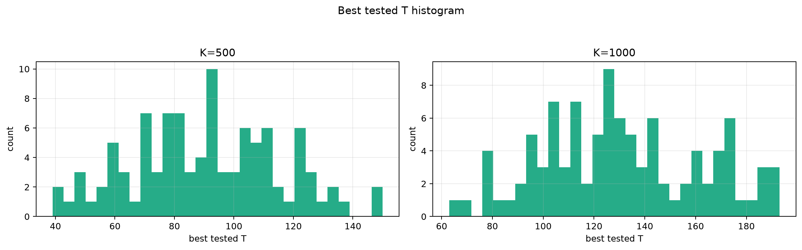
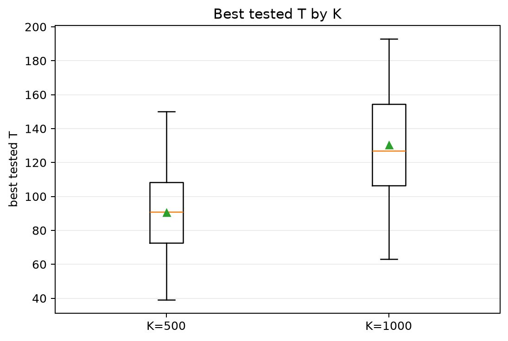
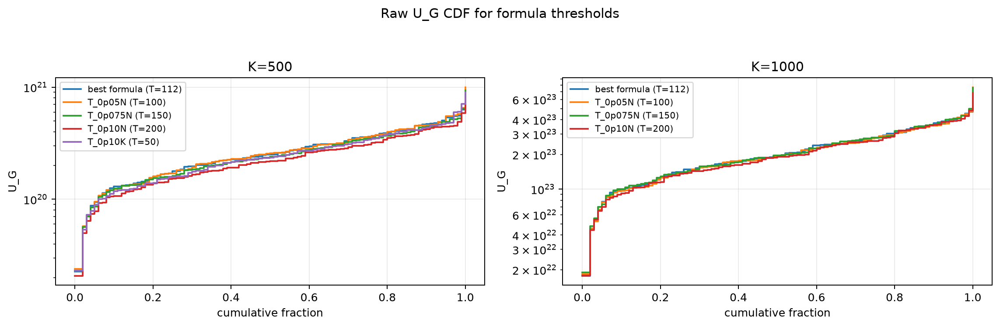
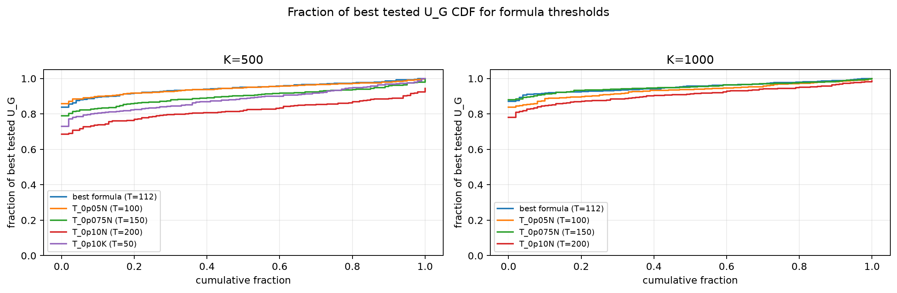

# Threshold Full Sweep: rayleigh

- N: 2000
- L: 6
- K values: 500, 1000
- Samples: 100
- Generator seeds: 42
- Sigma: 1.0

The experiment sweeps every integer `T` from `0` to `K` and evaluates raw `U_G`.

## Answer

- `K=500`: best fixed `T=87`; 99% mean-`U_G` diapason `70..112`; best tested `T` median `91.0` (p05..p95 `50.0..128.2`).
- `K=1000`: best fixed `T=126`; 99% mean-`U_G` diapason `110..152`; best tested `T` median `127.0` (p05..p95 `79.0..186.1`).

## Best Fixed Thresholds And Formula Checks

| K | best fixed T | 99% diapason | best tested T median | best tested T std | best formula | formula T | formula fraction |
|---:|---:|---|---:|---:|---|---:|---:|
| 500 | 87 | 70..112 | 91.000 | 24.648 | T_0p075NL_over_Lp2 | 112 | 0.9453 |
| 1000 | 126 | 110..152 | 127.000 | 31.426 | T_0p075NL_over_Lp2 | 112 | 0.9531 |

## Plots

## Artifacts

- `threshold_runs.csv.gz`
- `best_thresholds.csv`
- `threshold_summary.csv`
- `threshold_best_t_stats.csv`
- `threshold_formula_comparison.csv`
