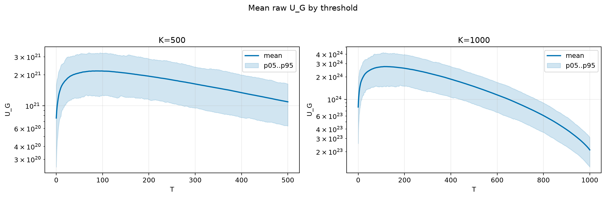
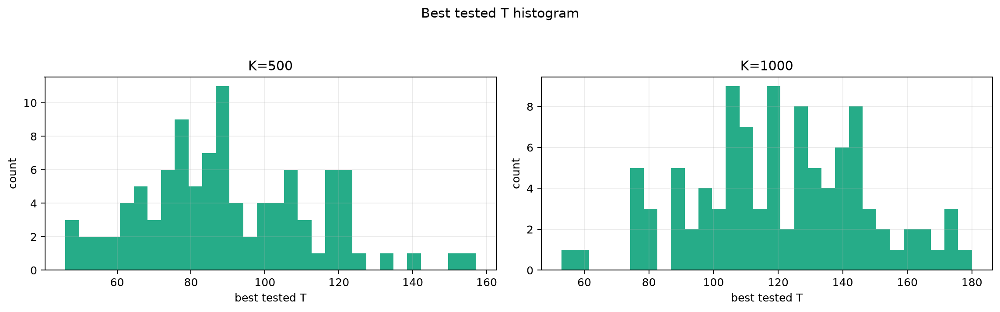
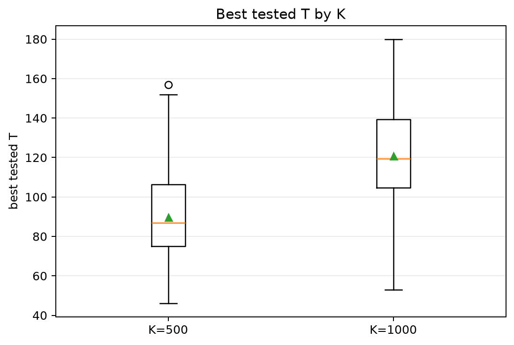
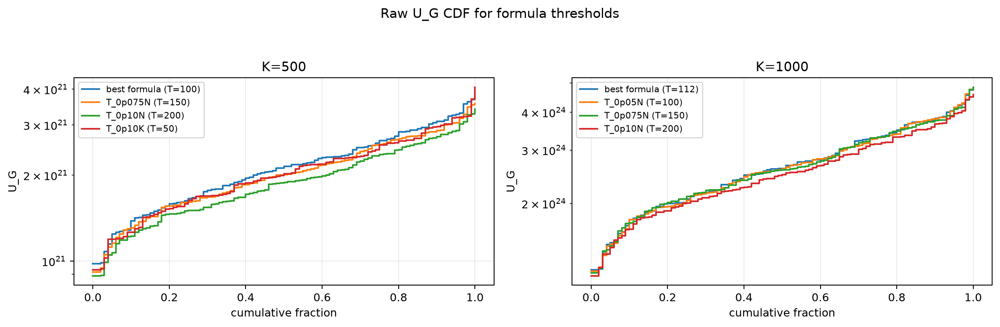
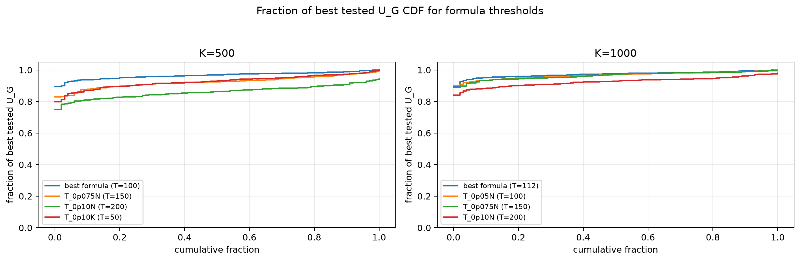

# Threshold Full Sweep: twdp

> Historical K semantics note: this report uses active-K semantics. Here `K` is the number of selected/kept antennas, not the number turned off. A `25% active` or `K=0.25N` case means `75% off`, not the real `25% off` task. For real off-percent experiments, `25% off => K_active=0.75N` and `50% off => K_active=0.50N`.

- N: 2000
- L: 6
- K values: 500, 1000
- Samples: 100
- Generator seeds: 42
- Sigma: 1.0

The experiment sweeps every integer `T` from `0` to `K` and evaluates raw `U_G`.

## Answer

- `K=500`: best fixed `T=97`; 99% mean-`U_G` diapason `68..115`; best tested `T` median `87.0` (p05..p95 `54.0..123.1`).
- `K=1000`: best fixed `T=114`; 99% mean-`U_G` diapason `97..148`; best tested `T` median `119.5` (p05..p95 `77.0..167.1`).

## Best Fixed Thresholds And Formula Checks

| K | best fixed T | 99% diapason | best tested T median | best tested T std | best formula | formula T | formula fraction |
|---:|---:|---|---:|---:|---|---:|---:|
| 500 | 97 | 68..115 | 87.000 | 23.006 | T_0p05N | 100 | 0.9661 |
| 1000 | 114 | 97..148 | 119.500 | 26.604 | T_0p075NL_over_Lp2 | 112 | 0.9733 |

## Plots

## Artifacts

- `threshold_runs.csv.gz`
- `best_thresholds.csv`
- `threshold_summary.csv`
- `threshold_best_t_stats.csv`
- `threshold_formula_comparison.csv`
