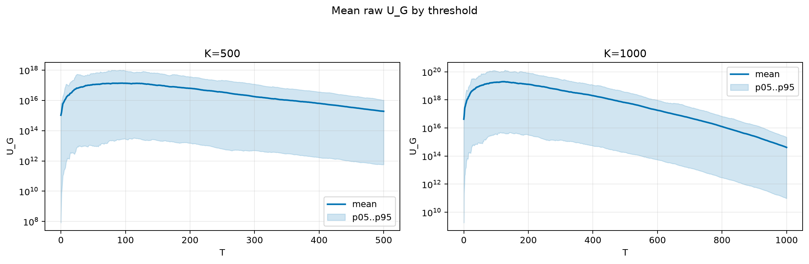
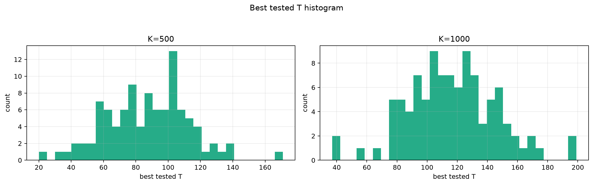
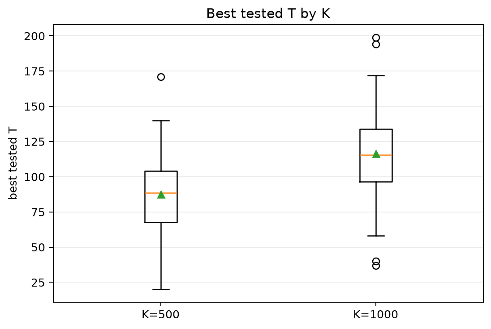
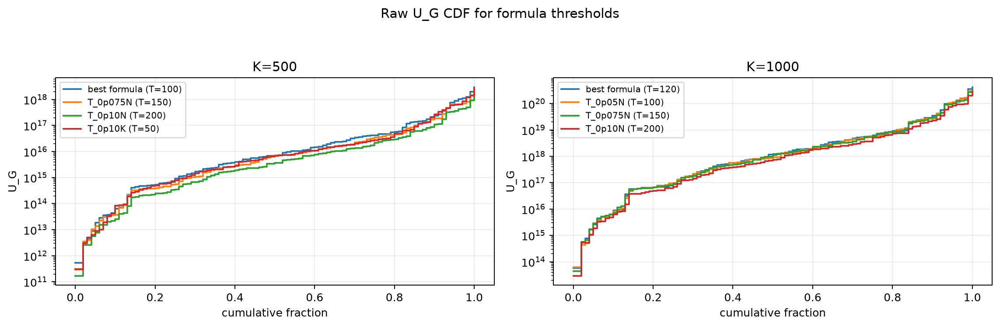
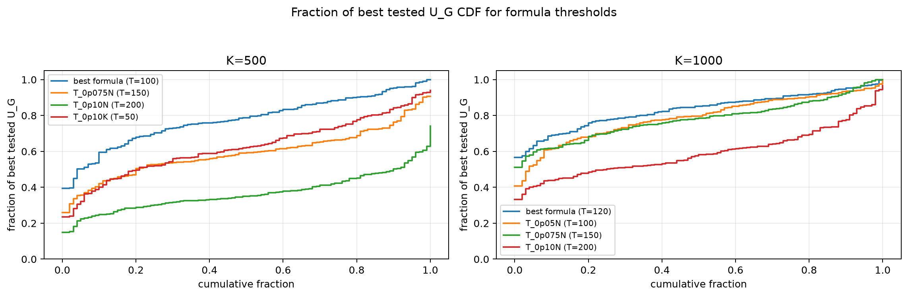

# Threshold Full Sweep: lognormal

- N: 2000
- L: 8
- K values: 500, 1000
- Samples: 100
- Generator seeds: 42
- Sigma: 1.0

The experiment sweeps every integer `T` from `0` to `K` and evaluates raw `U_G`.

## Answer

- `K=500`: best fixed `T=95`; 99% mean-`U_G` diapason `94..96`; best tested `T` median `88.5` (p05..p95 `46.9..128.1`).
- `K=1000`: best fixed `T=125`; 99% mean-`U_G` diapason `125..125`; best tested `T` median `115.5` (p05..p95 `77.0..163.4`).

## Best Fixed Thresholds And Formula Checks

| K | best fixed T | 99% diapason | best tested T median | best tested T std | best formula | formula T | formula fraction |
|---:|---:|---|---:|---:|---|---:|---:|
| 500 | 95 | 94..96 | 88.500 | 25.892 | T_0p05N | 100 | 0.7811 |
| 1000 | 125 | 125..125 | 115.500 | 29.616 | T_0p075NL_over_Lp2 | 120 | 0.8343 |

## Plots

## Artifacts

- `threshold_runs.csv.gz`
- `best_thresholds.csv`
- `threshold_summary.csv`
- `threshold_best_t_stats.csv`
- `threshold_formula_comparison.csv`
