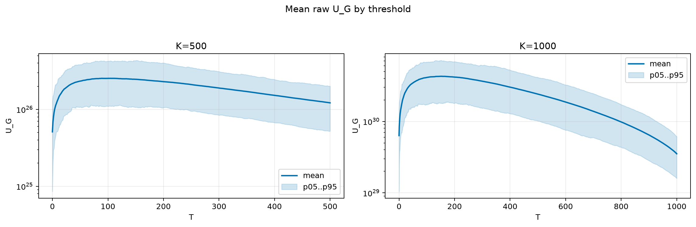
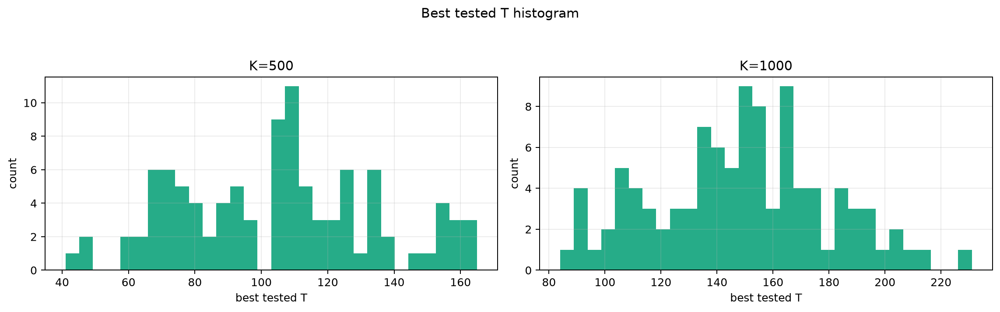
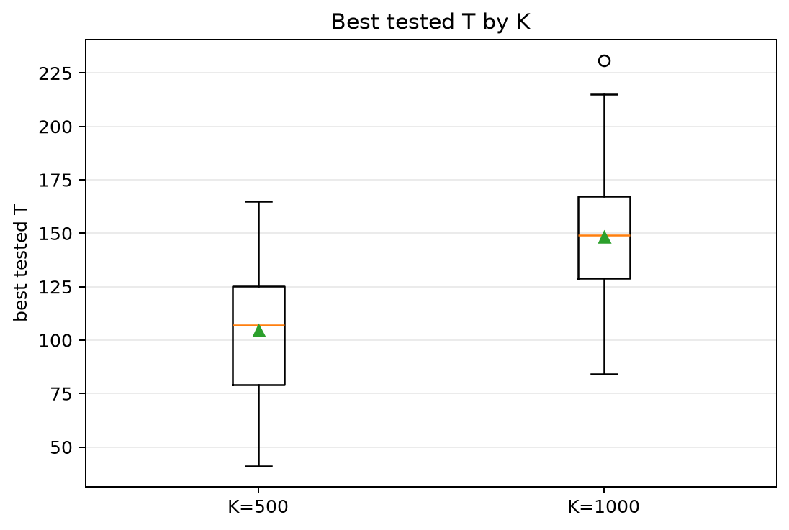
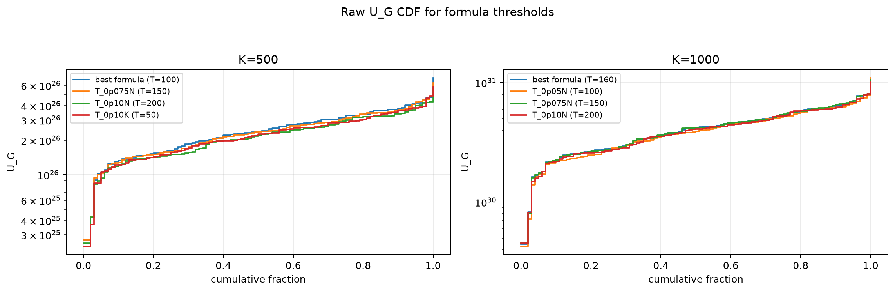
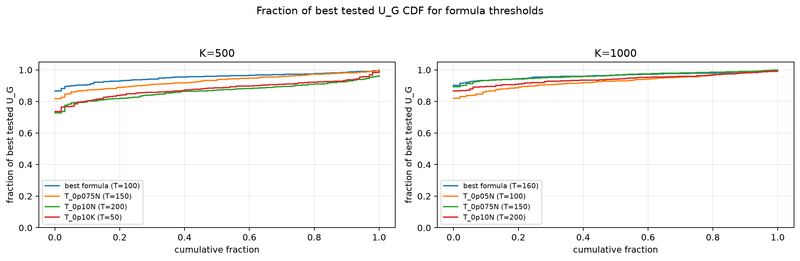

# Threshold Full Sweep: nakagami

- N: 2000
- L: 8
- K values: 500, 1000
- Samples: 100
- Generator seeds: 42
- Sigma: 1.0

The experiment sweeps every integer `T` from `0` to `K` and evaluates raw `U_G`.

## Answer

- `K=500`: best fixed `T=89`; 99% mean-`U_G` diapason `79..122`; best tested `T` median `107.0` (p05..p95 `62.9..157.1`).
- `K=1000`: best fixed `T=151`; 99% mean-`U_G` diapason `131..175`; best tested `T` median `149.0` (p05..p95 `96.8..197.3`).

## Best Fixed Thresholds And Formula Checks

| K | best fixed T | 99% diapason | best tested T median | best tested T std | best formula | formula T | formula fraction |
|---:|---:|---|---:|---:|---|---:|---:|
| 500 | 89 | 79..122 | 107.000 | 29.659 | T_0p05N | 100 | 0.9550 |
| 1000 | 151 | 131..175 | 149.000 | 31.269 | T_0p10NL_over_Lp2 | 160 | 0.9647 |

## Plots

## Artifacts

- `threshold_runs.csv.gz`
- `best_thresholds.csv`
- `threshold_summary.csv`
- `threshold_best_t_stats.csv`
- `threshold_formula_comparison.csv`
