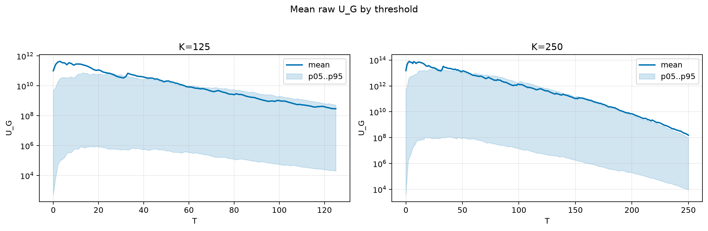
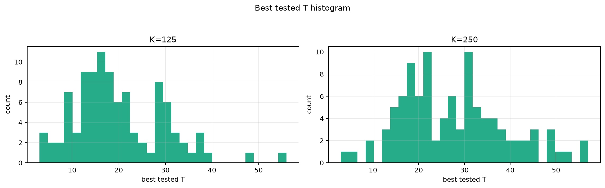
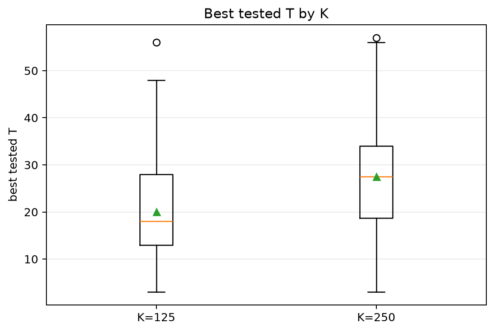
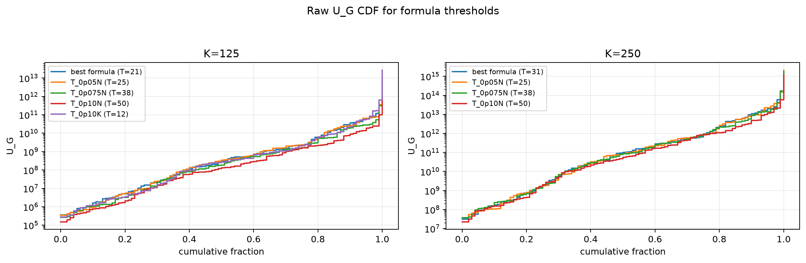
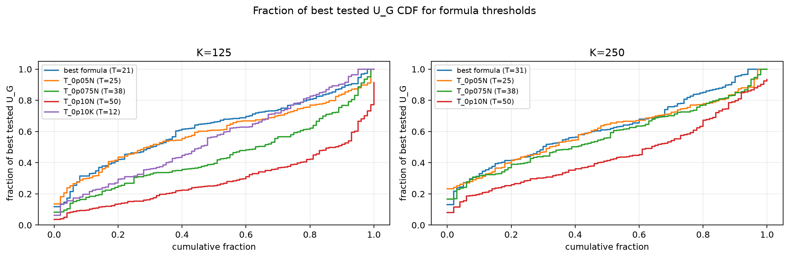

# Threshold Full Sweep: lognormal

- N: 500
- L: 10
- K values: 125, 250
- Samples: 100
- Generator seeds: 42
- Sigma: 1.0

The experiment sweeps every integer `T` from `0` to `K` and evaluates raw `U_G`.

## Answer

- `K=125`: best fixed `T=3`; 99% mean-`U_G` diapason `3..3`; best tested `T` median `18.0` (p05..p95 `7.0..37.0`).
- `K=250`: best fixed `T=3`; 99% mean-`U_G` diapason `3..3`; best tested `T` median `27.5` (p05..p95 `12.0..48.0`).

## Best Fixed Thresholds And Formula Checks

| K | best fixed T | 99% diapason | best tested T median | best tested T std | best formula | formula T | formula fraction |
|---:|---:|---|---:|---:|---|---:|---:|
| 125 | 3 | 3..3 | 18.000 | 9.714 | T_0p05NL_over_Lp2 | 21 | 0.6250 |
| 250 | 3 | 3..3 | 27.500 | 11.419 | T_0p075NL_over_Lp2 | 31 | 0.6289 |

## Plots

## Artifacts

- `threshold_runs.csv.gz`
- `best_thresholds.csv`
- `threshold_summary.csv`
- `threshold_best_t_stats.csv`
- `threshold_formula_comparison.csv`
