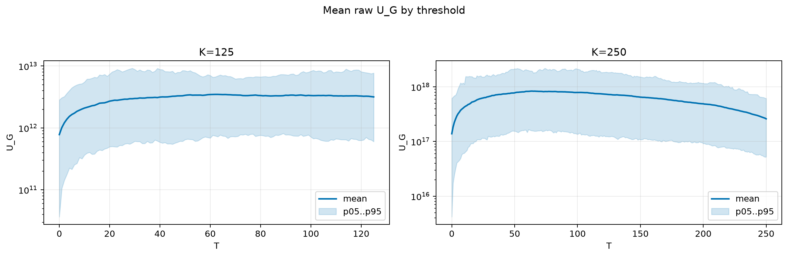
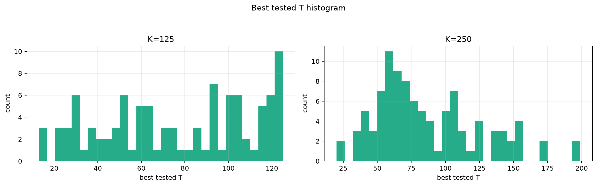
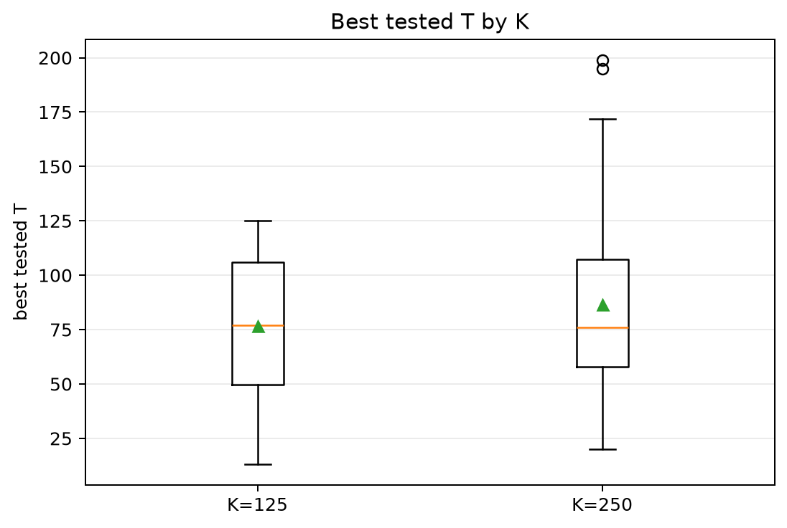
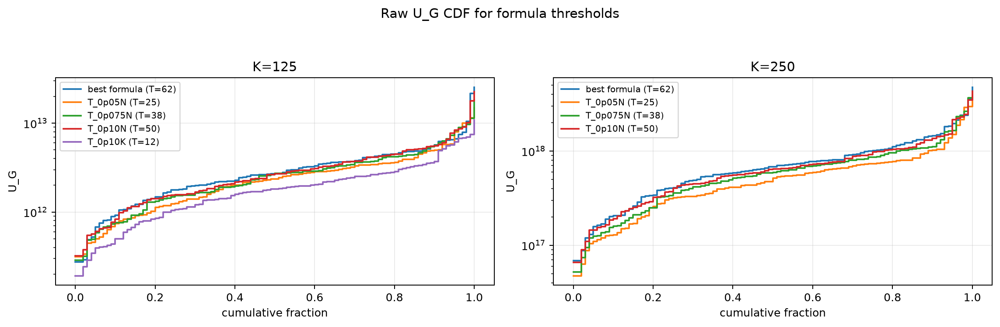
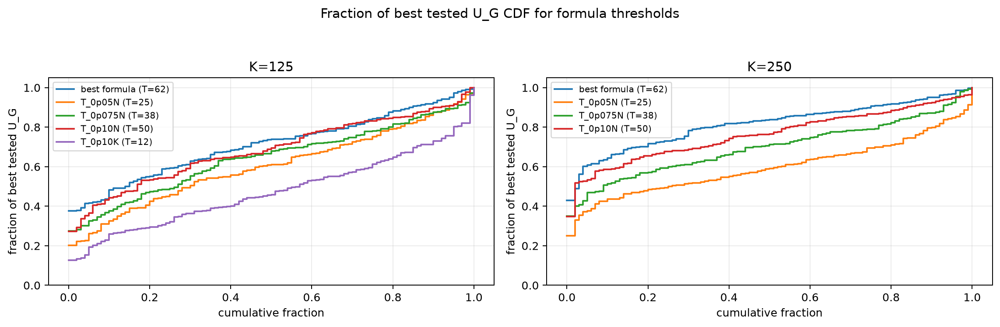

# Threshold Full Sweep: rician

- N: 500
- L: 10
- K values: 125, 250
- Samples: 100
- Generator seeds: 42
- Sigma: 1.0

The experiment sweeps every integer `T` from `0` to `K` and evaluates raw `U_G`.

## Answer

- `K=125`: best fixed `T=62`; 99% mean-`U_G` diapason `60..66`; best tested `T` median `77.0` (p05..p95 `22.0..124.0`).
- `K=250`: best fixed `T=64`; 99% mean-`U_G` diapason `62..68`; best tested `T` median `76.0` (p05..p95 `38.0..155.1`).

## Best Fixed Thresholds And Formula Checks

| K | best fixed T | 99% diapason | best tested T median | best tested T std | best formula | formula T | formula fraction |
|---:|---:|---|---:|---:|---|---:|---:|
| 125 | 62 | 60..66 | 77.000 | 34.433 | T_0p15NL_over_Lp2 | 62 | 0.7163 |
| 250 | 64 | 62..68 | 76.000 | 39.005 | T_0p15NL_over_Lp2 | 62 | 0.8187 |

## Plots

## Artifacts

- `threshold_runs.csv.gz`
- `best_thresholds.csv`
- `threshold_summary.csv`
- `threshold_best_t_stats.csv`
- `threshold_formula_comparison.csv`
