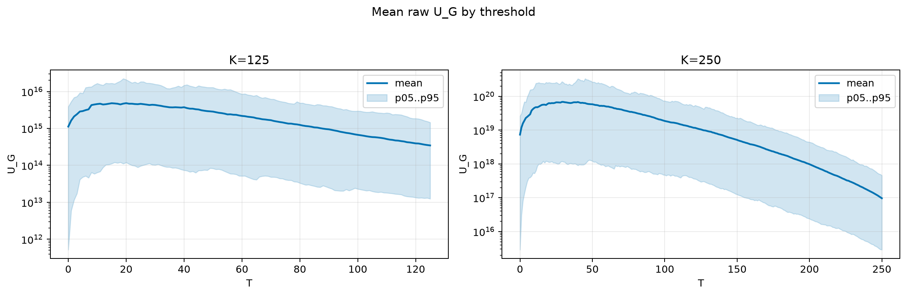
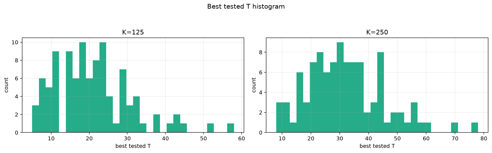
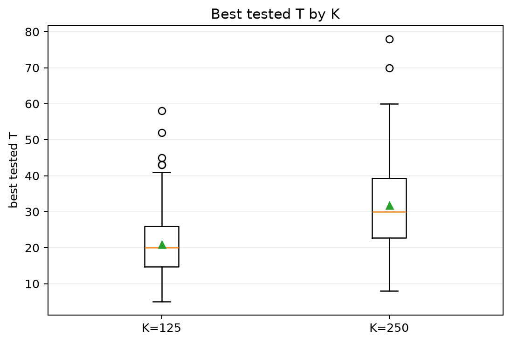
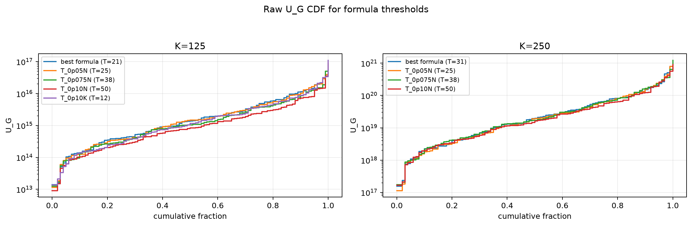
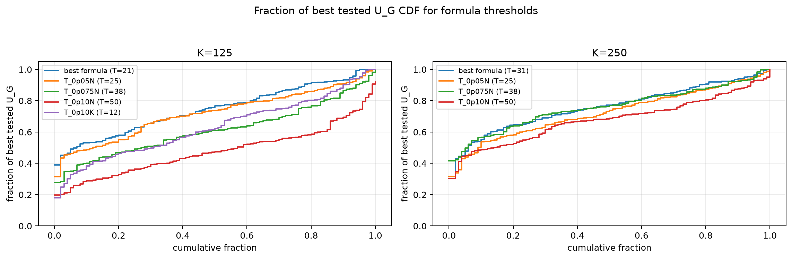

# Threshold Full Sweep: thin_tail

- N: 500
- L: 10
- K values: 125, 250
- Samples: 100
- Generator seeds: 42
- Sigma: 1.0

The experiment sweeps every integer `T` from `0` to `K` and evaluates raw `U_G`.

## Answer

- `K=125`: best fixed `T=20`; 99% mean-`U_G` diapason `20..20`; best tested `T` median `20.0` (p05..p95 `8.0..41.1`).
- `K=250`: best fixed `T=29`; 99% mean-`U_G` diapason `29..30`; best tested `T` median `30.0` (p05..p95 `11.0..55.0`).

## Best Fixed Thresholds And Formula Checks

| K | best fixed T | 99% diapason | best tested T median | best tested T std | best formula | formula T | formula fraction |
|---:|---:|---|---:|---:|---|---:|---:|
| 125 | 20 | 20..20 | 20.000 | 10.116 | T_0p05NL_over_Lp2 | 21 | 0.7489 |
| 250 | 29 | 29..30 | 30.000 | 13.304 | T_0p075NL_over_Lp2 | 31 | 0.7650 |

## Plots

## Artifacts

- `threshold_runs.csv.gz`
- `best_thresholds.csv`
- `threshold_summary.csv`
- `threshold_best_t_stats.csv`
- `threshold_formula_comparison.csv`
