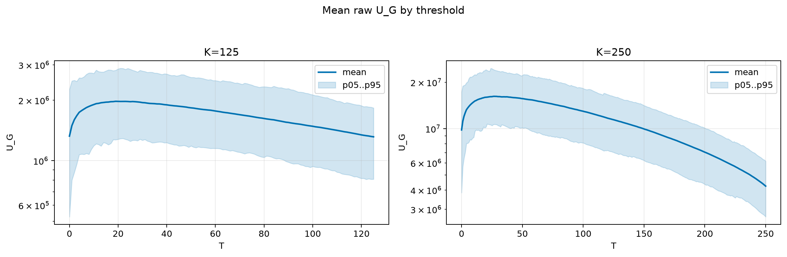
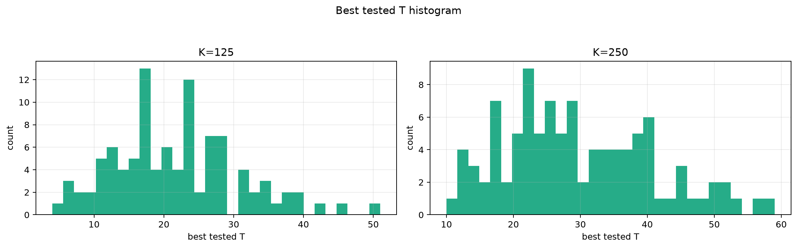
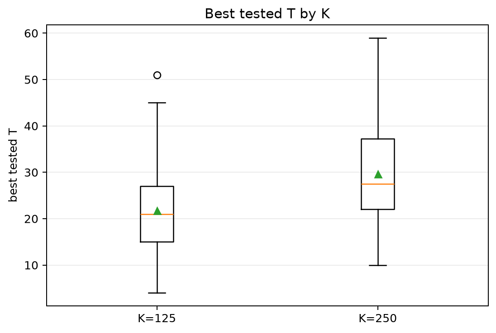
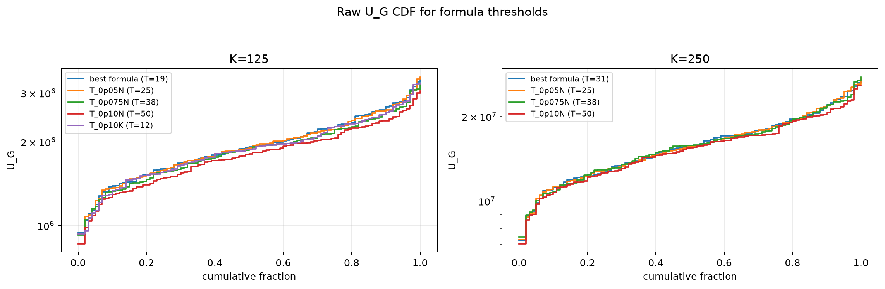
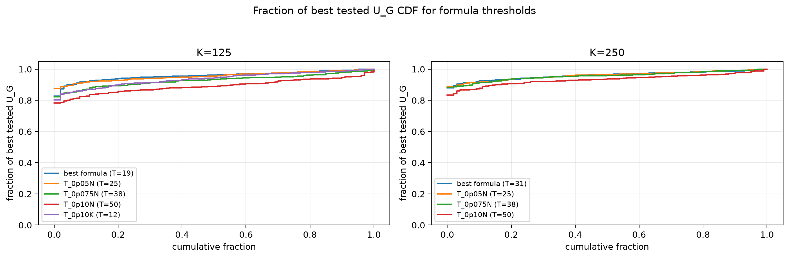

# Threshold Full Sweep: nakagami

> Historical K semantics note: this report uses active-K semantics. Here `K` is the number of selected/kept antennas, not the number turned off. A `25% active` or `K=0.25N` case means `75% off`, not the real `25% off` task. For real off-percent experiments, `25% off => K_active=0.75N` and `50% off => K_active=0.50N`.

- N: 500
- L: 2
- K values: 125, 250
- Samples: 100
- Generator seeds: 42
- Sigma: 1.0

The experiment sweeps every integer `T` from `0` to `K` and evaluates raw `U_G`.

## Answer

- `K=125`: best fixed `T=19`; 99% mean-`U_G` diapason `15..29`; best tested `T` median `21.0` (p05..p95 `8.0..38.1`).
- `K=250`: best fixed `T=27`; 99% mean-`U_G` diapason `22..38`; best tested `T` median `27.5` (p05..p95 `13.9..50.0`).

## Best Fixed Thresholds And Formula Checks

| K | best fixed T | 99% diapason | best tested T median | best tested T std | best formula | formula T | formula fraction |
|---:|---:|---|---:|---:|---|---:|---:|
| 125 | 19 | 15..29 | 21.000 | 9.155 | T_0p075NL_over_Lp2 | 19 | 0.9592 |
| 250 | 27 | 22..38 | 27.500 | 11.106 | T_0p125NL_over_Lp2 | 31 | 0.9608 |

## Plots

## Artifacts

- `threshold_runs.csv.gz`
- `best_thresholds.csv`
- `threshold_summary.csv`
- `threshold_best_t_stats.csv`
- `threshold_formula_comparison.csv`
