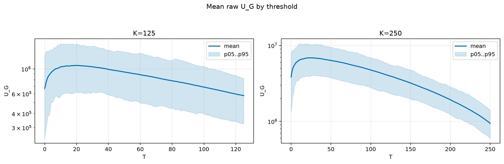
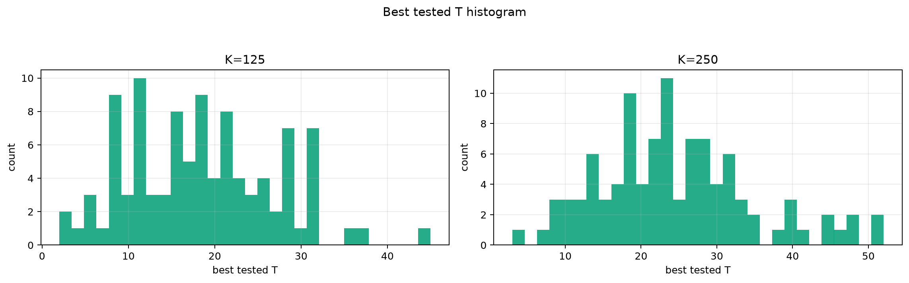
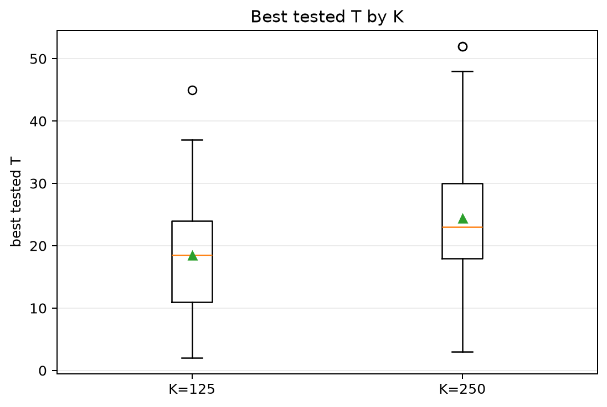
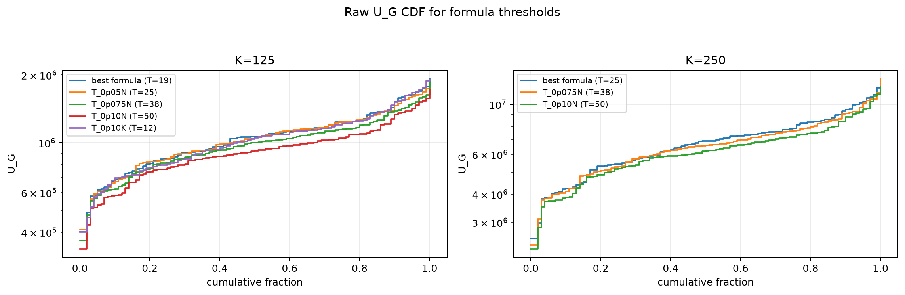
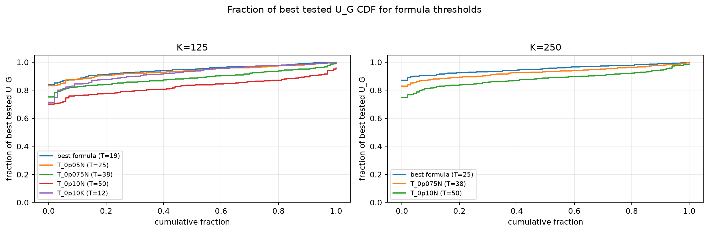

# Threshold Full Sweep: rayleigh

- N: 500
- L: 2
- K values: 125, 250
- Samples: 100
- Generator seeds: 42
- Sigma: 1.0

The experiment sweeps every integer `T` from `0` to `K` and evaluates raw `U_G`.

## Answer

- `K=125`: best fixed `T=20`; 99% mean-`U_G` diapason `16..24`; best tested `T` median `18.5` (p05..p95 `6.0..32.0`).
- `K=250`: best fixed `T=24`; 99% mean-`U_G` diapason `19..32`; best tested `T` median `23.0` (p05..p95 `10.9..45.1`).

## Best Fixed Thresholds And Formula Checks

| K | best fixed T | 99% diapason | best tested T median | best tested T std | best formula | formula T | formula fraction |
|---:|---:|---|---:|---:|---|---:|---:|
| 125 | 20 | 16..24 | 18.500 | 8.442 | T_0p075NL_over_Lp2 | 19 | 0.9453 |
| 250 | 24 | 19..32 | 23.000 | 10.218 | T_0p05N | 25 | 0.9522 |

## Plots

## Artifacts

- `threshold_runs.csv.gz`
- `best_thresholds.csv`
- `threshold_summary.csv`
- `threshold_best_t_stats.csv`
- `threshold_formula_comparison.csv`
