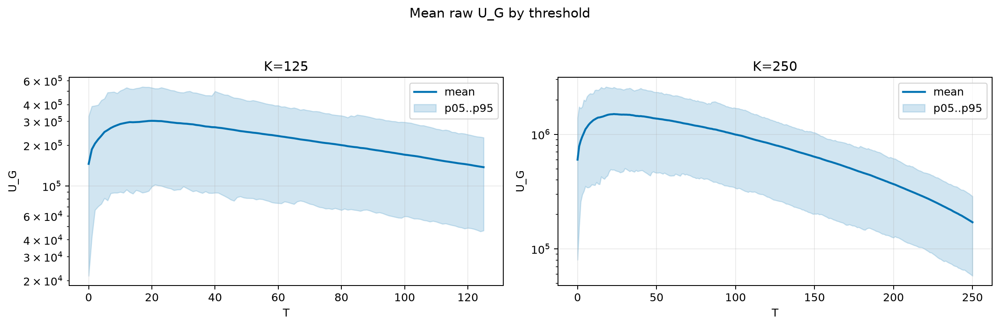
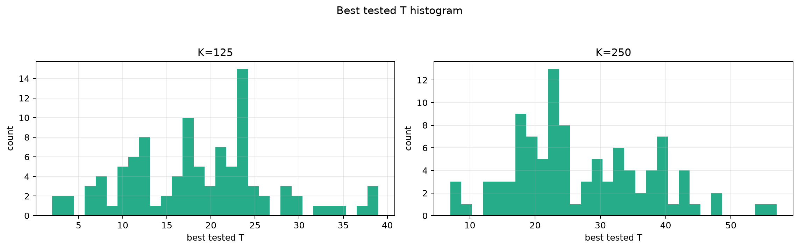
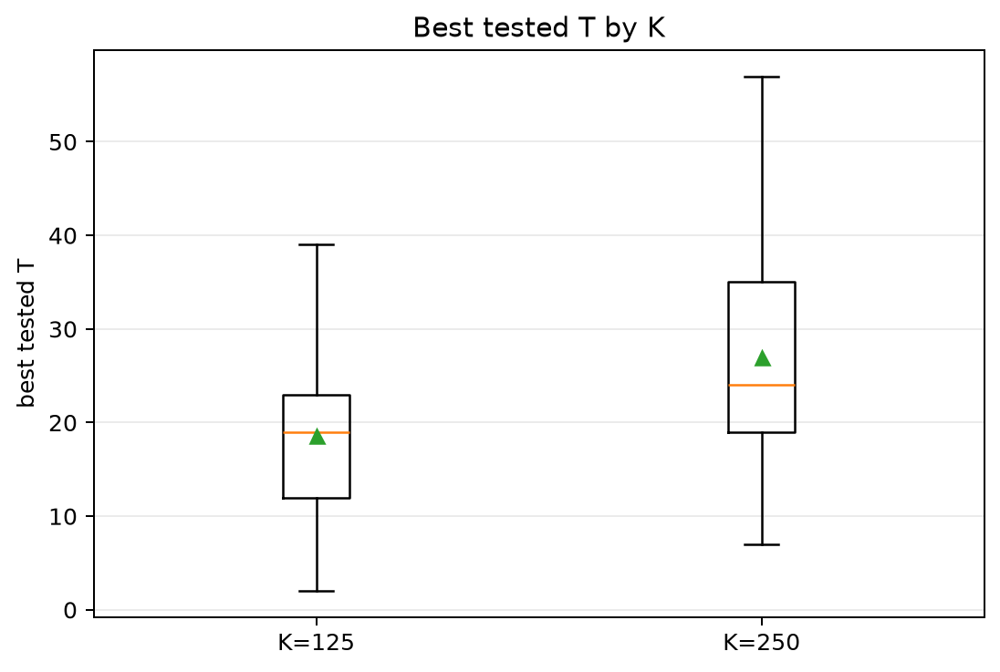
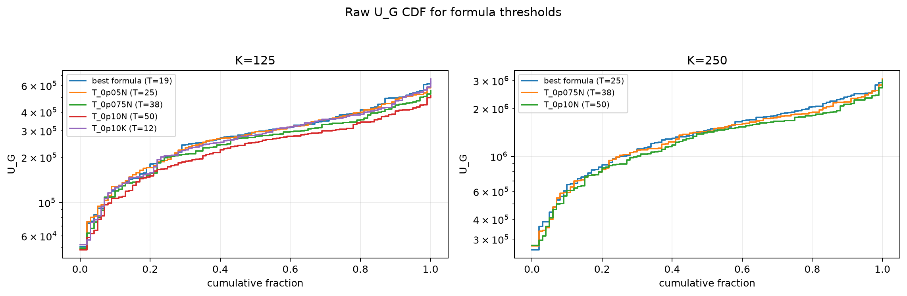
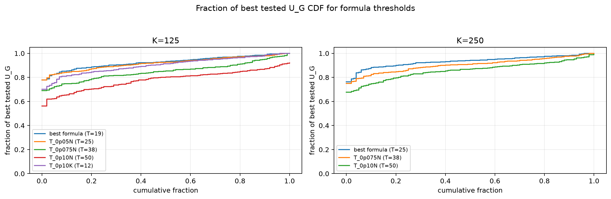

# Threshold Full Sweep: thin_tail

- N: 500
- L: 2
- K values: 125, 250
- Samples: 100
- Generator seeds: 42
- Sigma: 1.0

The experiment sweeps every integer `T` from `0` to `K` and evaluates raw `U_G`.

## Answer

- `K=125`: best fixed `T=20`; 99% mean-`U_G` diapason `18..23`; best tested `T` median `19.0` (p05..p95 `6.0..33.1`).
- `K=250`: best fixed `T=23`; 99% mean-`U_G` diapason `20..27`; best tested `T` median `24.0` (p05..p95 `12.9..43.1`).

## Best Fixed Thresholds And Formula Checks

| K | best fixed T | 99% diapason | best tested T median | best tested T std | best formula | formula T | formula fraction |
|---:|---:|---|---:|---:|---|---:|---:|
| 125 | 20 | 18..23 | 19.000 | 8.144 | T_0p075NL_over_Lp2 | 19 | 0.9279 |
| 250 | 23 | 20..27 | 24.000 | 10.430 | T_0p05N | 25 | 0.9348 |

## Plots

## Artifacts

- `threshold_runs.csv.gz`
- `best_thresholds.csv`
- `threshold_summary.csv`
- `threshold_best_t_stats.csv`
- `threshold_formula_comparison.csv`
