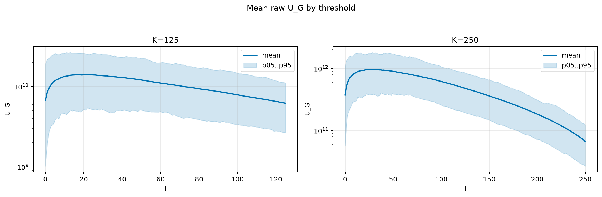
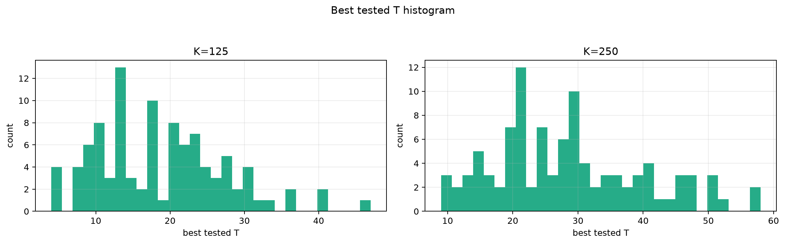
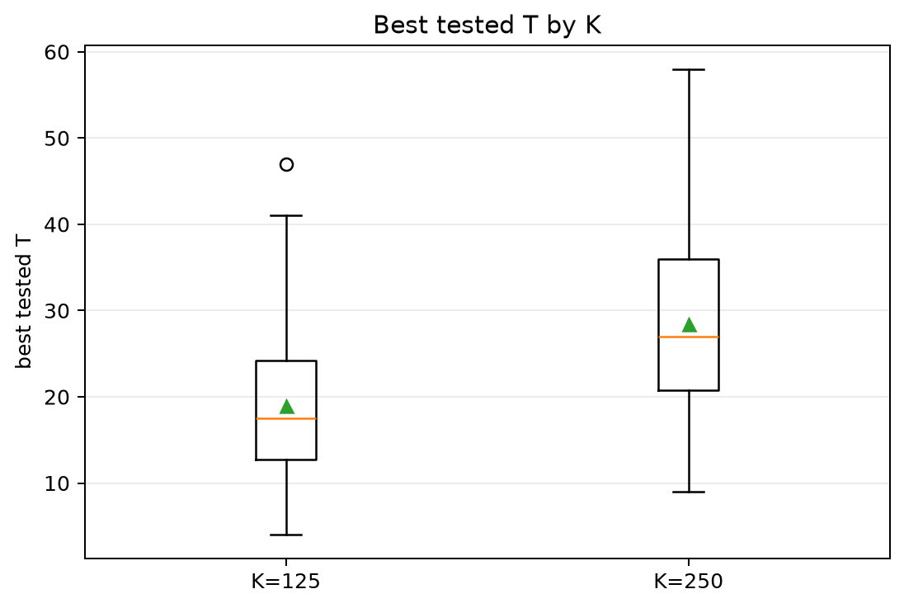
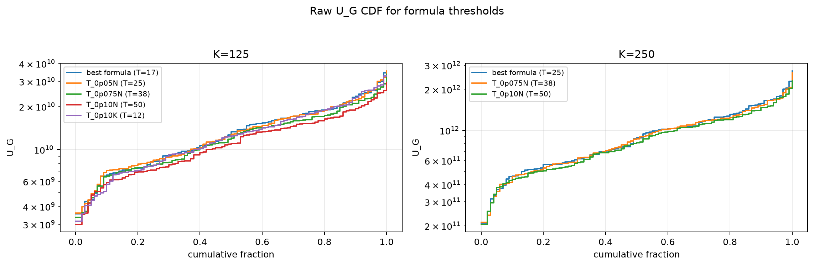
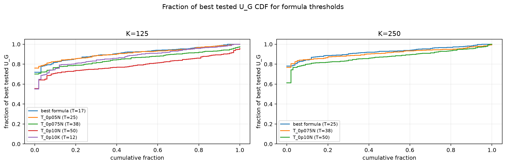

# Threshold Full Sweep: rayleigh

- N: 500
- L: 4
- K values: 125, 250
- Samples: 100
- Generator seeds: 42
- Sigma: 1.0

The experiment sweeps every integer `T` from `0` to `K` and evaluates raw `U_G`.

## Answer

- `K=125`: best fixed `T=21`; 99% mean-`U_G` diapason `15..25`; best tested `T` median `17.5` (p05..p95 `7.0..34.1`).
- `K=250`: best fixed `T=26`; 99% mean-`U_G` diapason `22..34`; best tested `T` median `27.0` (p05..p95 `12.9..50.0`).

## Best Fixed Thresholds And Formula Checks

| K | best fixed T | 99% diapason | best tested T median | best tested T std | best formula | formula T | formula fraction |
|---:|---:|---|---:|---:|---|---:|---:|
| 125 | 21 | 15..25 | 17.500 | 8.683 | T_0p05NL_over_Lp2 | 17 | 0.9123 |
| 250 | 26 | 22..34 | 27.000 | 11.406 | T_0p05N | 25 | 0.9249 |

## Plots

## Artifacts

- `threshold_runs.csv.gz`
- `best_thresholds.csv`
- `threshold_summary.csv`
- `threshold_best_t_stats.csv`
- `threshold_formula_comparison.csv`
