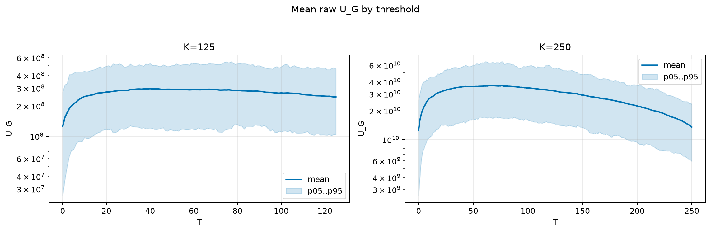
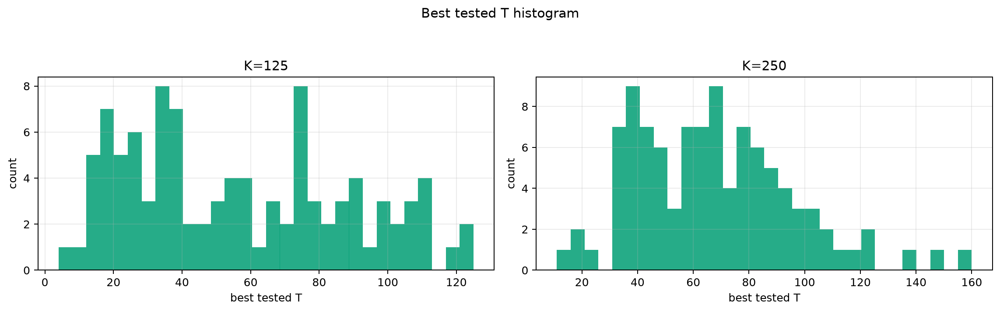
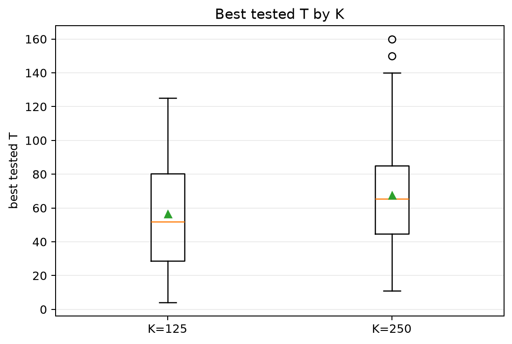
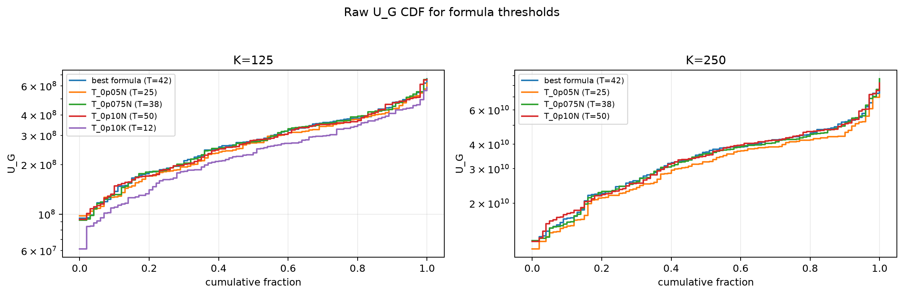
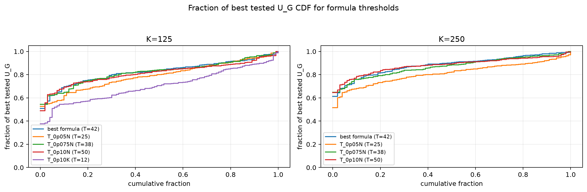

# Threshold Full Sweep: rician

- N: 500
- L: 4
- K values: 125, 250
- Samples: 100
- Generator seeds: 42
- Sigma: 1.0

The experiment sweeps every integer `T` from `0` to `K` and evaluates raw `U_G`.

## Answer

- `K=125`: best fixed `T=40`; 99% mean-`U_G` diapason `37..44`; best tested `T` median `52.0` (p05..p95 `15.9..110.0`).
- `K=250`: best fixed `T=65`; 99% mean-`U_G` diapason `64..72`; best tested `T` median `65.5` (p05..p95 `34.0..117.2`).

## Best Fixed Thresholds And Formula Checks

| K | best fixed T | 99% diapason | best tested T median | best tested T std | best formula | formula T | formula fraction |
|---:|---:|---|---:|---:|---|---:|---:|
| 125 | 40 | 37..44 | 52.000 | 31.802 | T_0p125NL_over_Lp2 | 42 | 0.8285 |
| 250 | 65 | 64..72 | 65.500 | 28.744 | T_0p125NL_over_Lp2 | 42 | 0.8855 |

## Plots

## Artifacts

- `threshold_runs.csv.gz`
- `best_thresholds.csv`
- `threshold_summary.csv`
- `threshold_best_t_stats.csv`
- `threshold_formula_comparison.csv`
