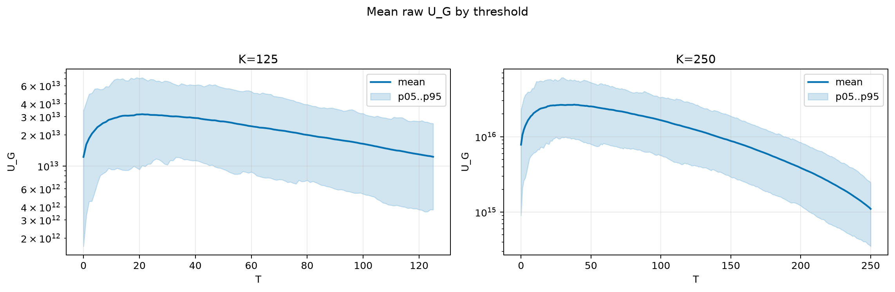
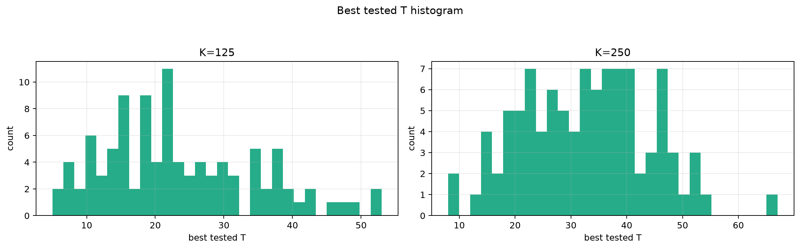
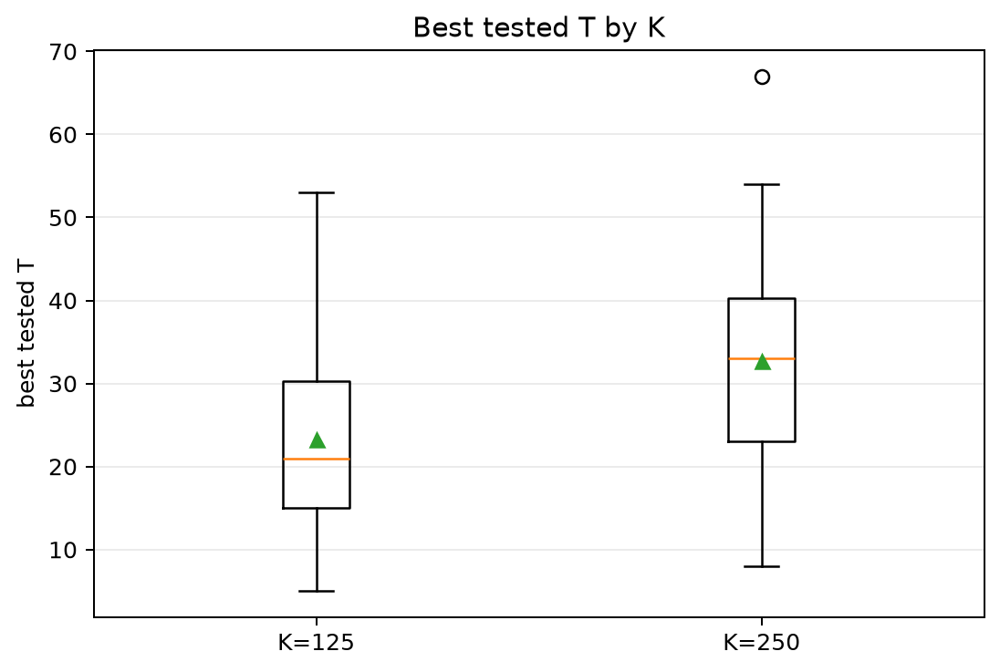
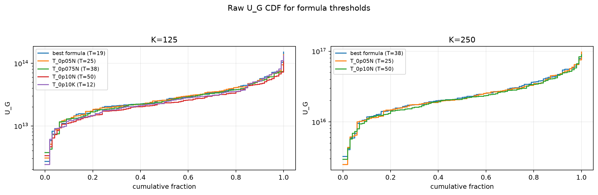
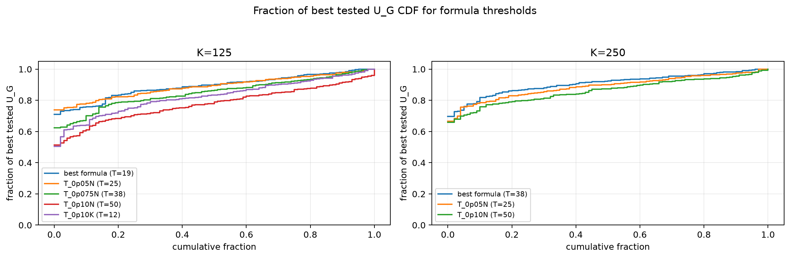

# Threshold Full Sweep: gaussian

- N: 500
- L: 6
- K values: 125, 250
- Samples: 100
- Generator seeds: 42
- Sigma: 1.0

The experiment sweeps every integer `T` from `0` to `K` and evaluates raw `U_G`.

## Answer

- `K=125`: best fixed `T=21`; 99% mean-`U_G` diapason `19..23`; best tested `T` median `21.0` (p05..p95 `7.0..43.1`).
- `K=250`: best fixed `T=38`; 99% mean-`U_G` diapason `33..40`; best tested `T` median `33.0` (p05..p95 `14.9..50.1`).

## Best Fixed Thresholds And Formula Checks

| K | best fixed T | 99% diapason | best tested T median | best tested T std | best formula | formula T | formula fraction |
|---:|---:|---|---:|---:|---|---:|---:|
| 125 | 21 | 19..23 | 21.000 | 11.174 | T_0p05NL_over_Lp2 | 19 | 0.8924 |
| 250 | 38 | 33..40 | 33.000 | 11.540 | T_0p075N | 38 | 0.9099 |

## Plots

## Artifacts

- `threshold_runs.csv.gz`
- `best_thresholds.csv`
- `threshold_summary.csv`
- `threshold_best_t_stats.csv`
- `threshold_formula_comparison.csv`
